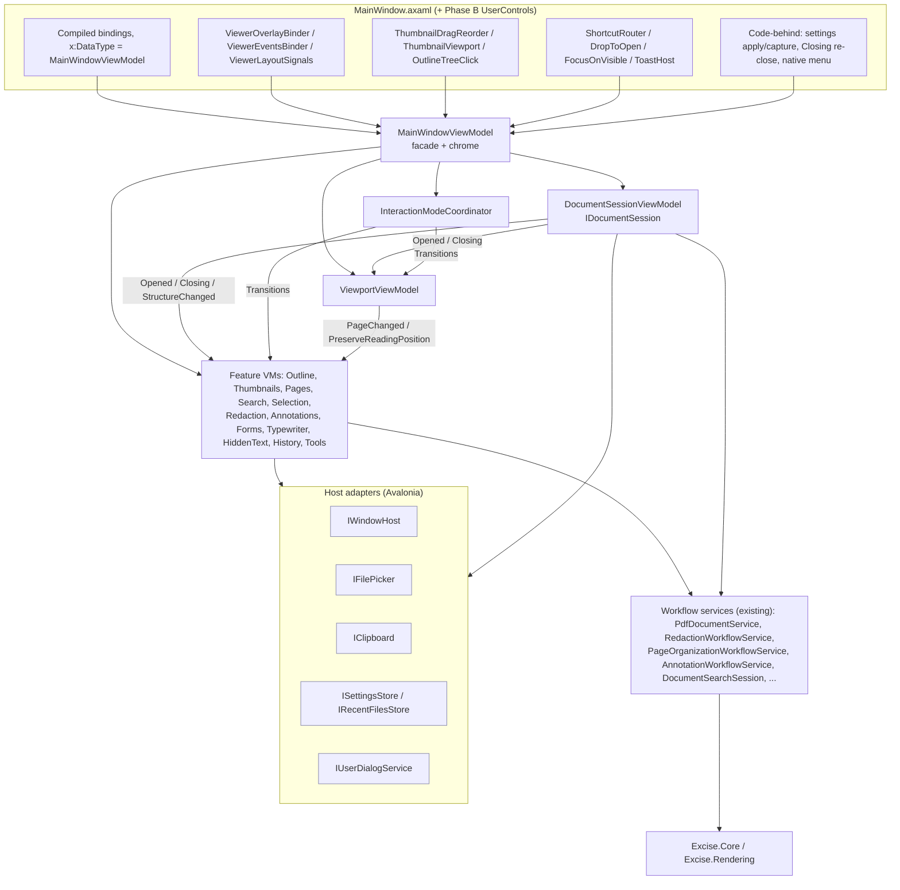

# Main-window architecture (`app-main-window`)

Target structure for `MainWindowViewModel`, its partials, `MainWindow.axaml`
and its code-behind, with the sequencing constraints an incremental refactor
must respect. Written for #1500.

## Authority and scope

[`README.md`](README.md) requires a new architecture document to carry an
authority the existing files do not. This one does: **member-level target
design for the `app-main-window` subsystem** — which unit owns which state,
what each unit exposes, and how the units communicate. `system-design.md`
deliberately stops at "`MainWindowViewModel` is a composition surface. Feature
state and workflows move behind focused collaborators" (`system-design.md:110`);
this document says which collaborators, with what contracts.

Two things this document is not:

- It is not a status record. `architecture/assessment.json` owns
  `main-window-concentration`'s status and evidence; it moves to `implemented`
  only when the refactor has landed, citing #1500.
- It is not a task list. The "Migration sequencing" section states the
  *ordering constraints the design imposes* (which owner must exist before
  which extraction is behaviour-preserving). Step tracking, assignment and
  completion live in #1500 and its sub-issues, per the README's rule that
  plans belong in issues.

Every number here was **measured 2026-09-15 at develop `7df4bfab`** by
reading the code; nothing was built or run. Line references are
`file:line` at that commit and will drift — re-derive before acting on one.

Two concurrent facts a reader must know:

- The **toolbar region of `MainWindow.axaml` (lines 447–832) and new menu
  entries are being edited on branch `fix/quick-wins-and-bugs`**
  (worktree `.claude/worktrees/lane-a-quick-wins`). This document describes
  develop. Any step that touches the toolbar waits for that branch to land.
- The product owner's framing (#1500): a large file is not the defect.
  The units below are judged by cohesion (one responsibility per unit, one
  owner per piece of state), coupling, testability without constructing the
  whole window, discoverability, and Avalonia/ReactiveUI/.NET conventions.
  No line-count target appears anywhere in this document, by design.

## 1. Current state inventory

### 1.1 Files

| File | Lines | Role today |
|---|---:|---|
| `Excise.App/ViewModels/MainWindowViewModel.cs` | 3,223 | services, all cross-cutting state, document lifecycle, page organisation, zoom/fit, clipboard, pickers, recent files, links, help, preferences |
| `MainWindowViewModel.Commands.cs` | 303 | declares 96 `ReactiveCommand` properties and wires them; `CurrentModeText` |
| `MainWindowViewModel.Annotations.cs` | 603 | annotation authoring from selection/drag; `ClearCurrentTextSelection` |
| `MainWindowViewModel.Attachments.cs` | 460 | Attachments pane (#1563): embedded-file list, pane visibility, save / save-all, undoable strip; the pane binds to the main VM |
| `MainWindowViewModel.Bates.cs` | 128 | Bates stamping via a dialog |
| `MainWindowViewModel.DocumentOpen.cs` | 372 | the staged open pipeline and its failure path |
| `MainWindowViewModel.DragDrop.cs` | 58 | drop-to-open |
| `MainWindowViewModel.Forms.cs` | 451 | AcroForm fill/authoring, **plus** `InteractionMode`, path-annotation mode and form-authoring mode |
| `MainWindowViewModel.HiddenText.cs` | 233 | hidden-text audit scan (structural + optional OCR) |
| `MainWindowViewModel.History.cs` | 180 | undo/redo commands and the page/annotation undo primitives |
| `MainWindowViewModel.Performance.cs` | 83 | performance settings, preference persistence |
| `MainWindowViewModel.Permissions.cs` | 85 | `/P` permission gate |
| `MainWindowViewModel.Redaction.cs` | 231 | mark/remove/clear/apply-all redactions |
| `MainWindowViewModel.ReduceFileSize.cs` | 193 | Reduce File Size (#1550): preset dialog, save-copy picker, background optimize, before/after message |
| `MainWindowViewModel.Scripting.cs` | 550 | script-facing surface and a second load/save path |
| `MainWindowViewModel.Search.cs` | 536 | search state, commands, debounce, result publishing |
| `MainWindowViewModel.Searchable.cs` | 139 | OCR "make searchable" dialog and run |
| `MainWindowViewModel.Security.cs` | 194 | encryption dialog, apply/remove protection |
| `MainWindowViewModel.Signing.cs` | 148 | PKCS#12 signing |
| `MainWindowViewModel.Thumbnails.cs` | 82 | pass-through to `ThumbnailSidebarSession` |
| `MainWindowViewModel.Typewriter.cs` | 288 | typewriter boxes, typewriter mode, **plus** reload-after-save |
| `MainWindowViewModel.TypewriterStyle.cs` | 184 | style inspector (font size, colour, alignment) |
| `MainWindowViewModel.UnsavedChanges.cs` | 160 | unsaved-changes prompt |
| `Excise.App/Views/MainWindow.axaml` | 1,616 | one window: menu, toast, title, toolbar, search bar, sidebars, viewer, status bar |
| `Excise.App/Views/MainWindow.axaml.cs` | 1,182 | code-behind |

Already-extracted owners the partials delegate to: `DocumentStateManager`
(`FileState`, `MainWindowViewModel.cs:48`), `RedactionWorkflowManager`
(`RedactionWorkflow`, `:49`), `DocumentViewportSession` (`_viewportSession`,
`:92`), `ThumbnailSidebarSession` (`_thumbnailSession`, `:93`, constructed
at `:140` rather than injected), `DocumentSearchSession` (`_searchSession`,
`Search.cs:20`, injected), `DocumentTextIndexSession` (`_textIndexSession`,
`:44`), `EditHistoryService` (`_history`, `History.cs:20`, constructed
inline).

Composition today: Microsoft.Extensions.DependencyInjection with
`ValidateOnBuild` (`App.axaml.cs:53-59`); every service is a singleton and
the view model is created by an explicit 16-argument factory
(`Composition/ApplicationComposition.cs:51-69`) mirrored exactly by
`Excise.App.Tests/Utilities/MainWindowViewModelTestFactory.cs:81-97`.
`MainWindow` is `new`ed in `App.axaml.cs:113-117` with `DataContext = vm`;
it is not resolved from the container. No design-time DataContext exists.

### 1.2 Cross-cutting state and its readers

The state below is declared in `MainWindowViewModel.cs` and read or written
from other partials or the view. This is the coupling the refactor must
untangle; each row is a piece of state that today has a declaring file but no
owning *unit*.

| State | Declared | Written by | Read by |
|---|---|---|---|
| `_currentFilePath` | `:62` | DocumentOpen (`PrepareDocumentOpen`), `SaveFileAsAsync :2227`, `CloseDocument :2289`, Scripting (`:303-464`) | Annotations, DocumentOpen, HiddenText (`:147`), Redaction (`:23-50`), Search (off-thread, `Search.cs:284-331`), Security, Signing, Scripting, Forms, code-behind (via `DocumentName`) |
| `_pdfCoreDocument` / `PdfCoreDocument` | `:63` / `:209` | DocumentOpen, `ReloadPdfCoreDocumentFromCurrentDocumentAsync :1684`, Typewriter (`ReloadPdfCoreDocumentAfterSaveAsync`), close | Annotations, Forms (`CurrentPageFormFields`), Permissions (fallback), Redaction (`ToViewerRedactionArea`), Search (off-thread), zoom/fit (`:1959`), XAML `PdfViewerControl.Document` |
| `FileState` (`DocumentStateManager`) | `:48` | every feature partial increments a counter; `MarkSaved` in save paths and `UnsavedChanges.cs:60-118` | `StatusBarText`, `SaveButtonText`, `HasUnsavedDocumentChanges`, code-behind `Closing` (`MainWindow.axaml.cs:175`) |
| Mode flags: `_isRedactionMode :75`, `_isTextSelectionMode :85`, `_isFormAuthoringMode` (`Forms.cs:124`), `_isPathAnnotationMode` (`Forms.cs:29`), `_isTypewriterMode` (`Typewriter.cs:18`) | four files | each setter turns the others off (`:781-813`, `:897-919`, `Forms.cs:38-64`, `Forms.cs:130-157`, `Typewriter.cs:22-51`); `ViewMode` setter (`:226-233`); `PrepareDocumentOpen`; close | `IsEditingModeActive :403`, `InteractionMode` (`Forms.cs:16`), `CurrentModeText` (`Commands.cs:11`), `ShowPendingRedactionsPanel` (`Search.cs:195`), `MacNativeMenuBuilder.cs:206-226`, XAML (`IsRedactionMode`, `IsTextSelectionMode`, `IsTypewriterMode`, `IsFormAuthoringMode`, `InteractionMode`) |
| `CurrentPageIndex` (via `_viewportSession`) | `:430` | navigation, DocumentOpen (`:198`), page organisation, History primitives, Search (`NavigateToSearchMatch`), Typewriter (`GoToNextPendingTypewriterEdit`), code-behind `OnPageChanged`/`OnLinkClicked` | everything; the setter fans out to thumbnails, search highlights, hidden-text scan and selection clear (`RefreshCurrentPageBindings :451-464`) |
| `ZoomLevel`, `ViewMode`, `ViewportWidth/Height`, fit mode (via `_viewportSession`) | `:582`, `:215`, `:1025`, `:1038` | zoom commands, code-behind `VisibleViewportChanged` (`MainWindow.axaml.cs:352-356`), `ApplyContinuousScrollPreference` (from code-behind `:288`), mode setters force `SinglePage` | XAML (`ZoomLevel`, `ViewMode`, `IsContinuousView`), `RestoreViewModeFromPreference :414` |
| Redaction selection: `_currentRedactionPageArea :76`, `CurrentRedactionArea :815`, `CurrentRedactionRenderDpi :831` | cs | code-behind `OnRedactionDrawn` (`:956`), Redaction (`MarkRedactionArea` clears it), close, DocumentOpen | Redaction, **Annotations** (Square/Circle/FreeText/Stamp/ImageStamp read it, `Annotations.cs:127-390`) |
| Text selection: `_currentTextSelectionArea :86`, `_currentTextSelectionPageArea :87`, `_selectedText :88` | cs | code-behind `OnTextSelected` (`:1020-1038`), `SetSelectedTextAndCopyAsync :958`, `CopyTextAsync :1748`, `ClearCurrentTextSelection` (`Annotations.cs:597`) | Annotations (all "from selection" commands), `HasTextSelection :947`, XAML |
| `ClipboardHistory` | `:207` | `PublishToClipboardAndHistoryAsync :1810`, close, open | XAML right sidebar |
| `OperationStatus` | `:974` | DocumentOpen, DragDrop, Search (background progress) | XAML status bar |
| `CurrentPageSearchHighlights` | `:1067` | Search (`UpdateSearchHighlights`, `Search.cs:474-503`) | code-behind `OnSearchHighlightsChanged` → viewer `Add/ClearSearchHighlights` |
| `RenderVersion` | `:422` | `RequestViewerRenderRefresh :1726` from Annotations, Bates | XAML `PdfViewerControl.RenderVersion` |
| `OutlineNodes`, `HasOutline`, `SelectedOutlineNode` | `:174-206` | DocumentOpen (`LoadDocumentOutline`), failure path | XAML TreeView, code-behind `OnOutlineTreePointerPressed` |
| Sidebar/visibility flags `:96-102` | cs | toggle commands | XAML, `MacNativeMenuBuilder` |
| Preferences: reading order, whitespace, carrier policies, whole word, width policy `:64-74` | cs | code-behind `OnDataContextChanged` applies persisted values (`:288-299`), `PreferencesViewModel.SaveToMainViewModel` | `BuildRedactedCopySafetyOptions :367` (Redaction, Scripting), `WritePreferencesTo` (`Performance.cs:69`), XAML two-way to the viewer |
| Test seams: `MainWindowResolver :2794`, `StorageProviderOverride :2814`, `Pick*Override :2831-2833`, `KeyboardShortcutsDialogRequested :2713`, `DocumentationOpener :2759` | cs | tests | pickers (`:2840-2933`), dialogs; more seams in Annotations (`:321`), Attachments (`:63`, `:166`), Bates (`:42`), Redaction (`:187`) |

### 1.3 `MainWindowViewModel.cs` members by responsibility

Callers column: **X** = XAML binding, **C** = another partial, **V** =
code-behind, **T** = tests, **S** = scripting-reachable (public), **M** =
`MacNativeMenuBuilder`/`MacApplicationMenu`, **P** = `PreferencesViewModel`.

**Construction and composition**

| Member (line) | What it does | State | Services | Callers |
|---|---|---|---|---|
| service fields (31–45) | injected dependencies | — | all | C |
| `FileState` (48), `RedactionWorkflow` (49) | state managers, constructed inline | own | — | X (`RedactionWorkflow.*`), C, V |
| `ToastService` (54) | exposes the toast service | — | `_toastService` | V (`:309`) |
| ctor (107–148) | assigns 16 services, creates `ThumbnailSidebarSession`, subscribes `DocumentReleased`, `InitializeCommands()`, `InitializeSessionState()` | — | — | `ApplicationComposition`, test factory |
| `InitializeSessionState` (150–154) | recent files + zoom preference | `RecentFiles`, viewport | disk | ctor |
| `OnDocumentReleased` (1099–1110) | asks the reclaimer for a GC on close/replace | — | `_memoryReclaimer` | `_documentService.DocumentReleased` (never unsubscribed) |

**Document identity, open/close/save (session)**

| Member (line) | What it does | State | Services | Callers |
|---|---|---|---|---|
| `PdfCoreDocument` (209–213) | the viewer's document | `_pdfCoreDocument` | — | X, C |
| `DocumentName` (752–754) | file name or "No document open" | `_currentFilePath` | — | X, C (Security, page extraction names) |
| `IsDocumentLoaded` (1074) | `_documentService.IsDocumentLoaded` | — | doc service | X (36 uses), M |
| `SaveDocumentForTests` (1090) | #917 identity seam | — | doc service | T |
| `DisposeViewerDocumentIfNotShared` (1112–1117) | dispose only a non-shared viewer doc | `_pdfCoreDocument` | doc service | C (`:1683`) |
| `ConfirmProceedIfDocumentSignedAsync` (1192–1203) | #1415 one-time signed-document warning | `_hasWarnedAboutSignedDocumentThisSession` | `_dialogService.ShowConfirmAsync`, doc service | `SaveFileAsync`, `SaveFileAsAsync` |
| `SaveFileAsync` (1205–1271) | routes to redacted-copy or Save-As when on an original; else syncs forms, burns typewriter, saves, reloads, clears history | `FileState`, typewriter, history | doc service, toast; Forms/Typewriter/History methods | `SaveFileCommand`, `UnsavedChanges.cs` |
| `SaveAsAsync` (2177–2208) | picker then `SaveFileAsAsync` | — | pickers | `SaveAsCommand` |
| `SaveFileAsAsync` (2210–2245) | save to path, update paths, reload | `_currentFilePath`, `FileState` | doc service; Forms/Typewriter/History | S, T, `SaveAsAsync` |
| `CloseDocumentAsync` (2252–2258) | unsaved prompt then close | — | — | `CloseDocumentCommand` |
| `CloseDocument` (2260–2285) | cancel index/search, persist doc state, close, reset, publish | all per-document state | `_textIndexSession`, `_searchSession`, doc service | `CloseDocumentAsync` |
| `ResetClosedDocumentWorkspaceState` (2287–2309) | clears path, document, thumbnails, redaction, selection, typewriter, history, clipboard, search, modes, page, zoom | eight partials' state | — | `CloseDocument` |
| `PublishClosedDocumentState` (2311–2324) | raises 11 property changes | — | — | `CloseDocument` |
| `ExitAsync` (2339–2353) | unsaved prompt then `TryShutdown()` | — | `Application.Current.ApplicationLifetime` | `ExitCommand` |
| `LoadRecentFileAsync` (2355–2376) | existence check, unsaved prompt, load | `RecentFiles` | `File.Exists` | `LoadRecentFileCommand` (menu items built at `:988`) |
| `RestoreDocumentStateAsync` (3163–3197) | restore zoom + last page from `WindowSettings` | viewport | `Models.WindowSettings.Load()` (static, disk) | DocumentOpen (`:280`) |
| `SaveDocumentState` (3203–3221) | persist zoom + page per file | — | `WindowSettings.Update` (static, disk) | `CloseDocument` |
| `ReloadPdfCoreDocumentFromCurrentDocumentAsync` (1672–1724) | re-point viewer doc, raise `DocumentStructureChanged`, clamp page, restart thumbnails with a mutation-version cache salt, restart text index, refresh bindings | `_pdfCoreDocument`, `_documentMutationVersion`, thumbnails, index | `_textIndexSession`, thumbnails | `RefreshAfterDocumentMutationAsync` |
| `RefreshAfterDocumentMutationAsync` (1643–1656) | reload + re-fit + raise `TotalPages`, recount `/Redact`, raise `StatusBarText`. Does **not** touch `FileState` | — | — | page ops, History primitives, Searchable, Annotations undo |
| `DocumentStructureChanged` event (2024) | #917 layout-rebuild signal | — | — | V (`:328`) |

**Recent files and preferences persistence**

| Member (line) | What it does | State | Services | Callers |
|---|---|---|---|---|
| `RecentFiles` (980–984), `HasRecentFiles` (986) | list + flag | `_recentFiles` | — | X, M (`RecentFiles.CollectionChanged`) |
| `RecentFileMenuItems` (988–1020) | **builds `Avalonia.Controls.MenuItem`s** with tooltips and `LoadRecentFileCommand` | — | Avalonia controls | X |
| `LoadRecentFiles` (2973–3002), `AddToRecentFiles` (3004–3035), `SaveRecentFiles` (3037–3049), `RemoveFromRecentFiles` (3054–3070) | file-backed MRU of 10 | `RecentFiles` | `AppPaths.RecentFilesPath`, `File.*` (UI thread) | ctor, DocumentOpen, Scripting |
| `LoadZoomPreference` (3074–3101), `SaveZoomPreference` (3103–3116) | zoom persisted as text | viewport | `AppPaths.ZoomSettingsPath`, `File.*` | ctor, `ApplyZoomTransition` |
| `ReadingOrderStrategy` (248–252), `ApplyReadingOrderStrategyPreference` (255–258), `WhitespaceMode` (265–269), `ApplyWhitespaceModePreference` (272–275) | copy/selection preferences, two-way to the viewer | `_readingOrderStrategy`, `_whitespaceMode` | — | X (two-way), V (`:289-294`), P |
| `LinkUriCarrierPolicy` (290–294), `MetadataCarrierPolicy` (301–305), `RedactionWholeWord` (319–323), `RedactionWidthPolicy` (337–341), `ApplyRedactionPolicyPreferences` (349–360) | redaction safety policy (#1052/#1169/#1189) | `:68-74` | — | V (`:295-299`), P, `Performance.cs:69` |
| `BuildRedactedCopySafetyOptions` (367–381) | policy → `RedactedCopySafetyOptions` | reads the four above | Core | Redaction (`:133`), Scripting (`:395`) |
| `ContinuousScrollPreference` (383), `ApplyContinuousScrollPreference` (385–395) | persisted view-mode preference | viewport | — | V (`:288`, `:220`), `ToggleContinuousView` |
| `ShowPreferences` (3128–3157) | builds `PreferencesViewModel`, `LoadFromMainViewModel(this)`, shows `Views.PreferencesWindow` modally (not awaited) | — | `GetMainWindow()`, view construction | `ShowPreferencesCommand` |

**Viewport, navigation, zoom**

| Member (line) | What it does | State | Services | Callers |
|---|---|---|---|---|
| `ViewMode` (215–238), `IsContinuousView` (240) | view mode; entering Continuous turns off redaction/forms/typewriter modes | `_viewportSession`, mode flags | — | X (two-way), M |
| `IsEditingModeActive` (403–404) | any of four mode flags (**not** text selection) | reads `Forms.cs`/`Typewriter.cs` fields directly | — | mode setters |
| `RestoreViewModeFromPreference` (414–420) | back to Continuous when the last editing mode exits | viewport | — | mode setters in three files |
| `RenderVersion` (422–426), `RequestViewerRenderRefresh` (1726–1729) | viewer invalidation counter | `_renderVersion` | — | X, Annotations, Bates |
| `CurrentPage` (428), `CurrentPageIndex` (430–443), `DisplayPageNumber` (528), `TotalPages` (466) | page position (0/1-based) | `_viewportSession`, doc service | — | X, C, V, S |
| `RefreshCurrentPageBindings` (451–464) | fan-out after a page change: page props, form fields, thumbnail selection, search highlights, hidden-text scan, selection clear | five partials | — | `CurrentPageIndex` setter, DocumentOpen, reload |
| `ZoomLevel` (582–586), `ApplyZoomTransition` (588–596), `SetManualZoom` (1870–1876) | zoom with fit-mode latch and persistence | viewport | disk (`SaveZoomPreference`) | X, T, `PdfViewerControl` callers |
| `ViewportWidth` (1025–1036), `ViewportHeight` (1038–1049), `ReapplyFitModeIfNeeded` (1051–1063) | viewport size from the view; re-fit on change | viewport | — | V (`:350-356`) |
| `ZoomIn/Out/ActualSize` (1850–1864), `ZoomFitWidth/Page` (1878–1879), `ZoomFitWidthInternal` (1885–1909), `ZoomFitPageInternal` (1911–1936), `TryGetMaxPageDimensionsInViewerDips` (1949–1972) | zoom commands; fit against the widest page (#847) at 96-dpi dips (#693) | viewport, `PdfCoreDocument` | `PdfCoordinateMapper` | commands, `ReapplyFitModeIfNeeded` |
| `NextPageAsync` (1974), `PreviousPageAsync` (1984), `GoToPageAsync` (1994–2004) | navigation | `CurrentPageIndex` | — | commands, V (Home/End), `RestoreDocumentStateAsync` |
| `PreserveReadingPositionRequested` event (2015), `RequestPreserveReadingPosition` (2026) | #846 reading-anchor snapshot before a structural mutation | — | — | V (`:322`), page ops |
| `ToggleContinuousView` (1743–1746) | flips the preference | — | — | command, M |

**Interaction modes and selections** (the mode *state machine* is split across
this file, `Forms.cs` and `Typewriter.cs`; see §1.7)

| Member (line) | What it does | State | Services | Callers |
|---|---|---|---|---|
| `IsRedactionMode` (781–813) | on entry: SinglePage, off text-selection/forms/typewriter; on exit: restore view mode, restore text selection if no editing mode; raises `CurrentModeText`, `InteractionMode`, `ShowPendingRedactionsPanel`, `ShowClipboardHistoryPanel` | `_isRedactionMode` + three foreign flags | — | X, M, Redaction, Forms, Typewriter, close, open |
| `IsTextSelectionMode` (897–919) | on entry: off redaction/forms/typewriter (#815: does not change view mode) | `_isTextSelectionMode` | — | X, M, mode setters, `ToggleTextSelectionMode` (1731–1741) |
| `CurrentRedactionArea` (815–829), `CurrentRedactionRenderDpi` (831–854), `CurrentRedactionPageArea` (856–860), `SetCurrentRedactionPageArea` (862–871), `ToViewerRedactionArea` (873–892), `ToAvaloniaRect` (894–895) | the drag rectangle in three representations (Avalonia `Rect`, page rect, DPI) | `_currentRedactionPageArea` | `PdfCoordinateMapper` | V (`OnRedactionDrawn :956`), Redaction, Annotations, close |
| `CurrentTextSelectionArea` (921–925), `CurrentTextSelectionPageArea` (927–935), `SelectedText` (937–945), `HasTextSelection` (947–949) | text selection | `:86-88` | — | V (`OnTextSelected`), X, Annotations |
| `SetSelectedTextAndCopyAsync` (958–972) | publish selection; gate the OS copy on `/P` bit 5 | `SelectedText` | `EnsureDocumentPermission`, clipboard | V (`:1033`) |

**Clipboard**

| Member (line) | What it does | State | Services | Callers |
|---|---|---|---|---|
| `ClipboardHistory` (207) | last 20 copies | own | — | X |
| `CopyTextAsync` (1748–1802) | copy live selection or whole page, gated on bit 5 | `SelectedText` | `_textExtractionService`, toast | `CopyTextCommand`, V (Ctrl+C) |
| `PublishToClipboardAndHistoryAsync` (1810–1848) | insert history entry on the UI thread; **resolves the OS clipboard through `Application.Current.ApplicationLifetime`** | `ClipboardHistory` | `Dispatcher.UIThread`, `TopLevel.Clipboard` | copy paths |
| `CurrentPageText` (761–779) | page text for tests | — | `_textExtractionService` | T, S |

**Page organisation** (all push undo closures built from `History.cs` primitives)

| Member (line) | What it does | State | Services | Callers |
|---|---|---|---|---|
| `RemoveCurrentPageAsync` (1273–1314), `RemoveSelectedPagesAsync` (1501–1532) | remove with undo (captured `PdfPage`s) | `CurrentPageIndex`, `FileState`, history | `_pageOrganizationWorkflow`, toast | commands |
| `AddPagesAsync` (1316–1334), `AddPagesFromFileAsync` (1336), `InsertPagesBeforeCurrentAsync` (1339), `InsertPagesAfterCurrentAsync` (1349), `InsertPagesFromFileAsync` (1359–1377), `PickPdfForPageInsertionAsync` (1626–1630) | insert pages from another PDF (no undo entry) | `FileState` | workflow, pickers | commands, S |
| `CombineDocumentsAsync` (1379–1404), `SplitDocumentAsync` (1406–1453) | merge/split to disk (no undo; split spec parsed by the workflow) | — | workflow, `_dialogService.PromptTextAsync/ShowMessageAsync`, pickers, toast | commands |
| `ExtractCurrentPageAsync` (1455–1467), `ExtractPagesToFileAsync` (1469–1484), `ExtractSelectedPagesAsync` (1486–1499) | extract pages to a new file | — | workflow, pickers, toast | commands, S |
| `MoveCurrentPageEarlier/LaterAsync` (1534–1548), `MoveCurrentPageAsync` (1550), `MovePageAsync` (1553–1580), `RemapCurrentPageAfterSingleMove` (1582–1591), `MoveSelectedPagesAsync` (1593–1624) | reorder with undo | `CurrentPageIndex`, `FileState`, history, thumbnail marks | workflow, toast | commands, V (drag-reorder `:507`), S |
| `RotatePageLeft/Right/180Async` (2029–2114) | rotate with undo | `FileState`, history | doc service | commands, V (Ctrl+L/R) |
| `MarkPageOrganizationChanged` (1632–1641) | bump `FileState` counters, raise `SaveButtonText`/`StatusBarText` | `FileState` | — | page ops, History primitives |
| Page marks: `SelectedPageCount`, `HasSelectedPages`, `CanRemoveSelectedPages`, `CanMoveSelectedPagesEarlier/Later`, `PageSelectionSummary` (159–167), `UpdateThumbnailSelection` (2116–2122), `MarkPageForOperation` (2124–2130), `GetSelectedPageIndices` (2132–2137), `ClearSelectedPages` (2139–2145), `RestoreSelectedPages` (2147–2154), `AttachPageSelectionTracking` (2156–2163), `RaiseSelectedPagePropertiesChanged` (2165–2173) | batch page selection stored **on `PageThumbnail` items** (`IsMarkedForPageOperation`) | `PageThumbnails` | — | X, M, page ops, `Thumbnails.cs:47` |

**Outline and sidebars**

| Member (line) | What it does | State | Services | Callers |
|---|---|---|---|---|
| `OutlineNodes` (174), `HasOutline` (177), `SelectedOutlineNode` (192–206), `JumpToOutline` (726–750) | outline tree and navigation (`SelectedOutlineNode` setter navigates) | own | — | X (two-way), V (`:435`), `JumpToOutlineCommand` (lazy, `Commands.cs:106`) |
| `IsOutlineSidebarVisible` (179–190), `IsThumbnailsSidebarVisible` (599–608), `IsLeftSidebarVisible` (615), `IsSidebarSplitterVisible` (618), `IsClipboardSidebarVisible` (621–625), `ToggleThumbnailsSidebar` (712), `ToggleClipboardSidebar` (715), `ToggleOutlineSidebar` (718) | sidebar visibility (#369) | `:96`, `:102`, `:178` | — | X, M, commands |
| `PageThumbnails` (157) | `_thumbnailSession.Items` | session | — | X |

**Annotation display**

| Member (line) | What it does | State | Services | Callers |
|---|---|---|---|---|
| `AreAnnotationsVisible` (638–645), `AreCommentAnnotationsVisible` (657–664), `AreFieldAndLinkAnnotationsVisible` (667–674), `IsAnnotationAuditModeEnabled` (686–693), `AreFormFieldsHighlighted` (703–710) and their `Toggle*` methods | viewer display switches (#1021, #1005) | `:97-101` | — | X (to `PdfViewerControl.Show*`), commands |
| `RedactAnnotationCount` (481–485), `RedactAnnotationNotice` (492–496), `RefreshRedactAnnotationCount` (503–525) | count `/Redact` marks, never apply them (#1021) | `_redactAnnotationCount` | doc service (walks every page) | X, open/close/mutation |

**Status bar**

| Member (line) | What it does | State | Services | Callers |
|---|---|---|---|---|
| `StatusBarText` (556–580) | priority chain: hovered link, hovered annotation, pending redactions, typewriter/form/annotation counts, "Ready", file type | `_hoveredLinkTarget :538`, `_hoveredAnnotationInfo :547`, `RedactionWorkflow`, `FileState` | — | X; raised by hand from ≥ 12 sites |
| `SaveButtonText` (535) | `FileState.GetSaveButtonText()` | — | — | X, M; raised by hand |
| `OperationStatus` (974–978) | transient operation text | `_operationStatus` | — | X |
| `SetHoveredLinkTarget` (2665–2671), `SetHoveredAnnotationInfo` (2677–2685) | hover feedback, bidi-escaped (#1205) | above | `UnicodeTextSafety` | V |

**Export, print, links, help**

| Member (line) | What it does | State | Services | Callers |
|---|---|---|---|---|
| `ExportCurrentPageAsync` (2380–2432), `ExportCurrentPageToImageAsync` (2434–2464), `ExportPagesAsync` (2466–2509), `ExportPagesToImagesAsync` (2511–2547) | raster export gated on bit 5; the two `*Async` pickers inline `FilePickerSaveOptions`/`FolderPickerOpenOptions` | — | `_imageExportWorkflow`, `GetStorageProvider()` | commands, S |
| `PrintAsync`, `CanPrint`, `PrintScaling` (`MainWindowViewModel.Printing.cs`) | #1545: /P bits 3+12 gate, then a print copy of the current state (pending redactions applied) through `IDocumentPrinter` (PDFKit on macOS; on Windows `PrintDlgExW` + excise's raster through `PrintDocument`, #1546; honest refusal elsewhere) | `_printScaling` | `_printWorkflow` (`DocumentPrintWorkflowService`), `_dialogService`, `_toastService` | command, V (Ctrl+P), M (native menu enablement) |
| `AllowedExternalLinkSchemes` (2581), `OpenExternalLinkAsync` (2593–2628), `ShowDangerousLinkRefusalAsync` (2638–2657) | #625 link policy with confirmation | — | `_dialogService`, `UrlOpener` | commands ← V (`:981`, `:988`) |
| `VerifySignaturesAsync` (3122–3125) | delegates to the workflow service | — | `_signatureWorkflowService` | command |
| `ShowAbout` (2689–2699), `ShowKeyboardShortcuts` (2716–2748), `KeyboardShortcutsDialogRequested` (2713), `ShowDocumentation` (2761–2777), `DocumentationOpener` (2759) | help; the shortcut text is a **hard-coded string that duplicates the key map in `MainWindow_KeyDown`** | — | `GetMainWindow()`, `FAContentDialog`, `UrlOpener` | commands, M |

**Window/host access and pickers (view concerns living in the view model)**

| Member (line) | What it does | Callers |
|---|---|---|
| `ShowErrorDialogAsync` (1119–1175) | builds a raw `Avalonia.Controls.Window` with a StackPanel/TextBlock/Button | DocumentOpen (`:332`) |
| `MainWindowResolver` (2794), `DefaultMainWindowResolver` (2796–2802), `GetMainWindow` (2816) | owner-window lookup via `Application.Current.ApplicationLifetime` | dialogs in cs, Attachments, Bates, Searchable, Security, Redaction |
| `StorageProviderOverride` (2814, public), `GetStorageProvider` (2818–2821) | picker host | pickers in cs, Annotations, Attachments, DocumentOpen, Forms, Security, Signing |
| `PickPdfFilesOverride`, `PickSavePdfPathOverride`, `PickFolderOverride` (2831–2833) and `PickPdfFilesAsync` (2840–2869), `PickSavePdfPathAsync` (2876–2904), `PickFolderAsync` (2910–2933), `ShowSaveRedactedFileDialog` (2935–2969) | pickers with test seams (#816) | page ops, Save As, Redaction |

### 1.4 Partial-class members

Line numbers are within the named partial. "cs" means `MainWindowViewModel.cs`.

**`Commands.cs`** — declares 96 `ReactiveCommand` properties (35–133, all
`{ get; private set; } = null!`), creates them in `InitializeCommands`
(135–150) via seven `Initialize*Commands` methods plus `InitializeSearchCommands`
(`Search.cs:209`), `InitializeScriptingCommands` (`Scripting.cs:100`, empty)
and `InitializeHistory` (`History.cs:39`). No command has a `canExecute`
observable; gating happens inside handlers. `ThrownExceptions.Subscribe` at
165, 167, 185, 265, 270 discard their `IDisposable`. `CurrentModeText` (11–33)
reads mode flags from cs, `Forms.cs` and `Typewriter.cs`.

| Group (lines) | Commands → handler |
|---|---|
| File/page (152–175) | `OpenFile`→`DocumentOpen.cs:35`; `SaveFile`→cs:1205; `RemoveCurrentPage`→cs:1273; `AddPages`→cs:1316; `InsertPagesBefore/AfterCurrent`→cs:1339/1349; `ExtractCurrentPage`→cs:1455; `ExtractSelectedPages`→cs:1486; `CombineDocuments`→cs:1379; `SplitDocument`→cs:1406; `RemoveSelectedPages`→cs:1501; `MoveSelectedPagesEarlier/Later`→cs:1593; `ClearSelectedPages`→cs:2139; `MoveCurrentPageEarlier/Later`→cs:1534/1542 |
| Redaction (177–187) | `ToggleRedactionMode`→`Redaction.cs:13`; `ApplyRedaction`→`MarkCurrentRedactionAsync` `Redaction.cs:171` (the name says apply; it marks); `RemovePendingRedaction`→`:55`; `ClearAllRedactions`→`:74`; `ApplyAllRedactions`→`:89` |
| Editing modes (189–215) | `ToggleTextSelectionMode`→cs:1731; `ToggleFormAuthoringMode`→inline lambda with a bit-4 check (192–203); `ToggleTypewriterMode`→`Typewriter.cs:53`; `ToggleFreehand/Line/Arrow/Polygon/PolyLineMode`→`Forms.cs:103`; `DiscardPendingTypewriterEdits`→`Typewriter.cs:219`; `GoToNextPendingTypewriterEdit`→`:236`; `SetTypewriterColor`→`TypewriterStyle.cs:80` |
| Annotations (217–231) | ten `Add*Annotation*` commands → `Annotations.cs` |
| View/navigation (233–260) | `ToggleOutline/Thumbnails/ClipboardSidebar`, five annotation-display toggles, `ToggleContinuousView`, `CopyText`, `ZoomIn/Out/ActualSize/FitWidth/FitPage`, `Next/PreviousPage`, `GoToPage`, `RotatePageLeft/Right/180` → cs; `ToggleRevealHiddenText`/`ToggleRevealRasterizedHidden` → inline lambdas (244–245) over `HiddenText.cs` |
| Document utility (262–290) | `MakeSearchable`→`Searchable.cs:30`; `Security`→`Security.cs:38`; `Attachments`→`Attachments.cs:171`; `BatesNumbering`→`Bates.cs:47`; `ReduceFileSize`→`ReduceFileSize.cs:37`; `AutoDetectFields`→`Forms.cs:265`; `SaveFlattenedFormCopy`→`Forms.cs:360`; `SignDocument`→`Signing.cs:35`; `SaveAs`, `CloseDocument`, `Exit`, `LoadRecentFile`, `ExportCurrentPage`, `ExportPages`, `Print`, `OpenExternalLink`, `ShowDangerousLinkRefusal`, `VerifySignatures`, `ShowPreferences` → cs |
| Help (292–297) | `About`, `ShowShortcuts`, `ShowDocumentation` → cs |
| Elsewhere | `UndoCommand`/`RedoCommand` created in `History.cs:55-56`; six search commands in `Search.cs:211-221`; `JumpToOutlineCommand` lazy in `Commands.cs:106-107` |

**`Annotations.cs`**

| Member (line) | Kind | Does | State (owner) | Services | Callers |
|---|---|---|---|---|---|
| `DefaultStickyNoteText` (13) | const | prompt default | — | — | — |
| `AnnotationsChanged` (15) | event | raised after add/undo/redo (590, `History.cs:105`) | — | — | V (`:317`, never `-=`) |
| `AddHighlightAnnotationFromSelectionAsync` (17–48), `AddTextMarkupFromSelectionAsync` (73–101), `AddUnderline/StrikeOut/SquigglyAnnotationFromSelectionAsync` (103–109) | async | bit 6 gate, selection rect → text-markup annotation | `SelectedText`, `CurrentTextSelectionPageArea` (cs) | doc service, `_dialogService`, `EnsureDocumentPermission` | commands, X |
| `AddShapeFromDragAsync` (127–152), `AddSquare/CircleAnnotationFromDragAsync` (154–157), `AddFreeTextAnnotationFromDragAsync` (170–206), `AddStampAnnotationFromDragAsync` (217–248), `AddImageStampAnnotationFromDragAsync` (339–390), `ResolveImageStampPathAsync` (392–418), `TryDecodeRgb` (426–451) | async/static | drag rect (**the redaction rectangle**) → shape/FreeText/stamp/image stamp; `TryDecodeRgb` runs a SkiaSharp pixel loop in the VM | `CurrentRedactionPageArea` (cs), `_pdfCoreDocument` | `_annotationWorkflow`, dialogs, `GetStorageProvider()`, `SKBitmap` | commands |
| `OnAnnotationPathDrawnAsync` (258–302), `ToWorkflowPathKind` (304–311) | async | stroke → Ink/Line/Arrow/Polygon/PolyLine with undo | `PathAnnotationKind` (`Forms.cs:73`), `_pdfCoreDocument` | `_annotationWorkflow.AddPath/ReplayPath`, `RecordAnnotationAdd` | V (`:1078`) |
| `StandardStampNames` (314), `_imageStampPathProviderForTests` (321), `SetImageStampPathProviderForTests` (323) | static/seam | — | — | — | X, T |
| `AddStickyNoteAnnotationAsync` (453–507), `GetDefaultStickyNoteRect` (550–562) | async | prompt + note at selection or default rect | `SelectedText`, `CurrentPageIndex`, selection page area | dialogs, toast | command |
| `TryGetCurrentShapeContentRect` (514), `TryGetCurrentTextSelectionContentRect` (517), `TryGetContentRect` (520–548) | private | page rect → content points | cs selection/redaction rects | `PdfCoordinateMapper` | above |
| `CommitRectAnnotationAsync` (564–583), `MarkAnnotationChangedAsync` (585–595) | private | author + count + `RenderVersion++` + toast | `FileState.AnnotationEditsCount`, `RenderVersion` | `_annotationWorkflow`, toast | above |
| `ClearCurrentTextSelection` (597–602) | private | clears the three selection members **owned by cs**; called from cs:463, 1739, 2294 and `DocumentOpen.cs:120` | cs | — | C |

**`Attachments.cs`**

| Member (line) | Kind | Does | State | Services | Callers |
|---|---|---|---|---|---|
| `Attachments`, `HasAttachments`, `AttachmentsSummary`, `AttachmentsEmptyText`, `AttachmentsCountText`, `SelectedAttachment` (selecting a page attachment sets `CurrentPageIndex`) | props | the pane's list and empty state; **the pane's DataContext is the main VM** (`MainWindow.axaml` `AttachmentsPanel`) | own | — | `MainWindow.axaml` |
| `IsAttachmentsSidebarVisible`, `ToggleAttachmentsSidebar`, `ApplyAttachmentsPanePreference`, `AttachmentsPaneFocusRequested` | props/event | pane visibility (part of `IsLeftSidebarVisible`), restored from and written to `window.json` by `MainWindow.axaml.cs` | own | — | XAML, `MacNativeMenuBuilder`, code-behind |
| `PickAttachmentSavePathOverride`, `ShowAttachmentsPaneOverride` | seams | — | — | — | T |
| `RefreshAttachments`, `ClearAttachments` | internal/private | re-read `GetEmbeddedFiles()` / empty the list; refreshed on open, close and failed open, cleared at the start of an open | `Attachments` | doc service | `DocumentOpen.cs`, cs close path |
| `SaveAttachmentAsync`, `SaveSelectedAttachmentAsync`, `SaveAllAttachmentsAsync`, `PickAttachmentSavePathAsync` | async | /P bit 5 gate, then write decoded bytes to a picked path or folder (`AttachmentFileNames`) | — | doc service, toast, picker | `SaveSelectedAttachmentCommand`, `SaveAllAttachmentsCommand` |
| `ShowAttachmentsPaneAsync` | private | refresh, show the pane, request focus | — | dialog service | `AttachmentsCommand` |
| `StripAllAttachments` | public | `ScrubEmbeddedFilesReversibly()` counted as a page edit and pushed to `_history` | `FileState.PageEditsCount` | doc service, toast | `RemoveAllAttachmentsCommand` |

**`Bates.cs`**

| Member (line) | Kind | Does | State | Services | Callers |
|---|---|---|---|---|---|
| `_batesService` (35–36) | field | `BatesNumberingService` **constructed inline with `NullLogger`, not injected** | — | — | — |
| `BatesOptionsOverride` (42) | seam | — | — | — | T |
| `ApplyBatesNumberingAsync` (47–67), `PromptForBatesOptionsAsync` (69–83) | async | dialog (`new Views.BatesNumberingDialog`) → options | — | `GetMainWindow()`, dialog service | `BatesNumberingCommand` |
| `ApplyBatesNumbering` (94–127) | internal | stamp all pages, `PageEditsCount++`, `RenderVersion++`, toast; **no undo entry, no `RefreshAfterDocumentMutationAsync`** (thumbnails/index not invalidated) | `FileState`, `RenderVersion` | `_batesService`, doc service, toast | above, T |

**`DocumentOpen.cs`**

| Member (line) | Kind | Does | State | Services | Callers |
|---|---|---|---|---|---|
| `DocumentOpenTiming` (14–22), `DocumentOpenStageTimings` (26–33) | record/class | timing payloads | — | — | `LastDocumentOpenTiming` |
| `OpenFileAsync` (35–80) | private | unsaved prompt, inline `FilePickerOpenOptions`, load | — | `ConfirmDiscardUnsavedChangesAsync`, `GetStorageProvider()`, `StoragePickers` | `OpenFileCommand` |
| `LoadDocumentAsync` (82–103) | public | validate (**outside** the try, `:84`), prepare, acquire, activate, complete; failure handler | `PdfCoreDocument` | — | DragDrop, Forms (`:415`), `LoadRecentFileAsync`, Redaction (`:159`), Scripting (`:230`), `App.axaml.cs`, T, S |
| `ValidateDocumentPath` (105–112) | static | throws on empty/missing path | — | — | above |
| `PrepareDocumentOpen` (114–142) | private | clears state in **eight partials**: timing, redaction rect, selection, `RedactionWorkflow.Reset`, typewriter, history, clipboard, thumbnails, outline, document, `IsRedactionMode`, `IsTypewriterMode`, signed-warning flag, path, `FileState.SetDocument`, status. Does **not** reset `IsFormAuthoringMode`, `IsPathAnnotationMode`, `SelectedAttachment`, `RevealHiddenText` | many | `_textIndexSession.Cancel()` | `LoadDocumentAsync` |
| `AcquireDocumentAsync` (144–156), `AcquirePasswordProtectedDocumentAsync` (158–187), `LoadDocumentInstanceAsync` (361–367), `IsPasswordVerificationFailure` (369–371) | private | load in `Task.Run`; password retry via `_dialogService.PromptPasswordAsync`; failure matched **on exception message text** | `OperationStatus` | doc service | `LoadDocumentAsync` |
| `ActivateDocumentAsync` (189–208), `StartThumbnailSessionAsync` (210–215), `LoadDocumentOutline` (217–234), `StartDocumentTextIndex` (236–252) | private | page 0, fit, thumbnails, outline, background text index with `OperationStatus` progress | `CurrentPageIndex`, `OutlineNodes`, index | `_textIndexSession.Start`, `PdfOutlineParser` | `LoadDocumentAsync` |
| `CompleteDocumentOpenAsync` (254–308) | private | raise `TotalPages`/`IsDocumentLoaded`, recount `/Redact`, recent files, attachment warning toast, restore doc state, timing + `AppMetrics` + responsiveness report | `LastDocumentOpenTiming` | toast, `AppMetrics`, `ResponsivenessReportWriter` | `LoadDocumentAsync` |
| `HandleDocumentOpenFailureAsync` (310–333), `GetDocumentOpenFailureMessage` (335–355) | private | roll back, close, toast + **raw-Window error dialog** (`cs:1119`) | path, `FileState.Reset`, document, outline | `_textIndexSession.Cancel`, doc service | `LoadDocumentAsync` |

**`DragDrop.cs`** — `OpenDroppedFilesAsync(IReadOnlyList<IStorageItem>)`
(33–57, public): resolves the first local PDF (`DroppedPdfResolver`), unsaved
prompt, `LoadDocumentAsync`; `IStorageItem` is an Avalonia type in a public
signature; a `ValidateDocumentPath` exception escapes to the view's drop
handler (`MainWindow.axaml.cs:265-279` catches and `Debug.WriteLine`s it).

**`Forms.cs`** (also owns two interaction modes)

| Member (line) | Kind | Does | State | Services | Callers |
|---|---|---|---|---|---|
| `InteractionMode` (16–27) | computed | priority chain over five mode flags → `Excise.Avalonia.Controls.InteractionMode` | cs + Typewriter flags | — | X (`PdfViewerControl.InteractionMode`) |
| `_isPathAnnotationMode` (29), `IsPathAnnotationMode` (38–64), `_pathAnnotationKind` (66), `PathAnnotationKind` (73–82), `PathCaptureKind` (88–93), `TogglePathMode` (103–122) | mode | path-drawing mode; entering forces SinglePage and turns off the other four; **nothing but `TogglePathMode` ever turns it off** (not the sibling setters, not `ViewMode`, not `PrepareDocumentOpen`) | own + cs/Typewriter flags | `EnsureDocumentPermission` | five commands, X, Annotations |
| `_isFormAuthoringMode` (124), `IsFormAuthoringMode` (130–157), `_formAuthoringFieldType` (159), `FormAuthoringFieldType` (164–168) | mode | form-authoring mode with the same mutual-exclusion pattern; field type set from code-behind (`:1114`) | own; read as a **field** by cs:231/404/794/912 | — | command lambda, X, V |
| `CurrentPageFormFields` (175–190) | computed | `GetFormFields()` for the current page, exceptions swallowed | `_pdfCoreDocument`, `CurrentPageIndex` | Core | X (`PdfViewerControl.FormFields`), raised at cs:459 |
| `OnFormFieldEdited` (200–216), `OnFormFieldRectDrawn` (224–260), `AutoDetectAndApplyFormFields` (265–296), `AddFormFieldToDocument` (298–324), `NextUniqueFieldName` (431–450) | view callbacks | bits 4/6/9; mutate the viewer document and mirror to the save document when they differ (#917) | `_pdfCoreDocument`, `FileState.FormFieldEditsCount` | doc service, `PdfFormAutoDetector` | V (`:1060`, `:1069`), command |
| `NotifyFormDirtyStateChanged` (326–330), `SyncFormFieldValueToServiceDocument` (332–348), `SyncAllFormFieldValuesToServiceDocument` (350–358) | private | dirty raise; value mirroring | — | doc service | save paths (cs:1243, 2222) |
| `SaveFlattenedFormCopyAsync` (360–393), `SaveFlattenedFormCopyAsAsync` (395–417), `SuggestFlattenedFormFilename` (419–429) | async | sync → reopen from bytes → burn typewriter → flatten → save re-encrypted → `FileState.MarkSaved` → **`LoadDocumentAsync` of the new file** | typewriter, `FileState` | doc service, pickers, Core, toast | command, S |

**`HiddenText.cs`**

| Member (line) | Kind | Does | State | Services | Callers |
|---|---|---|---|---|---|
| `RevealHiddenText` (28–36), `RevealRasterizedHidden` (46–54), `HiddenTextHighlights` (62–63), `IsHiddenTextScanInProgress` (65–69) | props | toggles trigger a rescan; overlay collection bound at `MainWindow.axaml:1223` | own | — | X, M, command lambdas |
| `_hiddenTextRefreshCts` (22), `RefreshHiddenTextHighlights` (71–88), `RefreshHiddenTextHighlightsAsync` (90–139), `IsCurrentHiddenTextScan` (220–232) | async | cancel previous, scan in `Task.Run`, marshal via `Dispatcher.UIThread.InvokeAsync`, drop stale; **the only CTS field in the VM**; not cancelled on close | `_currentFilePath`, `CurrentPageIndex` (cs) | `Dispatcher` | `RefreshCurrentPageBindings` (cs:462) |
| `ScanHiddenTextHighlights` (141–178), `AddRasterizedHiddenTextHighlights` (180–204), `CreateHighlight` (206–218) | private | reopen **from disk**, `HiddenTextDetector.ScanPage`, optional OCR via `new PdfOcrService()` / `new DifferentialOcrAuditor()` **constructed inline** | — | Core, `Excise.Ocr` | above |

**`History.cs`**

| Member (line) | Kind | Does | State | Services | Callers |
|---|---|---|---|---|---|
| `_history` (20) | field | `EditHistoryService` **constructed inline** | — | — | — |
| `UndoCommand`/`RedoCommand` (22–23), `CanUndo`/`CanRedo` (25–26), `UndoMenuHeader`/`RedoMenuHeader` (29–37), `InitializeHistory` (39–60) | commands/props | created here; `_history.Changed` raises the four props; comment at 49–54 records **avoiding `WhenAnyValue` on purpose** (ReactiveUI global init) | — | `_history` | X, M, `Commands.cs:149` |
| `ClearEditHistory` (66) | private | `_history.Clear()` | — | — | cs:1256/2231/2297, Redaction:149, Searchable:127, DocumentOpen:123 |
| `RecordAnnotationAdd` (77–98), `AdjustAnnotationBookkeeping` (100–106) | private | annotation undo/redo closures; raises `AnnotationsChanged` (declared in Annotations) | `FileState.AnnotationEditsCount` | doc service, `RefreshAfterDocumentMutationAsync` | Annotations |
| `ApplyPageRotationAsync` (112–117), `MovePageInternalAsync` (119–126), `MoveSelectedPagesInternalAsync` (128–135), `ReinsertPagesAsync` (137–151, **inserts into `document.Pages` directly, bypassing `PdfDocumentService`**), `RemovePagesInternalAsync` (153–159), `CapturePages` (166–179) | private | page undo/redo primitives | `CurrentPageIndex`, `FileState` | doc service | cs page ops |

**`Performance.cs`**

| Member (line) | Kind | Does | Callers |
|---|---|---|---|
| `_performanceSettings` (15), `PerformanceSettings` (18) | state | current settings | P |
| `PerformanceSettingsApplied` (24) | event | tells the window to push tile budget / cache / threads into the viewer | V (`:302`, never `-=`) |
| `ViewerTileCacheResidentBytesProvider` (30) | `Func<long?>?` | view-supplied callback capturing the control (`:303`) | P (`PreferencesViewModel.cs:365`) |
| `ApplyPerformanceSettings` (39–50) | internal | clamp, store, push `KeepMarginPages`/`PrewarmIdleDelay` (from `IdleTrimSeconds`, #1565)/`PrewarmEnabled` into `_thumbnailSession`, raise the event | V (`:304`), P (`:376`) |
| `ApplySavedPreferences` (57–63), `WritePreferencesTo` (69–82) | internal | copy back from Preferences; **`WindowSettings.Update` (disk) on the UI thread** | cs:3138, V (`:221`) |

**`Permissions.cs`** — `IgnoreDocumentPermissions` (39, public, scripting),
`CurrentDocumentPermissions` (45–47), `EnsureDocumentPermission` (59–84,
private; on denial logs and `_toastService.ShowWarning`). Called from
Typewriter (57, 72), Commands (196), Annotations (×8), Forms (×4), cs (×6).
`Scripting.cs:481-501` re-implements the same decision inline and throws
instead.

**`Redaction.cs`**

| Member (line) | Kind | Does | State | Services | Callers |
|---|---|---|---|---|---|
| `ToggleRedactionMode` (13–18) | private | flip, turn off text selection | cs modes | — | command |
| `MarkRedactionArea` (23–50), `MarkCurrentRedactionAsync` (171–177), `TryGetCurrentRedactionPageArea` (208–230) | private | capture preview text, `RedactionWorkflow.MarkArea`, `PendingRedactionsCount++`, clear the rect | cs rect, `FileState` | `_redactionWorkflowService.CaptureMark` | `ApplyRedactionCommand`, V (`:961`) |
| `RemovePendingRedaction` (55–69, raises `SaveButtonText` **but not `StatusBarText`**), `ClearAllRedactions` (74–84) | private | pending list edits | `RedactionWorkflow`, `FileState` | — | commands |
| `ApplyAllRedactionsAsync` (89–142) | private | save-path, `RedactedCopyRequest` with `BuildRedactedCopySafetyOptions()`, `CreateRedactedCopy`, publish | typewriter ops, path | `_redactionWorkflowService`, `_filenameSuggestionService`, doc service, dialog | command, `SaveFileAsync` |
| `PublishRedactedCopySuccessAsync` (144–164) | private | move to applied, clear typewriter + history, exit mode, **`LoadDocumentAsync` of the output**, formatted dialog | many | `_redactedCopyDialogFormatter`, dialog | above |
| `_redactedSavePathProviderForTests` (187), `SetRedactedSavePathProviderForTests` (189), `ResolveRedactedSavePathAsync` (192–206) | seam/private | picker via `ShowSaveRedactedFileDialog(Window, …)` (cs:2935) | — | `GetMainWindow()` | above, T |

**`ReduceFileSize.cs`** (#1550)

| Member (line) | Kind | Does | State | Services | Callers |
|---|---|---|---|---|---|
| `ReduceFileSizePresetOverride` (35) | seam | — | — | — | T |
| `ReduceFileSizeAsync` (37–89), `PromptForReduceFileSizePresetAsync` (91–104) | async | refuse unsaved edits → preset dialog (`new Views.ReduceFileSizeDialog`) → save picker → refuse the open file's own path | `FileState` (read) | doc service, `_filePicker`, dialog service, `GetMainWindow()` | `ReduceFileSizeCommand` |
| `ReduceFileSizeToAsync` (111–150) | internal | `SaveToBytes()` on the UI thread, then `PdfDocumentOptimizer.SaveOptimizedCopy` on the thread pool with the document's re-encryption options; never opens the copy | `OperationStatus` | doc service, dialog service | above, T |
| `DescribeReduceFileSizeResult` (152–175) | internal static | before → after sizes, skipped images, warnings | — | — | above, T |

**`Scripting.cs`** — the script contract (script globals are the whole VM
type, `Services/ScriptingService.cs:79,97`):

```csharp
public int LoadDocumentTimeoutSeconds { get; set; }                       // :27
public CurrentDocumentInfo? CurrentDocument { get; }                       // :33
public string FilePath { get; }                                            // :40
public ObservableCollection<PendingRedaction> PendingRedactions { get; }   // :46
public Task LoadDocumentCommand(string filePath)                           // :56
public Task RedactTextCommand(string text)                                 // :62
public Task FlattenOcrRedactCommand(string outputPath, string text)        // :69
public Task ApplyRedactionsCommand()                                       // :76
public Task SaveDocumentCommand(string filePath)                           // :82
public string ExtractAllText(bool forAccessibility = false)                // :95
public class CurrentDocumentInfo { FilePath; PageCount; Document }         // :525-550
public bool IgnoreDocumentPermissions { get; set; }                        // Permissions.cs:39
```

Private implementations: `LoadDocumentViaScriptAsync` (111–165; **a second
load path** that skips thumbnails, text index, viewer document and the
unsaved-changes prompt), `_pendingTextRedactions` (172),
`RedactTextViaScriptAsync` (182–217, adds a 1×1 placeholder mark on page 1),
`FlattenOcrRedactViaScriptAsync` (219–234), `ApplyRedactionsViaScriptAsync`
(243–294), `SaveDocumentViaScriptAsync` (303–464, 162 lines; chains temp
files per term), `ExtractAllTextViaScript` (469–519). Naming hazard: these
`*Command` members are methods, and `ApplyRedactionsCommand()` is one letter
from the `ApplyRedactionCommand` `ReactiveCommand` (`Commands.cs:180`) which
does something else. The harness defects in this file are filed as **#1501**
(see §1.8).

**`Search.cs`** — self-contained apart from cs state: backing fields (21–27,
38–39), timing seams (41–44, internal), `IsSearching` (47), `SearchProgressText`
(58), `SearchText` (65–73, every set schedules a debounced search),
`SearchCaseSensitive/WholeWords/UseRegex` (75–103), `ScheduleSearchDebounced`
(110), `_matchesByPage` (122), `SearchMatches` (124–132), `MatchesByPageIndexForBenchmark`
(135), `RebuildMatchesByPageIndex` (138), `CurrentSearchMatchIndex` (152),
`SearchResultText` (162), `IsSearchVisible` (176–187), `ShowSearchResultsPanel`/
`ShowPendingRedactionsPanel`/`ShowClipboardHistoryPanel` (194–196, read
`IsRedactionMode`; cs:809-811 does raise them), six commands (199–204) created
in `InitializeSearchCommands` (209–222), `FindNow` (228), `ToggleSearch` (236),
`CloseSearch` (253), `StartSearch` (266–282, fires `ExecuteSearchAsync` on
`Task.Run` unawaited), `ExecuteSearchAsync` (284–331, **reads `TextIndex`,
`PdfCoreDocument`, `_currentFilePath` off the UI thread**), `PostSearchStarted`
(333), `CreateSearchProgress` (343), `FormatSearchProgress` (356),
`QueueSearchResults` (362), `PublishSearchResults` (376–400), `FindNext`/`FindPrevious`
(408–436), `JumpToSearchMatch` (443), `NavigateToSearchMatch` (455–468, sets
the page — whose setter already calls `UpdateSearchHighlights` — then calls it
again), `UpdateSearchHighlights` (474–503, public, writes cs
`CurrentPageSearchHighlights` via `Dispatcher.UIThread.Post`), `ClearSearch`
(508), `PostClearSearchStatus` (517), `ClearSearchStatus` (526),
`IsSearchOperationStatus` (534). Cancellation lives in `DocumentSearchSession`.

**`Searchable.cs`** — `MakeSearchableAsync` (30–59, private; `new PdfOcrService().IsAvailable()`
inline, builds `MakeSearchableDialogViewModel` + `new Views.MakeSearchableDialog`,
subscribes `Completed` with an unawaited async lambda), `RunMakeSearchableAsync`
(75–105, internal; OCR on the live document in `Task.Run` with the dialog's
token), `OnMakeSearchableCompletedAsync` (114–138, internal; clears history,
raises save/status text, `RefreshAfterDocumentMutationAsync`; **never touches
`FileState` counters**, and the comment at 89–101 records that a cancelled run
leaves changed pages without a dirty mark).

**`Security.cs`** — `ShowSecurityDialogAsync` (38–69, `new Views.SecurityDialog`),
`ApplySecurityWithPickerAsync` (75–105) and `RemoveProtectionWithPickerAsync`
(113–149) with duplicated picker blocks (85–94 = 129–138), `SuggestSecuredFileName`
(151–155, **suggests the source's own name**), `ApplySecurity` (165–179),
`RemoveProtection` (186–193); saves are synchronous on the UI thread.

**`Signing.cs`** — `SignDocumentAsync` (35–97; guards, PKCS#12 picker,
password prompt, save picker), `SignDocumentAsAsync` (103–135, public; signs
the file **on disk** in `Task.Run` with `new SignatureApplicationService(NullLogger)`,
not the injected verification workflow), `_signingLogger` (137),
`SuggestSignedFilename` (139–147).

**`Thumbnails.cs`** — pure pass-through to `ThumbnailSidebarSession`:
constants (14–15), `ThumbnailPrefetchTask`/`ThumbnailPrewarmTask`/`ThumbnailPrewarmEnabled`
(17–24, internal seams) plus `ThumbnailPrewarmIdleDelay`, `NotifyThumbnailActivity`
and `ThumbnailRenderCountForTests` (#1565: the prewarm waits for a quiet period
— the `IdleTrimSeconds` preference — that page, zoom, sidebar and search-index
activity restarts),
`ComputeThumbnailWindow` (26–37), `NotifyThumbnailViewport`
(39, public, V `:460`), `EnsureThumbnailLoadedAsync` (42, public, V `:464`),
`StartThumbnailSession` (47–60; passes `AttachPageSelectionTracking` from cs as
the per-item callback), `ResetThumbnailSession` (62), `TrimThumbnailCaches`
(70–81, internal; `App.axaml.cs:131`). The session is `IDisposable` and **never
disposed**.

**`Typewriter.cs`**

| Member (line) | Kind | Does | State | Callers |
|---|---|---|---|---|
| `_isTypewriterMode` (18), `IsTypewriterMode` (22–51), `ToggleTypewriterMode` (53–64) | mode | same mutual-exclusion pattern; exit clears the inspector target and raises `IsTypewriterStyleInspectorVisible` | cs + Forms flags | X, M, command |
| `TypewriterTextOperations` (20) | collection | pending boxes; bound at `MainWindow.axaml:1238`; read by Redaction (`:130`) and `SaveFileAsync` | own | X, C |
| `OnTypewriterTextCreated/Edited/BoundsChanged/Deleted` (66–146) | view callbacks | mutate with undo via `RecordTypewriterEdit` (155–164) / `RestoreTypewriterOperations` (166) / `IndexOfTypewriterOperation` (174) | own, `_history` | V (`:1084-1102`) |
| `ApplyPendingTypewriterText` (185–196), `ClearPendingTypewriterText` (198–204), `HasPendingTypewriterEdits` (211), `DiscardPendingTypewriterEdits` (219–227, **history not cleared, so undo can resurrect discarded boxes**), `GoToNextPendingTypewriterEdit` (236–253), `RefreshTypewriterEditState` (255–261) | — | burn/clear/navigate/count | `FileState.TypewriterEditsCount` | save paths, Redaction, DocumentOpen, Forms, commands |
| `ReloadPdfCoreDocumentAfterSaveAsync` (263–287) | private | **document-lifecycle method living here**: reload the saved file (`DocumentReleaseReason.SaveReload`), restore page, restart thumbnails and index | `PdfCoreDocument`, `CurrentPageIndex` | cs:1252, cs:2236 |

**`TypewriterStyle.cs`** — inspector state (18–25), `IsTypewriterStyleInspectorVisible`
(31), `TypewriterFontSize` (34–45), `TypewriterColor` (47–58, **`Avalonia.Media.Color`
in the VM's public API**), `TypewriterColorBrush` (61, new `SolidColorBrush`
per read), `TypewriterAlignmentIndex` (63–74), `SetTypewriterColor` (80–86),
`SetActiveTypewriterOperation` (94–106), `ClearActiveTypewriterOperation` (108),
`SyncInspectorFromStyle` (110–123), `BuildInspectorStyle` (130–141),
`ApplyInspectorStyleToActiveBox` (143–167), `StylesEqual` (169), `ToAvaloniaColor`/
`ToPdfColor` (176–183).

**`UnsavedChanges.cs`** — `HasUnsavedDocumentChanges` (42–43, public; read
synchronously by the window's `Closing` handler), `ConfirmDiscardUnsavedChangesAsync`
(60–118, public; Save/Discard/Cancel via `IUserDialogService.ShowUnsavedChangesAsync`;
Discard calls `FileState.MarkSaved()` which zeroes counters but leaves
`RedactionWorkflow.PendingRedactions` and `TypewriterTextOperations` in
place), `BuildUnsavedChangesMessage` (125–159). Callers: `MainWindow.axaml.cs:193`,
`App.axaml.cs:244`, DragDrop, DocumentOpen, cs:2254/2343/2372.

### 1.5 `MainWindow.axaml.cs` members

| Member (line) | What it does | VM members touched | Verdict (see §4) |
|---|---|---|---|
| fields (24–43): `_pdfViewerControl`, `_windowSettings`, native-menu state, `_draggedThumbnailPageIndex`, `_toastTimer` | view state | — | mixed |
| `CacheTrimTarget` (49–51), `_performanceSettings` (58), `CacheTrimPolicyChanged` (64), `CacheTrimPolicyFor` (66–69) | report viewer + trim policy to `App` (#1478) | — | view glue, keep |
| `OnPerformanceSettingsApplied` (75–86) | push tile budget / single-page cache / render threads into the viewer; raise trim policy | `PerformanceSettingsApplied` | behaviour or bindings |
| ctor (88–148) | `InitializeComponent`; attaches thumbnail pointer handlers with `Tunnel|Bubble, handledEventsToo` (#827); hides `MainMenuBar` on macOS; `WindowSettings.Load()` + `ApplyTo`; `Closing`; drag-drop registration (#1002); `KeyDown`; `DataContextChanged`; `Opened` → native menu | — | split |
| `_closeApproved` (156), `OnWindowClosing` (171–187), `PromptThenCloseAsync` (189–208) | #1233 cancel-ask-re-close | `HasUnsavedDocumentChanges`, `ConfirmDiscardUnsavedChangesAsync` | keep (window mechanics) |
| `PersistWindowStateOnClose` (210–228) | `WindowSettings.Update` with VM preferences + window geometry; stop toast timer | `ContinuousScrollPreference`, `WritePreferencesTo` | settings store |
| `OnDragOver` (239–245), `OnDrop` (251–263), `OpenDroppedFilesSafeAsync` (265–279) | advertise + forward drop | `OpenDroppedFilesAsync` | behaviour |
| `OnDataContextChanged` (281–359) | applies persisted preferences to the VM; subscribes to `PerformanceSettingsApplied`, `ToastRequested`, `CurrentPageSearchHighlights.CollectionChanged`, `PendingRedactions`/`AppliedRedactions.CollectionChanged`, `AnnotationsChanged`, `PreserveReadingPositionRequested`, `DocumentStructureChanged`, `PropertyChanged` (page index), `VisibleViewportChanged`; sets `ViewerTileCacheResidentBytesProvider`; **no unsubscription anywhere** | 12 members | split: settings store + behaviours |
| `ConfigurePlatformMenu` (361–392), `SchedulePlatformMenuConfigure` (394–412) | macOS native menu attach with exporter retry | `MacNativeMenuBuilder.Create(vm)` | keep (platform) |
| `OnSearchHighlightsChanged` (414–417), `UpdateSearchHighlightsCanvas` (547–561) | collection → `ClearSearchHighlights`/`AddSearchHighlight` | `CurrentPageSearchHighlights` | behaviour |
| `OnOutlineTreePointerPressed` (426–440) | walk up to `TreeViewItem`, call `JumpToOutline` (FluentAvalonia hit-test workaround) | `JumpToOutline` | behaviour |
| `OnThumbnailViewportChanged` (449–465) | `EffectiveViewportChanged` → `NotifyThumbnailViewport` + `EnsureThumbnailLoadedAsync` | 2 | behaviour |
| `OnThumbnailPointerPressed` (467–480), `OnThumbnailPointerReleased` (482–508), `ThumbnailUnderPointer` (515–525) | drag-to-reorder by hit-testing the release point (#827) | `MovePageAsync` | behaviour |
| `OnSearchTextBoxKeyDown` (531–545) | Enter → `FindCommand`, Esc → `CloseSearchCommand` | 2 | `KeyBinding`s on the TextBox |
| `OnRedactionsChanged` (563–566), `UpdateRedactionOverlays` (585–609) | collections → `Clear/AddPendingRedaction`, `Clear/AddAppliedRedaction` for the current page | `RedactionWorkflow.GetPendingForPage/GetAppliedForPage`, `CurrentPageIndex` | behaviour |
| `OnAnnotationsChanged` (568–583) | reads `Document.GetPage(CurrentPage).GetAnnotations()` **from the control** and sets `Annotations` | — | VM property + binding |
| `MainWindow_KeyDown` (611–943) | 32 hand-written gesture branches with ordering hazards (#369) and focus guards (#827, #1170); duplicates the menu `InputGesture` text | 30 commands, `IsSearchVisible`, `IsRedactionMode`, `IsTextSelectionMode`, `TotalPages` | shortcut map + router |
| `OnRedactionDrawn` (949–963) | set `CurrentRedactionPageArea`; auto-execute `ApplyRedactionCommand` when > 5×5 | 2 | VM method |
| `OnLinkClicked` (969–975), `OnExternalLinkClicked` (978–982), `OnDangerousLinkClicked` (985–989), `OnLinkHovered` (992–996), `OnAnnotationHovered` (1004–1008), `OnPageChanged` (1041–1048) | viewer event → VM (page arithmetic in `OnLinkClicked`) | 6 | thin adapters; fold into one viewer-host behaviour |
| `OnTextSelected` (1010–1039) | **builds `PdfPageRect.ViewerDips(...)` with `DefaultViewerRenderDpi`** then `SetSelectedTextAndCopyAsync` | 4 | VM method |
| `OnFormFieldEdited` (1057), `OnFormFieldRectDrawn` (1066), `OnAnnotationPathDrawn` (1075, `async void`), `OnTypewriterText*` (1081–1103) | forward | 8 | thin adapters |
| `OnFormFieldTypeChanged` (1109–1121) | **maps ComboBoxItem content strings ("Checkbox", "Choice", "Signature") to `PdfFieldType`** | `FormAuthoringFieldType` | VM-bound `SelectedItem` + converter/enum items |
| `OnToastRequested` (1127–1165), `CreateToastTimer` (1172–1181) | `ToastService.ToastRequested` → `FAInfoBar` severity/title/message/`IsOpen`, 5 s `DispatcherTimer` | `ToastService` | toast VM + bindings |

### 1.6 External consumers that address members by name

These are the constraints on any rename or move (from
`scripts/build-gui-interaction-registry.py`, `Excise.App.Tests/UI/InteractionCoverage/GuiInteractiveElement.cs`,
`Views/MacNativeMenuBuilder.cs`, `Services/ScriptingService.cs`,
`Excise.App.Tests/PublicApi/*.approved.txt`):

| Consumer | What it reads | Effect of moving a member off `MainWindowViewModel` |
|---|---|---|
| Compiled bindings (`x:DataType="vm:MainWindowViewModel"`, `MainWindow.axaml:12`; `AvaloniaUseCompiledBindingsByDefault` in `Excise.App.csproj:9`) | 91 distinct `*Command` bindings, ~70 property paths, three `$parent[...]` casts (`:1113`, `:1309`, `:1360`) | build break unless the shell keeps a member of that name (nested paths such as `RedactionWorkflow.PendingRedactions` compile fine) |
| `tests/gui-interaction-registry.json` (t0 BLOCK `gui-interaction-registry`) | parses **only `MainWindow.axaml`** (`:37`); `command` = the `{Binding X}` name; button `path` = `x:Name`; menu `path` = header chain | a nested command binding changes the `command` string; a control moved to another `.axaml` vanishes from the registry; 12 ids exist only on buttons |
| GUI coverage ids (t1 IMPROVE `gui-interaction-coverage`) | reflection over **public `ICommand` properties of the root DataContext** (`GuiInteractiveElement.cs:241-262`) | a command moved to a child VM falls back to `x:Name`/text/ordinal and the id changes; `GuiClickSafetySweepTests.BuildCommandNameMap` uses the same reflection |
| `MacNativeMenuBuilder` | `PropertyChanged` filtered by `nameof(...)` on 21 properties (`:206-226`) and ~55 commands | menu silently stops refreshing unless the shell re-raises the same names |
| `ScriptingService` | the VM **type** is the script globals (`:79`, `:97`) | every public member is script-reachable; renames break `.csx` files only at run time |
| Public-API baselines | 278 `MainWindowViewModel` member lines, identical in Debug and Release; `scripts/check_unwired_api.py` reads the same files | any public addition/removal/rename regenerates both files (`APPROVE_PUBLIC_API=1`) |
| `MainWindowViewModelTestFactory` (353 uses in 82 files) and `ApplicationComposition` | the 16-argument internal constructor | a constructor change edits **two** files; the factory's parameters are all optional |
| `architecture/design.json` `app-main-window.sourceRoots` (`:406-440`) | 15 partial paths + sessions/services, `pathRole: ownership`; `check_architecture_registry.py:269-274` fails on a missing path; unlisted files fall back to the `app` container; overlapping ownership roots are an error (`:305-321`) | every new or removed file under the subsystem is a registry edit + `scripts/check-architecture-artifacts.sh --update`; Attachments, Bates, DragDrop, Performance, Signing and UnsavedChanges are **already unlisted** |
| Named controls | `FindControl("PdfViewerControl")` in code-behind and **63 test lookups**; `SearchTextBox` 6; `OutlineTree`, `ThumbnailsItemsControl`, `ToastInfoBar` and the toggle menu items in tests | a control moved into a `UserControl` is in another name scope |
| `VisualPolishAuditTests.cs:28-72` | reads the **source text** of `MainWindow.axaml` for icon resource usage | moving the toolbar or menu into another file breaks its `Contains` checks |
| `ResetPersistedSettingsBeforeEachTest` | deletes `window.json`, zoom and preferences files before every test | any new persisted file must go through `AppPaths` and be added to the delete list |
| `MainWindow.axaml` `AttachmentsPanel` | binds straight to the main VM (#1563) | the attachments feature cannot leave the shell until the pane gets its own DataContext |

### 1.7 Hidden couplings between groups

1. **The interaction-mode state machine has no owner.** Five flags in three
   files; every setter knows about the other four and repeats the same
   "force SinglePage on entry, restore on exit" dance (cs:781-813, cs:897-919,
   `Forms.cs:38-64`, `Forms.cs:130-157`, `Typewriter.cs:22-51`, plus
   `ViewMode` at cs:226-233). `IsEditingModeActive` (cs:403) reads two foreign
   backing **fields**. Path mode is asymmetric: nothing but `TogglePathMode`
   turns it off. Three derived properties (`InteractionMode`, `CurrentModeText`,
   `PathCaptureKind`) live in yet other files and are raised by hand from every
   setter.
2. **`RefreshCurrentPageBindings` (cs:451) is a hidden bus.** A page change
   re-selects thumbnails, rebuilds search highlights, restarts the hidden-text
   scan and clears the text selection, in that order, from one private method
   that five features depend on without declaring it.
3. **`FileState` is written from everywhere and never raises its own derived
   changes.** `DocumentStateManager` raises the counters but not
   `HasUnsavedChanges`, `IsOriginalFile` or `FileType` (`DocumentStateManager.cs:97-142`),
   so every mutation site raises `SaveButtonText` and `StatusBarText` on the
   shell by hand (≥ 12 sites) — and one forgets (`Redaction.cs:55-69`).
4. **The redaction drag rectangle doubles as the annotation drag rectangle.**
   Square, Circle, FreeText, Stamp and ImageStamp read `CurrentRedactionPageArea`
   (`Annotations.cs:127-390`); `IsRedactionMode` is the only way to draw it.
5. **Two documents, one identity rule.** Forms and annotations mutate
   `_pdfCoreDocument` and mirror to `_documentService.GetCurrentDocument()`
   under `ReferenceEquals` guards (#917); undo removes from the service
   document and relies on `RefreshAfterDocumentMutationAsync` to re-sync.
6. **Document lifecycle is spread over four files**: open (`DocumentOpen.cs`),
   close/save (cs), reload-after-save (`Typewriter.cs:263`), flatten-and-reload
   (`Forms.cs:395`), redacted-copy-and-reload (`Redaction.cs:144`), and a second
   scripting load path that skips half of it (`Scripting.cs:111`).
7. **Host access is ambient.** `Application.Current.ApplicationLifetime` is
   read in the VM (`cs:1123`, `:1830`, `:2346`, `:2798`), in
   `AvaloniaUserDialogService.cs:406-410`, and in `App.axaml.cs:41`.
8. **Services constructed inline** — `EditHistoryService` (`History.cs:20`),
   `BatesNumberingService` (`Bates.cs:35`), `ThumbnailSidebarSession` (cs:140),
   `PdfOcrService`/`DifferentialOcrAuditor` (`HiddenText.cs:187-190`,
   `Searchable.cs`), `SignatureApplicationService` (`Signing.cs`),
   `PreferencesViewModel` (cs:3132) — sit outside the validated container.
9. **Event subscriptions without disposal**: `_documentService.DocumentReleased`
   (cs:142), `_history.Changed` (`History.cs:41`), five `ThrownExceptions`
   subscriptions, and every `+=` in `OnDataContextChanged`. Harmless today
   because the shell and window live as long as the process, but it means
   no unit is disposable and the test host accumulates handlers per window.
10. **Threading is ad hoc.** `Dispatcher.UIThread` is called directly in
    Search (nine sites), HiddenText (two) and the clipboard path (cs:1821);
    `RxSchedulers.MainThreadScheduler` is configured (`Program.cs:21`) but
    unused by the view model.

### 1.8 Defects observed while reading

The refactor is behaviour-preserving. Each item below is **kept as-is by the
step that touches it, pinned by a unit test of the current behaviour**, and
changed only under its own issue.

- Scripting harness (**#1501**, confirmed in code): temp-file leak for ≥ 2
  terms (`Scripting.cs:375`); the load timeout's token only gates `Task.Run`
  start (`:137-148`); `ApplyRedactionsViaScriptAsync` (`:263`) and the area
  branch of `SaveDocumentViaScriptAsync` (`:425`) omit
  `BuildRedactedCopySafetyOptions()` — the default still scrubs attachments,
  but the user's per-carrier policy (link URIs, metadata) and whole-word
  choice are ignored; `ApplyRedactionsViaScriptAsync` mutates the document
  and zeroes `PendingRedactionsCount`, so `HasUnsavedChanges` can read false.
- Path-annotation mode is never cleared by sibling setters, `ViewMode`, or
  `PrepareDocumentOpen` (`Forms.cs:29-64`).
- `ApplyBatesNumbering` skips `RefreshAfterDocumentMutationAsync` and undo
  (`Bates.cs:94-127`).
- `Attachments`/`SelectedAttachment` are not reset on open or on a failed open
  (`Attachments.cs:36-56`, `DocumentOpen.cs:114-142`, `:310-333`).
- `RemovePendingRedaction` raises `SaveButtonText` but not `StatusBarText`
  (`Redaction.cs:55-69`).
- `ThumbnailSidebarSession` is `IDisposable` and never disposed (cs:93).
- `DiscardPendingTypewriterEdits` leaves undo history intact
  (`Typewriter.cs:219-227`).
- `SuggestSecuredFileName` proposes the source file's own name
  (`Security.cs:151-155`).
- `ExecuteSearchAsync` reads `TextIndex`, `PdfCoreDocument`, `_currentFilePath`
  off the UI thread (`Search.cs:284-331`).
- `OnMakeSearchableCompletedAsync` never updates `FileState`
  (`Searchable.cs:114-138`).
- `IsPasswordVerificationFailure` matches exception message text
  (`DocumentOpen.cs:369-371`).
- `LoadDocumentAsync` validates the path outside its `try`, so a drop of a
  vanished file throws into the view (`DocumentOpen.cs:84`, `DragDrop.cs`).

## 2. Assessment against Avalonia / ReactiveUI / .NET conventions

### 2.1 What strains the conventions, and why it costs maintainability

**MVVM: business logic in the view.** `MainWindow_KeyDown` (611–943) is the
only place the keyboard map exists; the menu's `InputGesture` attributes are
display text, so a gesture advertised in XAML did nothing until someone
re-typed it here (#827, #1170 — the same defect class three times).
`OnFormFieldTypeChanged` (1109–1121) turns ComboBox *strings* into a domain
enum. `OnTextSelected` (1010–1039) constructs `PdfPageRect.ViewerDips` with
`DefaultViewerRenderDpi`, a coordinate decision the VM should make.
`OnRedactionDrawn` (949–963) decides that a 5×5 drag is a redaction.
`OnAnnotationsChanged` (568–583) reads page annotations out of the *control's*
document. `UpdateRedactionOverlays`/`UpdateSearchHighlightsCanvas` project VM
collections onto viewer methods by hand and re-run on every page change and
collection change. None of this is testable without a `MainWindow`, which is
why the UI test suite constructs one 260 times.

**MVVM: view types in the view model.** `RecentFileMenuItems` builds
`Avalonia.Controls.MenuItem`s (cs:988–1020). `ShowErrorDialogAsync` builds a
`Window` from controls (cs:1119–1175). `TypewriterColor` is
`Avalonia.Media.Color` and `TypewriterColorBrush` allocates a brush per read
(`TypewriterStyle.cs:47-61`). `BatesNumberingDialog`,
`SecurityDialog`, `MakeSearchableDialog`, `PreferencesWindow`, `AboutWindow`
are `new`ed inside the VM and shown against a `Window` obtained from
`Application.Current.ApplicationLifetime`. `OpenDroppedFilesAsync` takes
`IStorageItem`; `TrimThumbnailCaches` takes `PdfViewerCacheTrimLevel`;
`InteractionMode`/`PathCaptureKind`/`PdfViewMode` come from
`Excise.Avalonia.Controls`. The view-model layer is therefore not headless:
`MainWindowViewModelTests` needs the Avalonia headless platform for reasons
unrelated to what they test.

**One object, many partials, no owners.** A `partial class` splits text, not
state. The mode flags (§1.7 item 1), `RefreshCurrentPageBindings` (item 2),
`FileState` fan-out (item 3) and the document lifecycle (item 6) are each
spread across three to eight files that reach into each other's private
fields. The symptom is the six "state not reset on open" and "raised in one
path but not the other" defects in §1.8 — each is a partial forgetting a
sibling's invariant, which is exactly what a partial split cannot prevent.

**Commands depend on unrelated services because the constructor does.** All
95 commands close over one object holding 16 services. A command's actual
dependencies are invisible (the `AttachmentsCommand` needs a document
service, a picker and a dialog owner; nothing says so), and a unit test of any
command must satisfy all 16 parameters — the factory hides this with optional
defaults, which is why it has 353 call sites.

**Dialog handling uses four mechanisms.** `IUserDialogService` (fail-closed,
fakeable), direct `Window` construction with `ShowDialog(owner)`, storage
pickers via `GetStorageProvider()` with five per-feature `*Override` seams,
and toasts. `PreferencesWindow` is handed the main VM or reads from it, as
does the Attachments pane (#1563, which replaced `AttachmentsDialog`). The test seams (`MainWindowResolver`,
`StorageProviderOverride`, `Pick*Override`, `ShowAttachmentsPaneOverride`,
`BatesOptionsOverride`, `_imageStampPathProviderForTests`,
`_redactedSavePathProviderForTests`, `KeyboardShortcutsDialogRequested`,
`DocumentationOpener`) are nine ways of saying "the VM should not own the
host": each exists because Avalonia's `IStorageProvider` is sealed against
fakes (comment at cs:2823–2830).

**Persistence is static and file-bound.** `WindowSettings.Load()/Update()`,
`AppPaths.RecentFilesPath`/`ZoomSettingsPath` with `File.*` are called from
the VM (cs:2973–3116, 3163–3221), `Performance.cs:60`, and the window
(`MainWindow.axaml.cs:122`, `:216`). This is the mechanism behind the
`window.json` view-mode leak that only reproduced in a full serial run
(CLAUDE.md "Chunking caveat"); `ResetPersistedSettingsBeforeEachTest`
mitigates it by deleting files, which treats the symptom.

**Eventing without disposal, and no unit is disposable** (§1.7 item 9).
`ThumbnailSidebarSession` is the one `IDisposable` in the graph and nobody
disposes it.

**Threading by hand** (§1.7 item 10) in three features, three styles
(`Post`, `InvokeAsync`, `Progress<T>`), while an Rx main-thread scheduler is
configured and unused.

**Naming that misleads.** `ApplyRedactionCommand` marks; `ApplyRedactionsCommand()`
is a script method; `Forms.cs` owns two interaction modes; `Typewriter.cs`
owns reload-after-save; `Annotations.cs` owns `ClearCurrentTextSelection`.

### 2.2 What is already fine and should stay

- **Composition root with validation.** `ApplicationComposition` +
  `ValidateOnBuild`/`ValidateScopes` and an explicit factory so a missing
  registration cannot silently pick another constructor
  (`ApplicationComposition.cs:42-46`). New units register here; no second
  container, no service locator.
- **`IUserDialogService` with fail-closed defaults**
  (`Services/IUserDialogService.cs`: `ShowConfirmAsync` → `false`,
  `ShowUnsavedChangesAsync` → `Cancel`). This is a safety invariant — "couldn't
  ask" must never destroy work — and any widened dialog interface keeps it.
  ReactiveUI `Interaction<TIn,TOut>` is *not* adopted: it throws
  `UnhandledInteractionException` when nothing handles it, the opposite
  default, and it would be a second dialog mechanism.
- **The already-extracted owners**: `DocumentViewportSession` (typed
  transitions, no Avalonia except the `PdfViewMode` enum),
  `ThumbnailSidebarSession` (owns its cancellation and bitmaps),
  `DocumentSearchSession`, `DocumentTextIndexSession`, `DocumentStateManager`,
  `RedactionWorkflowManager`, and the workflow services
  (`PageOrganizationWorkflowService`, `DocumentImageExportWorkflowService`,
  `AnnotationWorkflowService`, `RedactionWorkflowService`,
  `SignatureVerificationWorkflowService`). The target units wrap these; they
  do not replace them.
- **Compiled bindings with `x:DataType`** (`Excise.App.csproj:9`,
  `MainWindow.axaml:12`). Keep; nested paths keep working after extraction.
- **`CommandAccessibility` attached properties** and the `PdfCommandIds`
  registry: name/help/status derive from one id, independent of which file
  hosts the control. This is the model for the other attached behaviours.
- **The `Closing` cancel-then-re-close** (`MainWindow.axaml.cs:171-208`) is
  correctly a view concern with the decision in the VM.
- **The native macOS menu attach with exporter retry** (`:361-412`) is
  platform plumbing and stays in code-behind.
- **Deliberate ReactiveUI minimalism.** No `IViewFor`/`WhenActivated`/
  `ReactiveWindow` (ReactiveUI.Avalonia dropped in #593 for trim/AOT;
  `Threading/AvaloniaDispatcherScheduler.cs:6-15`), no `[Reactive]`
  (ReactiveUI.Fody dropped, `Excise.App.csproj:154-160` — CLAUDE.md's
  "use `[Reactive]`" advice is stale and should be corrected separately), and
  `History.cs:49-54` avoids `WhenAnyValue` gating to keep ReactiveUI's global
  initialisation out of `IsAotCompatible` builds. The target design keeps
  that posture: `ReactiveObject` + `RaiseAndSetIfChanged`, plain events or
  `IObservable` for cross-unit signals, and `IScheduler` for marshalling.
  `WhenActivated` is listed as an open decision, not assumed.
- **`Excise.App.Tests` stays serial** (#363). Nothing here changes test
  parallelism; the goal is that most new tests need no window at all.

## 3. Target architecture

### 3.1 Principles

1. **Facade stays, ownership moves.** Phase A keeps every public member of
   `MainWindowViewModel` with its current name and semantics — bindings,
   registry, coverage ids, `MacNativeMenuBuilder`, scripts and the API
   baseline all address it by name (§1.6). Feature state moves into child
   units the shell owns; the shell forwards properties/commands and re-raises
   child `PropertyChanged` under the same names. Rebinding XAML directly to
   children is Phase B and a separate decision (§6).
2. **One owner per piece of state.** Each row of §1.2 gets exactly one unit
   below; every other unit reads it through that owner's interface or
   observes its change signal.
3. **Cross-feature coordination through three explicit contracts**, not a
   messenger: `IDocumentSession` (what document is open, and its lifecycle
   signals), `InteractionModeCoordinator` (which mode owns the pointer), and
   `DocumentStateManager` made self-notifying (dirty state). No global event
   aggregator — the app has none, and one would be infrastructure to justify.
4. **Host access behind narrow interfaces**, injected: pickers, dialog
   owner/window host, clipboard, settings store, application lifetime. Each
   has one production adapter and one in-memory fake; the nine `*Override`
   seams collapse into those fakes.
5. **New units are `internal` in Phase A** (`InternalsVisibleTo` exists,
   `Excise.App.csproj:113`; compiled bindings are in-assembly). Nothing
   enters the public API baseline until Phase B decides what scripts see.
6. **No view types below the shell.** Child view models and services take
   `Excise.Core` types and plain .NET; Avalonia types are allowed only in the
   shell's forwarding members that XAML already binds (`CurrentRedactionArea`
   as `Rect`, `TypewriterColor`) and in behaviours/converters.
7. **Threading is a dependency.** Units that marshal take an `IScheduler`
   (`RxSchedulers.MainThreadScheduler` in production, `ImmediateScheduler` in
   tests) instead of calling `Dispatcher.UIThread`.
8. **Every unit is `IDisposable`** and owns its subscriptions; the shell
   disposes children; the window disposes its behaviours on detach.

### 3.2 Units

Signatures are the *intended* contracts; parameter and return types are
existing types unless marked *new*. `RC<T>` abbreviates
`ReactiveCommand<T, Unit>`.

#### `MainWindowViewModel` — the shell

Responsibility: compose the children, own window chrome, expose the stable
facade. Owns: sidebar visibility flags (cs:96–102, 178), `StatusBarText`
composition, `CurrentModeText`, `RecentFileMenuItems` (until Phase B replaces
it with a `MenuItem` `DataTemplate` over `RecentFiles`), the test seams that
Phase B retires. Depends on: every child unit, `IToastPresenter`.

```csharp
internal DocumentSessionViewModel   Session { get; }
internal ViewportViewModel          Viewport { get; }
internal InteractionModeCoordinator Modes { get; }
internal OutlineViewModel           Outline { get; }
internal ThumbnailsViewModel        Thumbnails { get; }
internal PageOrganizationViewModel  Pages { get; }
internal SearchViewModel            Search { get; }
internal TextSelectionViewModel     Selection { get; }
internal RedactionViewModel         Redaction { get; }
internal AnnotationsViewModel       Annotations { get; }
internal FormsViewModel             Forms { get; }
internal TypewriterViewModel        Typewriter { get; }
internal HiddenTextViewModel        HiddenText { get; }
internal EditHistoryViewModel       History { get; }
internal DocumentToolsViewModel     Tools { get; }   // attachments, bates, security, signing, OCR, export, links, help
internal PreferencesFacade          Preferences { get; }
// forwarding members: every public property/command/event/method of today's
// MainWindowViewModel, unchanged in name and type, delegating to a child.
```

Communication: children are constructed by the shell's constructor (Phase A)
or injected (Phase B); the shell subscribes each child's `PropertyChanged`
once through a `ForwardPropertyChanged(child, nameMap)` helper and re-raises
the mapped shell names, which keeps `MacNativeMenuBuilder`'s `nameof` filter
and every binding valid without per-property boilerplate.

#### `DocumentSessionViewModel` (implements `IDocumentSession`, *new*)

Responsibility: the one document lifecycle — open (all of `DocumentOpen.cs`),
close, save, save-as, reload-after-save (`Typewriter.cs:263`),
flatten-and-reload and redacted-copy-and-reload (as `ReplaceWithSavedFileAsync`),
recent files, per-document state restore, the signed-document warning, the
unsaved-changes prompt (`UnsavedChanges.cs`). Owns: `_currentFilePath`,
`_pdfCoreDocument`/`PdfCoreDocument`, `FileState`, `RecentFiles`,
`LastDocumentOpenTiming`, `_hasWarnedAboutSignedDocumentThisSession`,
`OutlineNodes` loading (hands the parsed tree to `OutlineViewModel`),
`RedactAnnotationCount`.

```csharp
internal interface IDocumentSession
{
    PdfDocument? Document { get; }            // today PdfCoreDocument
    string FilePath { get; }                  // today _currentFilePath
    bool IsDocumentLoaded { get; }
    int PageCount { get; }
    DocumentStateManager FileState { get; }
    IObservable<DocumentOpened>  Opened { get; }     // *new* record: FilePath, Document, PageCount, RestoredPageIndex?
    IObservable<DocumentClosing> Closing { get; }    // raised BEFORE state is torn down; features reset here
    IObservable<Unit>            StructureChanged { get; }   // today DocumentStructureChanged
    IObservable<Unit>            ContentChanged { get; }     // today RequestViewerRenderRefresh
    Task LoadDocumentAsync(string path, CancellationToken ct = default);
    Task<bool> ConfirmDiscardUnsavedChangesAsync(string actionDescription);
    Task SaveAsync(); Task SaveAsAsync(string path);
    Task CloseAsync(); Task ReplaceWithSavedFileAsync(string path);   // reload-after-save
    Task RefreshAfterMutationAsync();         // today RefreshAfterDocumentMutationAsync
}
```

`PrepareDocumentOpen`'s eight-partial reset (`DocumentOpen.cs:114-142`)
becomes: publish `Closing`; every feature resets its own state in its
subscriber; the session then loads. This is what closes the "state not reset
on open" class in §1.8 without the session knowing feature internals.
Depends on: `PdfDocumentService`, `DocumentTextIndexSession`,
`DocumentSearchSession` (cancel on close), `IFilePicker`, `IUserDialogService`,
`ISettingsStore`, `IRecentFilesStore`, `ToastService`, `ReleasedMemoryReclaimer`,
`FilenameSuggestionService`, `AppMetrics`/`ResponsivenessReportWriter`.

#### `ViewportViewModel`

Responsibility: page position, zoom, fit, view mode, viewport size, zoom
persistence, reading-anchor preservation. Wraps `DocumentViewportSession`.
Owns: everything the viewport rows in §1.2/§1.3 list plus `ViewMode`'s
"continuous turns off editing modes" rule, which it delegates to `Modes`.

```csharp
int CurrentPageIndex { get; set; }  int CurrentPage { get; }  int DisplayPageNumber { get; }  int TotalPages { get; }
double ZoomLevel { get; set; }  PdfViewMode ViewMode { get; set; }  bool IsContinuousView { get; }
bool ContinuousScrollPreference { get; }  double ViewportWidth { get; set; }  double ViewportHeight { get; set; }
IObservable<int> PageChanged { get; }          // replaces the RefreshCurrentPageBindings bus
IObservable<Unit> PreserveReadingPositionRequested { get; }
RC<Unit> ZoomIn, ZoomOut, ZoomActualSize, ZoomFitWidth, ZoomFitPage, NextPage, PreviousPage, ToggleContinuousView;
RC<int> GoToPage;
void ApplyContinuousScrollPreference(bool enabled);  void SetManualZoom(double zoom);
void RestoreViewModeFromPreference();  void ReapplyFitModeIfNeeded();
```

Depends on: `IDocumentSession` (page count, document for fit), `ISettingsStore`
(zoom preference), `InteractionModeCoordinator`.

#### `InteractionModeCoordinator`

Responsibility: the single mode state machine that today is five setters in
three files. Owns: `_isRedactionMode`, `_isTextSelectionMode`,
`_isFormAuthoringMode`, `_isPathAnnotationMode`, `_isTypewriterMode`,
`PathAnnotationKind`.

```csharp
internal enum EditorMode { Reading, TextSelection, Redaction, FormAuthoring, PathAnnotation, Typewriter }  // *new*
EditorMode Current { get; }
bool IsRedactionMode { get; set; }  bool IsTextSelectionMode { get; set; }  bool IsFormAuthoringMode { get; set; }
bool IsPathAnnotationMode { get; set; }  bool IsTypewriterMode { get; set; }
PathAnnotationKind PathAnnotationKind { get; set; }
bool IsEditingModeActive { get; }
InteractionMode InteractionMode { get; }  PathCaptureKind PathCaptureKind { get; }  string CurrentModeText { get; }
IObservable<(EditorMode From, EditorMode To)> Transitions { get; }
bool TryEnter(EditorMode mode, Func<bool>? permissionGate = null);  void Exit(EditorMode mode);  void ResetForNewDocument();
```

The transition table is one method; the "force SinglePage on entry, restore
on exit, restore text selection when nothing else is active" rule is written
once. Phase A pins today's asymmetry (path mode not cleared by siblings) with a
test and leaves it; whether to fix it is filed separately. Depends on:
`ViewportViewModel` (through an `IViewModePolicy` callback so the two are not
mutually constructed), `DocumentPermissionGuard`.

#### `OutlineViewModel`

Owns the outline tree. Fed by `Session.Opened` (`PdfOutlineParser.Parse`)
and cleared by `Session.Closing`; navigates through `ViewportViewModel`.

```csharp
ObservableCollection<OutlineNode> OutlineNodes { get; }   bool HasOutline { get; }
OutlineNode? SelectedOutlineNode { get; set; }            // setter navigates, as cs:198-206 does today
RC<OutlineNode> JumpToOutlineCommand { get; }
void JumpToOutline(OutlineNode? node);
void Load(PdfDocument document);   void Clear();
```

#### `ThumbnailsViewModel`

Owns `ThumbnailSidebarSession` (injected, disposed here), `PageThumbnails`,
the page-operation marks (`SelectedPageCount`, `HasSelectedPages`,
`CanRemoveSelectedPages`, `CanMoveSelectedPagesEarlier/Later`,
`PageSelectionSummary`, `MarkPageForOperation`, `ClearSelectedPages`,
`RestoreSelectedPages`, `GetSelectedPageIndices`), `NotifyThumbnailViewport`,
`EnsureThumbnailLoadedAsync`, `TrimThumbnailCaches`, prefetch/prewarm seams.
Subscribes `Session.Opened`/`StructureChanged` to restart the session (with the
mutation-version cache salt, cs:1710) and `Viewport.PageChanged` to update
`IsSelected`.

```csharp
ObservableCollection<PageThumbnail> PageThumbnails { get; }
int SelectedPageCount { get; }   bool HasSelectedPages { get; }   bool CanRemoveSelectedPages { get; }
bool CanMoveSelectedPagesEarlier { get; }   bool CanMoveSelectedPagesLater { get; }   string PageSelectionSummary { get; }
IReadOnlyList<int> GetSelectedPageIndices();   void MarkPageForOperation(int pageIndex, bool isSelected);
void ClearSelectedPages();   void RestoreSelectedPages(IEnumerable<int> pageIndices);
IObservable<Unit> SelectionChanged { get; }
void NotifyThumbnailViewport(int pageIndex, bool isVisible);
Task EnsureThumbnailLoadedAsync(int pageIndex, CancellationToken cancellationToken = default);
void TrimThumbnailCaches(PdfViewerCacheTrimLevel level);
void Start(string filePath, PdfDocument document, string? cacheSalt = null);   void Reset();
bool PrewarmEnabled { get; set; }   int KeepMarginPages { get; set; }      // driven by PreferencesFacade
TimeSpan PrewarmIdleDelay { get; set; }   void NotifyActivity();             // #1565: = IdleTrimSeconds
Task? PrefetchTask { get; }   Task? PrewarmTask { get; }                    // existing test seams
```

#### `PageOrganizationViewModel`

Owns the fourteen page commands of §1.3 (`RemoveCurrentPage`, `RemoveSelectedPages`,
`AddPages`, `InsertPagesBefore/AfterCurrent`, `Combine`, `Split`,
`ExtractCurrentPage`, `ExtractSelectedPages`, `MoveCurrentPageEarlier/Later`,
`MoveSelectedPagesEarlier/Later`, `RotatePageLeft/Right/180`) and the
public `AddPagesFromFileAsync`, `InsertPagesFromFileAsync`,
`ExtractPagesToFileAsync`, `MovePageAsync`, `MoveCurrentPageAsync`,
`MoveSelectedPagesAsync`, plus the undo primitives now in `History.cs:112-179`.
Depends on: `PageOrganizationWorkflowService`, `PdfDocumentService`,
`IDocumentSession` (`RefreshAfterMutationAsync`, `FileState`),
`ViewportViewModel` (current page, preserve-anchor), `ThumbnailsViewModel`
(selection), `EditHistoryViewModel` (push), `IFilePicker`,
`IUserDialogService`, `ToastService`.

```csharp
RC<Unit> RemoveCurrentPageCommand, RemoveSelectedPagesCommand, AddPagesCommand,
         InsertPagesBeforeCurrentCommand, InsertPagesAfterCurrentCommand, CombineDocumentsCommand,
         SplitDocumentCommand, ExtractCurrentPageCommand, ExtractSelectedPagesCommand,
         MoveCurrentPageEarlierCommand, MoveCurrentPageLaterCommand, MoveSelectedPagesEarlierCommand,
         MoveSelectedPagesLaterCommand, ClearSelectedPagesCommand,
         RotatePageLeftCommand, RotatePageRightCommand, RotatePage180Command;
Task AddPagesFromFileAsync(string sourcePdfPath);
Task InsertPagesFromFileAsync(string sourcePdfPath, int insertAtIndex);
Task ExtractPagesToFileAsync(string outputPath, IEnumerable<int> pageIndices);
Task MovePageAsync(int fromIndex, int toIndex);   Task MoveCurrentPageAsync(int toIndex);
Task MoveSelectedPagesAsync(int delta);
```

#### `SearchViewModel`

`Search.cs` as it stands, with `Dispatcher.UIThread.Post` replaced by an
injected `IScheduler` and the three cs reads (`TextIndex`, `PdfCoreDocument`,
`_currentFilePath`) captured on the UI thread into the
`DocumentSearchRequest` before `Task.Run`. Owns all `Search*` state and the six
commands; `CurrentPageSearchHighlights` moves here. `ShowSearchResultsPanel`
etc. stay on the shell (they combine search and mode state). Navigation to a
match goes through `ViewportViewModel`, not by writing the page index.

```csharp
string SearchText { get; set; }   bool SearchCaseSensitive { get; set; }
bool SearchWholeWords { get; set; }   bool SearchUseRegex { get; set; }
ObservableCollection<SearchMatch> SearchMatches { get; }   int CurrentSearchMatchIndex { get; set; }
string SearchResultText { get; }   bool IsSearchVisible { get; set; }
bool IsSearching { get; }   string SearchProgressText { get; }
ObservableCollection<PdfPageRect> CurrentPageSearchHighlights { get; }
RC<Unit> ToggleSearchCommand, FindCommand, FindNextCommand, FindPreviousCommand, CloseSearchCommand;
RC<SearchMatch> JumpToSearchMatchCommand;
void FindNow();   void JumpToSearchMatch(SearchMatch match);   void UpdateSearchHighlights();   void Cancel();
internal long LastSearchWorkerElapsedMs, LastSearchUiQueueElapsedMs,
              LastSearchUiPublishElapsedMs, LastSearchTotalElapsedMs { get; }   // benchmark seams
```

#### `TextSelectionViewModel`

Owns `CurrentTextSelectionArea`, `CurrentTextSelectionPageArea`,
`SelectedText`, `HasTextSelection`, `ClipboardHistory`, `CopyTextCommand`,
`SetSelectedTextAndCopyAsync`, `ClearCurrentTextSelection`, and a new
`void SetSelection(PdfPageRect? pageArea, string text)` that absorbs the
`ViewerDips` construction from `OnTextSelected`. Depends on:
`IClipboard` (*new*), `PdfTextExtractionService`, `DocumentPermissionGuard`,
`IDocumentSession`, `ViewportViewModel.PageChanged` (clear on navigate).
The unit holds the page-space rect only; the shell computes the Avalonia
`Rect` forward (`CurrentTextSelectionArea`) that XAML binds today.

```csharp
PdfPageRect? CurrentTextSelectionPageArea { get; }   string SelectedText { get; }   bool HasTextSelection { get; }
ObservableCollection<ClipboardEntry> ClipboardHistory { get; }
RC<Unit> CopyTextCommand;
void SetSelection(PdfPageRect? pageArea, string text);   // absorbs MainWindow.axaml.cs:1010-1039
Task SetSelectedTextAndCopyAsync(string text);   void ClearCurrentTextSelection();
```

#### `RedactionViewModel`

Owns `RedactionWorkflowManager` (injected), the drag rectangle in its three
representations (`CurrentRedactionArea`, `CurrentRedactionPageArea`,
`CurrentRedactionRenderDpi`), the four policy properties and
`BuildRedactedCopySafetyOptions`, the five commands, `ApplyAllRedactionsAsync`,
`RedactAnnotationNotice`, and a new `void OnAreaDrawn(PdfPageRect area)` that
absorbs the 5×5 auto-mark rule from `OnRedactionDrawn`. Exposes
`IObservable<Unit> OverlaysChanged` and `GetPendingForPage`/`GetAppliedForPage`
for the viewer behaviour. Depends on: `RedactionWorkflowService`,
`RedactedCopyDialogFormatter`, `FilenameSuggestionService`, `IFilePicker`,
`IUserDialogService`, `IDocumentSession` (save/reload), `TypewriterViewModel`
(pending text ops to burn), `EditHistoryViewModel` (clear), `Modes`.

```csharp
RedactionWorkflowManager Workflow { get; }                 // today RedactionWorkflow
PdfPageRect? CurrentRedactionPageArea { get; set; }   int CurrentRedactionRenderDpi { get; set; }
bool RedactionWholeWord { get; set; }   WidthPolicy RedactionWidthPolicy { get; set; }
CarrierScrubMode LinkUriCarrierPolicy { get; set; }   CarrierScrubMode MetadataCarrierPolicy { get; set; }
RedactedCopySafetyOptions BuildRedactedCopySafetyOptions();
int RedactAnnotationCount { get; }   string? RedactAnnotationNotice { get; }
RC<Unit> ToggleRedactionModeCommand, ApplyRedactionCommand, ClearAllRedactionsCommand, ApplyAllRedactionsCommand;
RC<Guid> RemovePendingRedactionCommand;
void OnAreaDrawn(PdfPageRect area);                        // absorbs OnRedactionDrawn, including the 5x5 rule
Task ApplyAllRedactionsAsync();
IEnumerable<PendingRedaction> GetPendingForPage(int pageNumber);
IEnumerable<PendingRedaction> GetAppliedForPage(int pageNumber);
IObservable<Unit> OverlaysChanged { get; }
```

The annotation drag rectangle is decoupled: `AnnotationsViewModel` receives
the rect through the same `OnAreaDrawn` path when `Modes.Current` says the
drag was for a shape, so `Annotations` stops reading `CurrentRedactionPageArea`.

#### `AnnotationsViewModel`

`Annotations.cs` plus the five display toggles and audit mode, `AnnotationsChanged`
(as `IObservable<Unit>`), and `CurrentPageAnnotations` (the property that
replaces code-behind `OnAnnotationsChanged`). Image decoding (`TryDecodeRgb`)
moves to `IImageDecoder` (*new*, SkiaSharp adapter). Depends on:
`AnnotationWorkflowService`, `IFilePicker`, `IUserDialogService`, `ToastService`,
`DocumentPermissionGuard`, `IDocumentSession`, `TextSelectionViewModel`,
`EditHistoryViewModel`, `Modes`.

```csharp
bool AreAnnotationsVisible { get; set; }   bool AreCommentAnnotationsVisible { get; set; }
bool AreFieldAndLinkAnnotationsVisible { get; set; }   bool IsAnnotationAuditModeEnabled { get; set; }
bool AreFormFieldsHighlighted { get; set; }
IEnumerable<PdfAnnotation>? CurrentPageAnnotations { get; }     // replaces code-behind OnAnnotationsChanged
RC<Unit> AddHighlightAnnotationFromSelectionCommand, AddUnderlineAnnotationFromSelectionCommand,
         AddStrikeOutAnnotationFromSelectionCommand, AddSquigglyAnnotationFromSelectionCommand,
         AddSquareAnnotationFromDragCommand, AddCircleAnnotationFromDragCommand,
         AddFreeTextAnnotationFromDragCommand, AddImageStampAnnotationFromDragCommand,
         AddStickyNoteAnnotationCommand;
RC<string> AddStampAnnotationFromDragCommand;
Task OnAnnotationPathDrawnAsync(/* AnnotationPathDrawnEventArgs.Strokes type */ strokes, int pageNumber);
void OnAreaDrawn(PdfPageRect area);         // shape/FreeText/stamp target, routed by the coordinator
IObservable<Unit> AnnotationsChanged { get; }
static IReadOnlyList<string> StandardStampNames { get; }
```

#### `FormsViewModel`

`Forms.cs` minus the two modes: `FormAuthoringFieldType` (set from a bound
enum, not a string), `CurrentPageFormFields`, `OnFormFieldEdited`,
`OnFormFieldRectDrawn`, `AutoDetectAndApplyFormFields`, `SaveFlattenedFormCopy*`,
`SyncAllFormFieldValuesToServiceDocument` (called by the session's save).

```csharp
PdfFieldType FormAuthoringFieldType { get; set; }
IReadOnlyList<PdfField>? CurrentPageFormFields { get; }
RC<Unit> AutoDetectFieldsCommand, SaveFlattenedFormCopyCommand;
void OnFormFieldEdited(string fieldName, string? newValue);
void OnFormFieldRectDrawn(PdfRectangle rect, int pageNumber);
void AutoDetectAndApplyFormFields();
Task SaveFlattenedFormCopyAsAsync(string outputPath);
void SyncAllFormFieldValuesToServiceDocument();      // invoked by DocumentSessionViewModel.SaveAsync
```

#### `TypewriterViewModel`

`Typewriter.cs` + `TypewriterStyle.cs` minus the mode and minus
`ReloadPdfCoreDocumentAfterSaveAsync`. `TypewriterColor` becomes a
`PdfColor`/hex string; the Avalonia `Color`/`IBrush` conversion is a view
converter. Exposes `ApplyPendingTypewriterText(PdfDocument)` and
`ClearPendingTypewriterText()` to the session's save path.

```csharp
ObservableCollection<PdfTypewriterTextOperation> TypewriterTextOperations { get; }
bool HasPendingTypewriterEdits { get; }   bool IsTypewriterStyleInspectorVisible { get; }
double TypewriterFontSize { get; set; }   int TypewriterAlignmentIndex { get; set; }
PdfColor TypewriterColor { get; set; }     // the shell forwards Avalonia Color / IBrush through a converter
RC<Unit> ToggleTypewriterModeCommand, DiscardPendingTypewriterEditsCommand, GoToNextPendingTypewriterEditCommand;
RC<string?> SetTypewriterColorCommand;
void OnTypewriterTextCreated(PdfRectangle rect, int pageNumber);
void OnTypewriterTextEdited(Guid operationId, string text, int pageNumber);
void OnTypewriterTextBoundsChanged(Guid operationId, PdfRectangle rect, int pageNumber);
void OnTypewriterTextDeleted(Guid operationId);
bool ApplyPendingTypewriterText(PdfDocument document);   void ClearPendingTypewriterText();
```

#### `HiddenTextViewModel`

`HiddenText.cs` with `IHiddenTextScanner` (*new*, wraps
`HiddenTextDetector` + optional `PdfOcrService`/`DifferentialOcrAuditor`)
injected and `IScheduler` for marshalling; cancels on `Session.Closing`.

```csharp
bool RevealHiddenText { get; set; }   bool RevealRasterizedHidden { get; set; }
bool IsHiddenTextScanInProgress { get; }
ObservableCollection<HiddenTextHighlight> HiddenTextHighlights { get; }
RC<Unit> ToggleRevealHiddenTextCommand, ToggleRevealRasterizedHiddenCommand;
void Refresh(string filePath, int pageIndex);   void Cancel();
```

#### `EditHistoryViewModel`

`History.cs` with `EditHistoryService` injected. The page and annotation
primitives move to their feature owners; `RecordAnnotationAdd` becomes
`AnnotationsViewModel`'s.

```csharp
bool CanUndo { get; }   bool CanRedo { get; }   string UndoMenuHeader { get; }   string RedoMenuHeader { get; }
RC<Unit> UndoCommand, RedoCommand;
void Push(string description, Func<Task> undo, Func<Task> redo);   void Clear();
```

#### `DocumentToolsViewModel` (or one small VM per tool)

Attachments (with its own `AttachmentsViewModel` as the pane's DataContext),
Bates, Security, Signing, MakeSearchable, page-image export, print (#1545),
external/dangerous links, help (About, shortcuts, documentation), verify
signatures. Each tool: guard → prompt → service → toast, ≤ 40 lines, with its
service injected (`BatesNumberingService`, `SignatureApplicationService`,
`IOcrServiceFactory` *new*) and dialogs opened through `IWindowHost`.

```csharp
// AttachmentsViewModel — becomes the Attachments pane's DataContext
ObservableCollection<AttachmentEntry> Attachments { get; }   bool HasAttachments { get; }
string AttachmentsSummary { get; }   AttachmentEntry? SelectedAttachment { get; set; }
RC<Unit> SaveSelectedAttachmentCommand, StripAllAttachmentsCommand;
void Refresh();   Task SaveAttachmentAsync(AttachmentEntry entry, string outputPath);

// the remaining tools (one small VM each, or one DocumentToolsViewModel)
RC<Unit> AttachmentsCommand, BatesNumberingCommand, SecurityCommand, SignDocumentCommand,
         MakeSearchableCommand, VerifySignaturesCommand, ExportCurrentPageCommand, ExportPagesCommand,
         PrintCommand, AboutCommand, ShowShortcutsCommand, ShowDocumentationCommand, ShowPreferencesCommand;
RC<string> OpenExternalLinkCommand, ShowDangerousLinkRefusalCommand;
Task SignDocumentAsAsync(string certificatePath, string? password, string outputPath);
Task ExportCurrentPageToImageAsync(string outputPath, int dpi = 150);
Task ExportPagesToImagesAsync(string outputFolder, string format = "png", int dpi = 150);
void ApplyBatesNumbering(BatesOptions options);
void ApplySecurity(string outputPath, string? userPassword, string? ownerPassword, PdfEncryptionAlgorithm algorithm);
void RemoveProtection(string outputPath);
Task<SearchableDocumentResult> RunMakeSearchableAsync(
    string language, bool force, IProgress<(int Done, int Total)> progress, CancellationToken cancellationToken);
```

#### `DocumentPermissionGuard` (service)

`Permissions.cs` as an injected class: `bool IgnoreDocumentPermissions`,
`PdfPermissions Current`, `bool Ensure(Func<PdfPermissions,bool>, string action,
string permission)`. Scripting's inline copy (`Scripting.cs:481-501`) calls it.

#### `PreferencesFacade`

`Performance.cs` + the six preference properties + `ApplySavedPreferences`,
writing through `ISettingsStore`; `PreferencesViewModel.LoadFrom/SaveTo` take
this facade instead of the whole shell. The four redaction policies live on
`RedactionViewModel` and are reached through it.

```csharp
ReadingOrderStrategy ReadingOrderStrategy { get; set; }   WhitespaceMode WhitespaceMode { get; set; }
PerformanceSettings PerformanceSettings { get; }
long? ViewerTileCacheResidentBytes { get; set; }          // bound from the viewer, replaces the Func<long?> callback
void ApplyPerformanceSettings(PerformanceSettings settings, bool fromPersistedStartup = false);
void LoadFrom(WindowSettings settings);   void WritePreferencesTo(WindowSettings settings);
void ApplySavedPreferences(PreferencesViewModel preferences);
```

#### Scripting surface

Stays a partial of the shell in Phase A (script globals are the shell type)
and delegates to children; `LoadDocumentViaScriptAsync` is re-expressed as
`Session.LoadDocumentAsync` with an option to skip thumbnails/index, closing
the two-load-paths split. Moving it to its own `ScriptingSurface` type is
Phase B (§6).

### 3.3 Services and interfaces (all `internal`, all with an in-memory fake)

| Interface | Members | Replaces |
|---|---|---|
| `IFilePicker` | `Task<IReadOnlyList<string>> OpenAsync(FilePickerRequest)`; `Task<string?> SaveAsync(SavePickerRequest)`; `Task<string?> PickFolderAsync(string title)` (requests are *new* records: title, filters, suggested name/dir) | `PickPdfFilesAsync`, `PickSavePdfPathAsync`, `PickFolderAsync`, `ShowSaveRedactedFileDialog`, the inline `FilePickerSaveOptions` in export/forms/security/signing/attachments/annotations, and the `Pick*Override`/`StorageProviderOverride`/`_redactedSavePathProviderForTests`/`PickAttachmentSavePathOverride`/`_imageStampPathProviderForTests` seams |
| `IWindowHost` | `Task<TResult?> ShowDialogAsync<TResult>(Func<Window> create)`; `Task ShowAsync(Func<Window> create)`; `void RequestShutdown()` | `GetMainWindow()`/`MainWindowResolver`, direct `ShowDialog(owner)` in Attachments/Bates/Security/Searchable/Preferences/About, `ExitAsync`'s lifetime lookup; the production adapter is the only place `Application.Current.ApplicationLifetime` is read |
| `IClipboard` | `Task SetTextAsync(string)` | `PublishToClipboardAndHistoryAsync`'s `TopLevel.Clipboard` lookup |
| `ISettingsStore` | `WindowSettings Load()`; `void Update(Action<WindowSettings>)`; `double? LoadZoom()`; `void SaveZoom(double)` | static `WindowSettings.Load/Update`, `AppPaths.ZoomSettingsPath` file IO; the test fake is in-memory, which removes the `window.json` leak at its source |
| `IRecentFilesStore` | `IReadOnlyList<string> Load()`; `void Save(IEnumerable<string>)` | `AppPaths.RecentFilesPath` file IO |
| `IToastPresenter` (optional) | `ToastViewModel` with `IsOpen`, `Title`, `Message`, `Severity` and an `IScheduler`-driven auto-dismiss | `OnToastRequested`/`CreateToastTimer` in code-behind |
| `IHiddenTextScanner`, `IOcrServiceFactory`, `IImageDecoder` | see units | inline `new PdfOcrService()`, `new DifferentialOcrAuditor()`, `SKBitmap.Decode` |
| `IUserDialogService` (existing) | unchanged; keep the fail-closed defaults | — |

### 3.4 Views, behaviours and attached properties

Phase A adds behaviours and leaves `MainWindow.axaml` as one file; Phase B
splits it. All behaviours live in `Excise.App/Behaviors/` (*new* folder) as
attached properties or `AvaloniaObject`-derived classes with explicit
attach/detach (no `Xaml.Behaviors` package is referenced; adding one is an
open decision).

| Unit | Kind | Replaces |
|---|---|---|
| `ViewerOverlayBinder` | attached property on `PdfViewerControl`: `SearchHighlights`, `PendingRedactions`, `AppliedRedactions` (each `IEnumerable<PdfPageRect>`), diffing into the control's `Add*/Clear*` methods | `UpdateSearchHighlightsCanvas`, `UpdateRedactionOverlays`, `OnSearchHighlightsChanged`, `OnRedactionsChanged`, the `PropertyChanged` page-index subscription. Alternative: add styled collection properties to `PdfViewerControl` — changes `Excise.Avalonia.approved.txt` (checked in `Excise.Avalonia.Tests`); the behaviour keeps that baseline untouched, so it is the Phase A choice |
| `ViewerPerformanceBinder` | attached property carrying `PerformanceSettings` → `ContinuousTileCacheByteBudget`, `SinglePageCacheCapacity`, `ContinuousRenderConcurrency` (plain CLR properties, `PdfViewerControl.CacheLimits.cs:24/56/75`) | `OnPerformanceSettingsApplied`, `PerformanceSettingsApplied` event; the resident-bytes read becomes a bound `ContinuousTileCacheResidentBytes` → VM property |
| `ViewerEventsBinder` | attached property mapping the 15 `PdfViewerControl` events to VM methods on the bound `MainWindowViewModel` (page changed, links, hovers, text selected, redaction drawn, form/typewriter/path events) | the 15 `On*` adapters; page arithmetic and `ViewerDips` construction move into the VM methods they call |
| `ViewerLayoutSignals` | subscribes `Viewport.PreserveReadingPositionRequested` and `Session.StructureChanged` → `PreserveContinuousReadingPositionOnNextRebuild()`, `RefreshContinuousLayout()`; pushes `GetVisibleViewportSize()`/`VisibleViewportChanged` into `ViewportWidth/Height` | the four subscriptions in `OnDataContextChanged:319-357` |
| `ThumbnailDragReorderBehavior` | attached to the thumbnails `ItemsControl`; the Tunnel+Bubble/`handledEventsToo` registration and hit-test drop resolution (#827) with an `ICommand` `ReorderCommand(from,to)` | ctor lines 106–113, `OnThumbnailPointerPressed/Released`, `ThumbnailUnderPointer` |
| `ThumbnailViewportBehavior` | `EffectiveViewportChanged` → `NotifyThumbnailViewport` + `EnsureThumbnailLoadedAsync` | `OnThumbnailViewportChanged` |
| `OutlineTreeClickBehavior` | walk to `TreeViewItem`, execute `JumpToOutlineCommand` | `OnOutlineTreePointerPressed` |
| `FocusOnVisibleBehavior` | when `IsSearchVisible` becomes true, focus + select-all the search box after layout | the Ctrl+F focus hop in `MainWindow_KeyDown:705-722` |
| `DropToOpenBehavior` | `DragDrop.SetAllowDrop`, `DragOver` advertise, `Drop` → `IReadOnlyList<string>` local paths → `OpenDroppedFilesCommand` | ctor lines 134–136, `OnDragOver`, `OnDrop`, `OpenDroppedFilesSafeAsync`; the VM stops taking `IStorageItem` |
| `MainWindowShortcuts` (*new* table) + `ShortcutRouter` | one `IReadOnlyList<Shortcut>` (gesture, command name, focus guard) consumed by (a) a `KeyDown` router that is unit-testable without a window, (b) the menu `InputGesture` text, (c) the shortcuts help dialog text, (d) `build-gui-interaction-registry.py` | `MainWindow_KeyDown`, the duplicated menu gestures, the hard-coded help text in `ShowKeyboardShortcuts`. Plain XAML `KeyBinding`s are insufficient alone: the unmodified `T`/`R`/`Enter` and Ctrl+Z branches must not fire while a `TextBox` is focused, which a `KeyBinding` cannot express |
| `ToastHost` (`UserControl`) | `FAInfoBar` bound to `ToastViewModel` | `OnToastRequested`, `CreateToastTimer`, `_toastTimer` |
| Converters | `PdfColorToBrushConverter`, `PdfFieldType` enum items | `TypewriterColorBrush`, `OnFormFieldTypeChanged` |
| Phase B `UserControl`s (each with `x:DataType` of the child VM): `MainMenuView`, `ToolbarView` (after lane-A lands), `SearchBarView`, `OutlineSidebarView`, `ThumbnailsSidebarView`, `ViewerHostView`, `RightSidebarView`, `StatusBarView` | region views | the seven rows of `MainWindow.axaml:29` |

### 3.5 Composition and data flow



Data flow for the three workflows the registry names for this component:

- **open-view**: `OpenFileCommand` → `Session.LoadDocumentAsync` → publishes
  `Closing` (features reset) → `PdfDocumentService.LoadDocument` →
  publishes `Opened` → `Viewport` restores page/zoom, `Outline` parses,
  `Thumbnails` starts its session, `HiddenText` clears, `Search` clears →
  bindings update; `ViewerLayoutSignals` re-lays-out.
- **redact-save**: viewer `RedactionDrawn` → `ViewerEventsBinder` →
  `Redaction.OnAreaDrawn` → `RedactionWorkflowManager.MarkArea` →
  `OverlaysChanged` → `ViewerOverlayBinder`; `ApplyAllRedactionsCommand` →
  `IFilePicker` → `RedactionWorkflowService.CreateRedactedCopy` (with
  `BuildRedactedCopySafetyOptions()`) → `Session.ReplaceWithSavedFileAsync`.
- **edit-save**: viewer form/typewriter/path events → feature VM → `History.Push`
  → `FileState` counters (self-notifying) → `StatusBarText`/`SaveButtonText`;
  `SaveFileCommand` → `Session.SaveAsync` → `Forms.SyncAll…`,
  `Typewriter.ApplyPending…` → `PdfDocumentService.SaveDocument` → reload.

### 3.6 Folder and file layout

```
Excise.App/
├── Composition/ApplicationComposition.cs        # registers every unit below
├── Behaviors/                                    # new: attached behaviours (§3.4)
│   ├── ViewerOverlayBinder.cs  ViewerEventsBinder.cs  ViewerLayoutSignals.cs  ViewerPerformanceBinder.cs
│   ├── ThumbnailDragReorderBehavior.cs  ThumbnailViewportBehavior.cs  OutlineTreeClickBehavior.cs
│   ├── DropToOpenBehavior.cs  FocusOnVisibleBehavior.cs
│   └── Shortcuts/MainWindowShortcuts.cs  ShortcutRouter.cs
├── Converters/PdfColorToBrushConverter.cs
├── Services/
│   ├── Host/IFilePicker.cs  AvaloniaFilePicker.cs  IWindowHost.cs  AvaloniaWindowHost.cs
│   │        IClipboard.cs  AvaloniaClipboard.cs  ISettingsStore.cs  FileSettingsStore.cs  IRecentFilesStore.cs
│   ├── DocumentPermissionGuard.cs  IHiddenTextScanner.cs  IOcrServiceFactory.cs  IImageDecoder.cs
│   └── (existing workflow services unchanged)
├── ViewModels/
│   ├── MainWindowViewModel.cs                    # shell: composition + chrome + forwarding
│   ├── MainWindowViewModel.Scripting.cs          # script facade (Phase A)
│   └── MainWindow/                               # ONE ownership root in design.json
│       ├── DocumentSessionViewModel.cs  IDocumentSession.cs  ViewportViewModel.cs  InteractionModeCoordinator.cs
│       ├── OutlineViewModel.cs  ThumbnailsViewModel.cs  PageOrganizationViewModel.cs  SearchViewModel.cs
│       ├── TextSelectionViewModel.cs  RedactionViewModel.cs  AnnotationsViewModel.cs  FormsViewModel.cs
│       ├── TypewriterViewModel.cs  HiddenTextViewModel.cs  EditHistoryViewModel.cs  PreferencesFacade.cs
│       ├── Tools/AttachmentsViewModel.cs  BatesViewModel.cs  SecurityViewModel.cs  SigningViewModel.cs
│       │        MakeSearchableViewModel.cs  ExportViewModel.cs  LinksViewModel.cs  HelpViewModel.cs
│       └── (DocumentViewportSession.cs, ThumbnailSidebarSession.cs, RedactionWorkflowManager.cs, DocumentStateManager.cs move here)
└── Views/
    ├── MainWindow.axaml(.cs)                     # Phase A: unchanged file, thinner code-behind
    └── MainWindow/                               # Phase B region views
        MainMenuView  ToolbarView  SearchBarView  OutlineSidebarView  ThumbnailsSidebarView
        ViewerHostView  RightSidebarView  StatusBarView  ToastHost
```

Registering `Excise.App/ViewModels/MainWindow/` as the `app-main-window`
ownership root replaces the per-file list in `design.json:406-440` (ownership
roots may not overlap, `check_architecture_registry.py:305-321`), so later
steps stop editing the registry per file.

## 4. Code-behind plan

| `MainWindow.axaml.cs` member | Destination | Reason |
|---|---|---|
| `_windowSettings` load/apply (ctor 122–124), `PersistWindowStateOnClose` (210–228) | stays, but through `ISettingsStore` injected into the window (constructor parameter or `App`-set property) | window geometry capture/apply is view state; the store must be fakeable so tests stop writing `window.json` |
| `OnWindowClosing`, `PromptThenCloseAsync`, `_closeApproved` (156–208) | stays | cancelling a routed window event and re-issuing `Close()` is view mechanics; the decision is `Session.ConfirmDiscardUnsavedChangesAsync` |
| `ConfigurePlatformMenu`, `SchedulePlatformMenuConfigure`, native-menu fields, `Opened` hook, macOS `MainMenuBar`/`TitleBarAppLabel` tweaks (115–119, 143–147, 361–412) | stays | platform exporter timing; `MacNativeMenuBuilder` keeps reading shell property names |
| `CacheTrimTarget`, `CacheTrimPolicyChanged`, `CacheTrimPolicyFor` (49–69) | stays | reports the viewer to `App` for #1478 wiring |
| `OnPerformanceSettingsApplied` (75–86), the `PerformanceSettingsApplied` subscription and `ViewerTileCacheResidentBytesProvider` (302–305) | `ViewerPerformanceBinder` + a bound `PerformanceSettings` property | removes an event and a control-capturing callback from the VM |
| Preference application in `OnDataContextChanged` (288–299) | `App` (or the window) passes `ISettingsStore` to the shell; the shell's `PreferencesFacade` loads on construction | the VM should not need the view to tell it its own persisted preferences |
| `ToastRequested` subscription, `OnToastRequested`, `CreateToastTimer`, `_toastTimer` (309, 1127–1181) | `ToastHost` UserControl + `ToastViewModel` with `IScheduler` auto-dismiss | testable without `FAInfoBar`; the dispatcher-timer lesson (comment at 35–42) is preserved by using the main-thread scheduler |
| `CurrentPageSearchHighlights`, `PendingRedactions`, `AppliedRedactions` subscriptions, `OnSearchHighlightsChanged`, `OnRedactionsChanged`, `UpdateSearchHighlightsCanvas`, `UpdateRedactionOverlays`, the page-index `PropertyChanged` subscription (312–338, 414–417, 547–566, 585–609) | `ViewerOverlayBinder` | projection of VM collections onto control methods is a binding concern |
| `OnAnnotationsChanged` (568–583) | delete; bind `PdfViewerControl.Annotations` to `Annotations.CurrentPageAnnotations` | the VM owns the document; the view should not read it from the control |
| `PreserveReadingPositionRequested`, `DocumentStructureChanged`, `VisibleViewportChanged` wiring (319–357) | `ViewerLayoutSignals` | all three are viewer-control plumbing keyed on VM signals |
| Thumbnail pointer handlers, `ThumbnailUnderPointer`, `_draggedThumbnailPageIndex` (106–113, 467–525) | `ThumbnailDragReorderBehavior` | keeps the Tunnel-is-load-bearing comment with the code it guards |
| `OnThumbnailViewportChanged` (449–465) | `ThumbnailViewportBehavior` | — |
| `OnOutlineTreePointerPressed` (426–440) | `OutlineTreeClickBehavior` | — |
| `OnSearchTextBoxKeyDown` (531–545) | `KeyBinding`s on `SearchTextBox` (`Enter`→`FindCommand`, `Escape`→`CloseSearchCommand`) | focus is already inside the box, so plain key bindings are correct here |
| `MainWindow_KeyDown` (611–943) | `MainWindowShortcuts` table + `ShortcutRouter`; the window's `KeyDown` becomes one line calling the router with `(key, modifiers, focusedElementKind)` | the router's ordering (Ctrl+Shift before Ctrl) and focus guards become unit tests; the registry and help text derive from the same table |
| Drag-drop registration, `OnDragOver`, `OnDrop`, `OpenDroppedFilesSafeAsync` (134–136, 239–279) | `DropToOpenBehavior` → `OpenDroppedFilesCommand(IReadOnlyList<string>)` | the VM stops depending on `IStorageItem` |
| `OnRedactionDrawn` (949–963) | `ViewerEventsBinder` → `Redaction.OnAreaDrawn(PdfPageRect)`; the 5×5 rule moves into the VM | it is a policy |
| `OnTextSelected` (1010–1039) | `ViewerEventsBinder` → `Selection.SetSelection(area, text)`; `ViewerDips` construction moves into the VM | coordinate policy |
| `OnLinkClicked`, `OnExternalLinkClicked`, `OnDangerousLinkClicked`, `OnLinkHovered`, `OnAnnotationHovered`, `OnPageChanged`, `OnFormFieldEdited`, `OnFormFieldRectDrawn`, `OnAnnotationPathDrawn`, `OnTypewriterText*` (969–1103) | `ViewerEventsBinder` | eleven one-line adapters become one declarative map; `OnLinkClicked`'s 1-based arithmetic moves to `Viewport.GoToPageNumber(int)` |
| `OnFormFieldTypeChanged` (1109–1121) | delete; bind the ComboBox to a `PdfFieldType` list with `SelectedItem="{Binding Forms.FormAuthoringFieldType}"` | no string parsing |
| `_pdfViewerControl` lookups (`FindControl` at 50, 78, 284, 570) | stays only for `CacheTrimTarget` | everything else reaches the control through behaviours |

## 5. Migration sequencing

Each step is independently mergeable and behaviour-preserving. "Must not
change" is the same for every step unless stated: command property names,
public member names and types on `MainWindowViewModel`, `AutomationProperties`
names (derived from `PdfCommandIds`), `tests/gui-interaction-registry.json`,
`tests/gui-interaction-coverage.tsv`, the scripting members, both
`Excise.App*.approved.txt` files, and `MainWindow.axaml`'s named controls.
Every step that adds or moves a file under the subsystem updates
`architecture/design.json` `app-main-window.sourceRoots` and regenerates via
`scripts/check-architecture-artifacts.sh --update` in the same change (this
branch does neither). Gates are named as rows of `tests/gates.tsv`; the
evidence run for anything touching the window is `app-tests-unchunked-evidence`
(serial by design, #363 — run alone, ask before starting a run that exceeds
three minutes). Steps touching `Redaction*`, `Scripting*` or annotation paths
also run `redaction-suites` (never checkpointed). `PublicApiApprovalTests`
guards the baseline; `gui-interaction-registry` and `architecture-registry`
are t0.

Sizes: S ≤ half a day, M ≤ two days, L ≤ a week.

| # | Step | Files | Owner created / coupling removed | Guarding tests | Risks | Size |
|---|---|---|---|---|---|---|
| 0 | Registry housekeeping: add the six unlisted partials to `app-main-window.sourceRoots` (or switch to the folder root now), regenerate artifacts | `architecture/design.json`, `architecture/generated/*` | none; makes later steps mechanical | `architecture-registry`, `architecture-registry-selftest` | overlapping-root error if per-file and folder roots coexist | S |
| 1 | `IFilePicker` + `IWindowHost` + `IClipboard` behind the existing seams: the production adapters honour `StorageProviderOverride`/`MainWindowResolver`; the five `Pick*` methods and every inline `FilePicker*Options` call the interface | `Services/Host/*`, cs pickers, Annotations/Attachments/DocumentOpen/Forms/Security/Signing/Redaction picker code, `ApplicationComposition`, test factory (two new optional parameters) | host access has one owner; `Application.Current` reads leave the VM | `StoragePickerRoutingTests`, `FileOpsCommandTests`, `PageOrganizationCommandTests`, `AttachmentsPanelTests`, `SecurityDialogUiTests`, `AnnotateAndDialogCommandTests`, `ExternalLinkClickTests` | none behavioural; the seams keep working so no test changes | M |
| 2 | `ISettingsStore` + `IRecentFilesStore`: replace static `WindowSettings.Load/Update` and `AppPaths` file IO in the VM, `Performance.cs`, and the window; the test factory injects an in-memory store; `MainWindow` receives the store from `App` | cs:2973–3116, 3163–3221, `Performance.cs:60`, `MainWindow.axaml.cs:122,216`, `App.axaml.cs`, `ResetPersistedSettingsBeforeEachTest` (keep as belt-and-braces) | preferences persistence has one owner; the `window.json` leak class loses its mechanism | `StatePersistenceTests`, `PerformancePreferencesTests`, `PerformancePreferencesLiveApplyTests`, `PreferencesReadingOrderTests`, `RedactionCarrierPolicyPreferenceTests`, `ResetPersistedSettingsBeforeEachTestTests` | a test that relied on reading the real file after a run must switch to the fake | M |
| 3 | `InteractionModeCoordinator`: move the five flags, `IsEditingModeActive`, `RestoreViewModeFromPreference`, `InteractionMode`, `PathCaptureKind`, `CurrentModeText`; the five shell setters delegate and re-raise the same names; a transition-table test pins today's behaviour **including the path-mode asymmetry** | cs:75,85,403–420,781–919; `Forms.cs:16–122,124–157`; `Typewriter.cs:18–51`; `Commands.cs:11–33,189–215`; new `InteractionModeCoordinator.cs` + tests | the mode state machine has one owner | `ModeSwitchDisplayTests`, `ModeSwitchVisualTests`, `EditModeSwitchReportTests`, `DefaultTextSelectionTests`, `GuiToggleStateRegressionTests`, `FormAuthoringTests`, `TypewriterWorkflowTests`, `RedactionMouseWorkflowTests`, `MacApplicationMenuTests` (menu refresh on `IsTextSelectionMode`/`IsTypewriterMode`/`IsRedactionMode`) | re-entrancy: today's setters recurse into each other; the coordinator must reproduce the exact notification order the tests observe | M |
| 4 | `DocumentPermissionGuard` as an injected service; scripting's inline copy calls it | `Permissions.cs`, `Scripting.cs:469–519`, all `EnsureDocumentPermission` callers, composition, factory | one permission decision | `DocumentPermissionEnforcementTests`, `ScriptingServiceTests` | none | S |
| 5 | `ViewportViewModel`: page/zoom/fit/view-mode members and the zoom preference; `RefreshCurrentPageBindings` becomes `PageChanged` with the current subscribers wired in the same order; shell forwards | cs:215–240, 383–466, 528, 582–596, 1025–1063, 1850–2027; `Thumbnails.cs` selection hook; `Search.cs:461` call site; `HiddenText.cs` call site | viewport has one owner; the hidden bus becomes an observable | `DocumentViewportSessionTests`, `ZoomFitModeLatchTests`, `ZoomFitRotatedPageTests`, `ContinuousNavigationRegressionTests`, `ContinuousLinkInteractionTests`, `UndoRedoContinuousKeyboardTests`, `OutlineTreeNavigationTests`, `SearchHighlightIndexTests` | subscriber order on page change (thumbnail select → highlights → hidden scan → clear selection) is observable; keep it | M |
| 6 | `DocumentSessionViewModel` / `IDocumentSession`: open, close, save, save-as, reload-after-save, flatten-reload, redacted-copy-reload, unsaved-changes, recent files, doc-state restore; features subscribe `Closing`/`Opened` instead of being reset by `PrepareDocumentOpen`; the scripting load path becomes an option on the session | `DocumentOpen.cs`, `DragDrop.cs`, `UnsavedChanges.cs`, cs:1099–1271, 1643–1724, 2177–2376, 3163–3221, `Typewriter.cs:263–287`, `Forms.cs:395–417`, `Redaction.cs:144–164`, `Scripting.cs:111–165` | the document lifecycle has one owner; six-file reset becomes per-feature subscribers | `GoldenPathTests`, `FileOpsCommandTests`, `UnsavedChangesOnCloseTests`, `StartupActivationWorkflowTests`, `SignedDocumentEditWarningTests`, `EncryptedDocumentSaveWarningTests`, `DragDropOpenTests`, `PageOrganizationSavePersistenceTests`, `ReleasedMemoryReclaimTests`, `AutomationScriptTests`, `ScriptedGuiTests`, `redaction-suites`, full `app-tests-unchunked-evidence` | largest step; `Closing`-based reset must clear exactly what `PrepareDocumentOpen` clears today (pin with a test that opens twice and asserts each feature's state), and the #1501 items stay as they are | L |
| 7 | `EditHistoryViewModel` (inject `EditHistoryService`) and `PageOrganizationViewModel` (the fourteen commands + the undo primitives from `History.cs:112–179`) | `History.cs`, cs:1273–1656, 2029–2173, composition, factory | undo and page organisation each have one owner | `UndoRedoWorkflowTests`, `UndoRedoContinuousKeyboardTests`, `PageOrganizationCommandTests`, `PageOrganizationWorkflowTests`, `ContinuousRotateReadingAnchorTests`, `MacApplicationMenuTests` (`CanUndo`/`UndoMenuHeader` refresh) | `ReinsertPagesAsync` bypasses `PdfDocumentService` (`History.cs:137–151`); keep it and file it | M |
| 8 | `SearchViewModel`: move `Search.cs` and `CurrentPageSearchHighlights`; inject `IScheduler`; capture document state on the UI thread before `Task.Run` | `Search.cs`, cs:90, 1067–1071, `Commands.cs:147` | search has one owner; off-thread reads gone | `SearchViewModelTests`, `SearchDebounceTests`, `SearchHighlightIndexTests`, `SearchHighlightOverlayTests`, `SearchOptionInteractionTests`, `RedactionAndSearchCommandTests`, `RealWorldSearchTests`, `MultiColumnSearchTests` | the timing seams (`LastSearch*ElapsedMs`) are benchmark inputs; keep them internal on the shell as forwards | M |
| 9 | `TextSelectionViewModel` + `IClipboard` (from step 1); `SetSelection` absorbs `OnTextSelected`'s `ViewerDips` construction; `ClearCurrentTextSelection` moves out of `Annotations.cs` | cs:86–88, 207, 921–972, 1748–1848; `Annotations.cs:597–602`; `MainWindow.axaml.cs:1010–1039` (calls the new method) | selection + clipboard have one owner | `TextSelectionDragTests`, `TextSelectionAlignmentTests`, `CharacterLevelSelectionTests`, `CopyReadingOrderTests`, `CopyWhitespaceModeTests`, `ClipboardEntryUnicodeSafetyTests`, `KeyboardShortcutTests` (Ctrl+C) | none | S |
| 10 | `RedactionViewModel`: `Redaction.cs`, the drag rectangle, the four policies, `BuildRedactedCopySafetyOptions`, `RedactAnnotationNotice`; `OnAreaDrawn` absorbs the 5×5 rule; annotations receive the rect through the coordinator instead of reading `CurrentRedactionPageArea` | `Redaction.cs`, cs:64–76, 290–381, 481–525, 815–895, `Annotations.cs:127–390` (rect source), `MainWindow.axaml.cs:949–963` | redaction workflow has one owner; the shared drag rectangle coupling is gone | `RedactionInteractionTests`, `RedactionWorkflowManagerTests`, `RedactionWorkflowServiceTests`, `RedactionMouseWorkflowTests`, `RedactionMouseDragBroadeningTests`, `RedactionCopyRecoveryTests`, `SecondRedactionSaveScrubTests`, `RedactionCarrierPolicyPreferenceTests`, `UserFlowAutomationTests`, `redaction-suites`, `redaction-architecture`, `redaction-oracles` | security-critical path: the `RedactedCopyRequest` construction (`Redaction.cs:89–142`) moves verbatim; verify with the independent oracles in `Excise.Rendering.Tests/Differential`, not with excise's own extraction | M |
| 11 | `AnnotationsViewModel` (+ `IImageDecoder`), `FormsViewModel`, `TypewriterViewModel` (+ colour converter), `HiddenTextViewModel` (+ `IHiddenTextScanner`) — one step each, any order | the four partial pairs, `Commands.cs` groups, composition, factory, `MainWindow.axaml` converter for `TypewriterColorBrush` | each feature has one owner; inline OCR/Skia construction leaves the VM | `AnnotationAuthoringWorkflowTests`, `TextMarkupAnnotationCommandTests`, `AnnotationDisplayControlTests`, `AnnotationHoverReadingTests`, `FormAuthoringTests`, `FormFieldsOverlayTests`, `FormWorkflowTests`, `TypewriterWorkflowTests`, `RevealHiddenTextTests`, `redaction-suites` for annotations (structure-tree carriers) | `TypewriterColor`'s public type changes only in Phase B; Phase A keeps the Avalonia `Color` forward on the shell | 4 × M |
| 12 | Tools: `AttachmentsViewModel` becomes the Attachments pane's DataContext (`x:DataType` change on `AttachmentsPanel` only), Bates/Security/Signing/MakeSearchable/export/links/help through `IWindowHost` with their services injected | `Attachments.cs`, `Bates.cs`, `Security.cs`, `Signing.cs`, `Searchable.cs`, cs:2380–2777, 3122–3157, `MainWindow.axaml` (`AttachmentsPanel`), composition, factory | dialog opening has one mechanism; inline services leave the VM | `AttachmentsPanelTests`, `BatesNumberingWorkflowTests`, `SecurityDialogUiTests`, `MakeSearchableDialogUiTests`, `MakeSearchableWiringTests`, `SignatureApplicationServiceTests`, `HiddenDialogCoverageTests`, `AboutDialogTests`, `DialogInputInteractionTests` | `ShowAttachmentsPaneOverride`/`BatesOptionsOverride` seams become `IWindowHost` fakes; tests that inspect owned windows keep working because the production adapter still calls `ShowDialog(owner)` | M |
| 13 | View-side binders: `ViewerOverlayBinder`, `ViewerLayoutSignals`, `ViewerPerformanceBinder`, `ViewerEventsBinder`, `ToastHost`, `DropToOpenBehavior`, thumbnail/outline behaviours; delete the corresponding code-behind; `PerformanceSettingsApplied` and `ViewerTileCacheResidentBytesProvider` retire | `MainWindow.axaml.cs`, `MainWindow.axaml` (attached properties on existing controls — no control moves, no `x:Name` changes), `Behaviors/*`, `Performance.cs` | code-behind holds only settings/closing/native menu/cache-trim | `SearchHighlightOverlayTests`, `PointerInteractionTests`, `MouseInputTests`, `InPageLinkClickTests`, `DragDropOpenTests`, `PerformancePreferencesLiveApplyTests`, `ToastServiceTests`, `StatusMessageAuditTests`, `IdleAnimationQuiescenceTests`, `GuiClickSafetySweepTests`, `CommandBindingSweepTests`, `gui-interaction-registry` (attached properties are not parsed, so the JSON is unchanged) | headless tests that wait on the old `DispatcherTimer` toast (`KeyboardShortcutTests` history, comment at `MainWindow.axaml.cs:35–42`) must see the same dismiss timing through the scheduler | L |
| 14 | `MainWindowShortcuts` + `ShortcutRouter`; `MainWindow_KeyDown` → one call; `ShowKeyboardShortcuts` text and menu `InputGesture`s generated from the table; `build-gui-interaction-registry.py` reads the table for shortcuts (a deliberate, reviewed registry change) | `Behaviors/Shortcuts/*`, `MainWindow.axaml.cs:611–943`, cs:2716–2748, `MainWindow.axaml` gestures, the generator, `tests/gui-interaction-registry.json` (`--update`) | one keyboard map; the "advertised but unwired" class (#827, #1170) cannot recur | `KeyboardShortcutTests` (31 windows), `KeyboardShortcutEffectTests`, `AccessibilityRegressionTests`, `gui-interaction-registry` | the registry diff is intended and must be reviewed line by line; `duplicateShortcuts` output must stay empty | M |
| 15 | Phase B, view split: one `UserControl` per region (toolbar last, after `fix/quick-wins-and-bugs` lands); extend the registry generator to glob `Views/MainWindow/*.axaml`; move `VisualPolishAuditTests`' source read to the new files; keep `x:Name`s and give each region's tests the right name scope (`FindControl` on the region, or `x:Name` re-exported by the window) | `Views/MainWindow/*`, `MainWindow.axaml`, generator, `VisualPolishAuditTests`, the 63 `PdfViewerControl` lookups (one helper) | discoverability: a region is a file | `gui-interaction-registry`, `gui-interaction-coverage`, `VisualPolishAuditTests`, `AccessibilityRegressionTests`, full `app-tests-unchunked-evidence` | coverage ids use the root `TopLevel` name (`GuiInteractiveElement.cs:51`), so `MainWindow/...` ids survive; ordinal ids of unnamed controls shift if regions reorder — name them first | L |
| 16 | Phase B, direct child bindings: XAML binds `Search.FindCommand` etc., forwarding members retire, children become part of the public surface as the product owner decides; regenerate the API baselines, `gui-interaction-registry.json` (`command` strings) and `gui-interaction-coverage.tsv` in **one** reviewed change; update `MacNativeMenuBuilder` to observe children; scripting moves to `ScriptingSurface` if decided | many; one change | shell shrinks to composition + chrome | everything in t1; `test-count-app`, `skip-budget-app` unchanged | this is the only step that changes ids and baselines; do not mix it with any behavioural step | L |

Ordering rationale: steps 1–2 remove the host and persistence couplings that
every later unit would otherwise inherit; step 3 must precede 5 and 6 because
open/close and view-mode changes drive mode transitions; step 5 precedes 6
because opening restores the viewport through its owner; 6 precedes 7–12
because those features subscribe to the session's signals instead of being
reset by it; 13–14 come after the VM units exist so a behaviour binds to a
child's contract rather than to the shell's internals; 15–16 are the only
steps whose diffs touch the name-addressed consumers in §1.6 and are kept
last and separate.

## 6. Open decisions for the product owner

1. **Phase B at all?** Phase A (steps 0–14) reaches "each responsibility has
   one owner; code-behind holds only view concerns; new units testable without
   the window" while leaving every name-addressed consumer untouched. Phase B
   (15–16) improves discoverability (one file per region, bindings that name
   their owner) at the cost of one deliberate churn of the registry, coverage
   ids, API baselines and `MacNativeMenuBuilder`. Decide after Phase A lands.
2. **Registering units in the container vs. shell-constructed children.**
   Phase A constructs children in the shell's constructor to keep the
   16-argument contract stable; registering each child in
   `ApplicationComposition` (with `ValidateOnBuild` catching missing
   dependencies) is cleaner but changes `MainWindowViewModelTestFactory`'s
   signature. Suggested: register from step 6 onward, and replace the
   16 positional parameters with a `MainWindowViewModelDependencies` record so
   the factory and the composition root stop mirroring each other.
3. **`WhenActivated` / ReactiveUI.Avalonia.** Adopting `IViewFor`/`WhenActivated`
   for the region views would give disposal-on-detach for free but re-adds a
   package dropped for AOT/trim reasons (#593). The alternative used here is
   explicit attach/detach in behaviours and `IDisposable` units. Keep the
   current posture unless the AOT lane's constraints change.
4. **Behaviour package.** Hand-written attached properties (as
   `CommandAccessibility` already is) versus `Avalonia.Xaml.Behaviors`. The
   design assumes hand-written; a package is justified only if more than a
   handful of behaviours need `Interaction.Behaviors` composition in XAML.
5. **Viewer overlay API.** App-side `ViewerOverlayBinder` (no `Excise.Avalonia`
   API change) versus styled collection properties on `PdfViewerControl`
   (cleaner, changes `Excise.Avalonia.approved.txt`). Phase A uses the binder;
   revisit if `Excise.Avalonia` gains a second consumer.
6. **Shortcut source of truth and the registry.** Step 14 makes the registry
   generator read the shortcut table instead of menu `InputGesture`
   attributes. This is a change to a t0 gate's input and needs the owner's
   agreement that the table, not the XAML, is authoritative.
7. **Which §1.8 behaviours to keep.** Each is pinned as-is during migration;
   the path-mode asymmetry, Bates skipping mutation refresh, the discard-then-
   undo typewriter case, and the security filename suggestion each need a
   yes/no under their own issue.
8. **Scripting surface after Phase B.** Keep the shell type as script globals
   (scripts keep working unchanged) or move to a dedicated `ScriptingSurface`
   with an explicit, smaller contract (scripts and `automation-scripts/*.csx`
   change; `ScriptingService(MainWindowViewModel)` is in the Debug baseline).
9. **`RecentFileMenuItems`.** Replace the VM-built `MenuItem`s with a
   `DataTemplate` over `RecentFiles` now (small XAML change, registry `path`
   for the bound header is already `<bound:...>`), or leave until Phase B.
10. **CLAUDE.md's "Modifying UI" and "Adding a New Service" recipes** say
    "add properties/commands to `MainWindowViewModel.cs`", "use `[Reactive]`"
    and "inject into `MainWindowViewModel`'s constructor". After step 6 the
    recipe is "add to the owning feature view model, register in
    `ApplicationComposition`, forward from the shell only if XAML binds it".
    Update in the same change as step 6, not before.


## 7. Multi-document: sessions, windows and tabs (#1551–#1554)

Written 2026-09-17 for the umbrella #1463. This section changes one premise of
§3 and §5, so it is stated first.

### 7.1 The session unit is the window view model

§3.2 and step 6 describe a `DocumentSessionViewModel` extracted *out of*
`MainWindowViewModel`, and #1551 inherited that as its prerequisite. Multi-
document support does not need it. Measured against §1.2–§1.3, about nine
tenths of `MainWindowViewModel`'s state is already per document, and every
name-addressed consumer in §1.6 (compiled bindings, the GUI interaction
registry, `MacNativeMenuBuilder`, scripting globals, the API baseline, 353
test-factory calls) addresses that type. So:

- **One `MainWindowViewModel` instance is one document session.** Two
  sessions are two instances, each with its own services.
- What is *app-wide* moves out of the instance, not the other way round.
- Step 6 is not a prerequisite. It remains an internal refactor of the
  per-session view model (shell plus children), and nothing below blocks it.

### 7.2 What is per session and what is app-wide

Per session, one Microsoft.Extensions.DependencyInjection **scope** per
session (`DocumentSessionFactory`; `ValidateScopes` already rejects a
scoped service resolved from the root):

| Per session (scoped) | Why |
|---|---|
| `PdfDocumentService` | the open document, path and password |
| `DocumentSearchSession`, `DocumentTextIndexSession` | cancellation and index of *this* document |
| `PageOrganizationWorkflowService`, `AnnotationWorkflowService` | take `PdfDocumentService` |
| `SignatureVerificationWorkflowService` | takes the dialog service |
| `ToastService` | a toast belongs to the window that shows the document |
| `IWindowHost`, `IFilePicker`, `IUserDialogService` | dialogs and pickers are owned by the session's window, not by `desktop.MainWindow` |
| `MainWindowViewModel` | and with it everything it already owns per instance: `FileState`, `RedactionWorkflow`, `EditHistoryService`, `ThumbnailSidebarSession`, viewport, outline, attachments, search results, selection, typewriter/forms state, XFA notice, signed-document warning, clipboard history (it is cleared on every open and close, so it was already per document) |

App-wide (singletons): `ISettingsStore` (preferences, window geometry,
per-file document state, zoom), `IRecentFilesStore` plus **one shared
recent-files collection** that every session's `RecentFiles` points at,
`ReleasedMemoryReclaimer`, the stateless redaction/extraction/search/
signature/export services, the printer and print workflow, the clipboard
adapter, and `DocumentWorkspace`.

Preferences are app-wide values held on each session (bindings need them
there). A Preferences save applies the dialog's values to **every** session,
not only the one that opened the dialog. This is a security property, not
tidiness: the redaction carrier policy and whole-word rule (#1052/#1169/#1189)
must not differ between two open windows.

### 7.3 Ownership

`DocumentWorkspace` (app singleton, `Excise.App/Workspace/`) owns the list of
sessions, knows which window hosts each one, routes opens, and runs the quit
review. A `DocumentSession` owns its scope and its view model and implements
`IDocumentSessionHost`, the narrow interface the view model calls back
through (`MainWindowViewModel.SessionHost`, internal, null in tests that build
a view model on its own, in which case every path behaves exactly as before).

- **Windows (#1553, #1552).** One `MainWindow` per session. Each window has its
  own `PdfViewerControl`, its own native menu (macOS) and its own
  `ViewerCacheTrimCoordinator`.
- **macOS native tabs (#1552).** Avalonia 12.1.2 sets
  `tabbingMode = NSWindowTabbingModeDisallowed` in
  `WindowImpl::OnInitialiseNSWindow` (read from the disassembly of
  `libAvaloniaNative.dylib`). `MacWindowTabbing` sets it back to
  `Automatic` with one `tabbingIdentifier` for all document windows, and a new
  document window joins the origin window's tab group with
  `addTabbedWindow:ordered:` when `NSWindow.userTabbingPreference` says so
  (System Settings ▸ Desktop & Dock ▸ "Prefer tabs when opening documents").
  Merge All Windows, Move Tab to New Window, Show Tab Bar and the window-tab
  next/previous actions are sent to the key window from the native Window menu.
  Those two are titled "Show Previous/Next **Window** Tab" there (#1598): they
  move through a merged NSWindow tab group, which is not what "Show Previous/
  Next Tab" means to a user looking at one window's document tabs.
- **In-app tabs (#1554).** A window hosts a `DocumentTabsViewModel`; its
  `DataContext` is the selected session. Switching has TWO paths, and on macOS
  only one of them works (#1598): `MainWindow.OnTabSwitchKeyDown` (a tunnelling
  KeyDown handler — Ctrl+Tab, Ctrl+Shift+Tab, Ctrl+PgDn/PgUp, Cmd+Shift+]/[)
  serves Windows and Linux, while AppKit consumes Control-Tab as a
  key-view/key-equivalent keystroke before Avalonia hears about it. So the
  native Window menu carries Show Previous/Next Tab with Safari's Ctrl+Tab and
  Ctrl+Shift+Tab, through `IDocumentSessionHost.CanSwitchTabs`/`SwitchTab`:
  the session asks its window, so a session that moves windows switches the
  tabs of whichever window shows it. The items' enabled state comes from the
  command's `CanExecute`, not from a flag, because Avalonia writes
  `NativeMenuItem.IsEnabled` from `Command.CanExecute` and that is what
  AppKit's validation (and therefore the key equivalent) reads at the moment
  the key is pressed.
  ⚠️ A headless test cannot tell the two paths apart: a synthetic key event
  reaches the KeyDown handler on every platform. Only a CGEvent against a real
  bundle can, which is how #1598 was found. One viewer per window, so an
  inactive tab holds no tile cache at all; switching re-renders the visible
  page and restores the tab's scroll position. That trade (no per-tab tile
  cache, one page render per switch) is deliberate: a viewer per tab needs the
  document region as its own `UserControl`, which is §5 step 15.

### 7.4 Opening a document

Preference `DocumentOpenMode` (Preferences ▸ Documents, persisted in
`window.json`): `Automatic`, `NewWindow`, `NewTab`, `ReplaceCurrent`.
`Automatic` means a new window on every platform; on macOS the system tabbing
preference then decides whether it appears as a tab.

For every entry point (File ▸ Open, Open Recent, drop, macOS file activation,
command-line arguments, a second instance):

1. If a session already has that file open, activate it (no second copy).
2. Else, if the requesting session has no document, open there.
3. Else apply the mode. `ReplaceCurrent` is today's behaviour, including the
   unsaved-changes prompt. The other modes never prompt, because nothing is
   discarded.

File ▸ Open allows multi-select and a drop opens every PDF it carries
(`DroppedPdfResolver.ResolveAllPdfs`) when the mode opens elsewhere. With
`ReplaceCurrent` only the first is used, as before.

Second instance (Windows and Linux): a per-user named pipe
(`PipeOptions.CurrentUserOnly`; .NET implements it with a Unix domain socket on
Linux). A launch that finds a running instance sends it the resolved paths and
exits. macOS does not need this: Launch Services already routes documents to
the running app as activation events.

### 7.5 Closing and quitting

- Closing a window runs the existing unsaved-changes guard for the sessions it
  hosts, then disposes them.
- Close Document (Cmd/Ctrl+W) closes the session's window or tab when another
  session exists. With a single session it keeps today's behaviour: the
  document closes and the empty window stays.
- Quit (File ▸ Exit, and Cmd+Q through
  `IClassicDesktopStyleApplicationLifetime.ShutdownRequested`) reviews each
  session with unsaved changes in turn, activating its window first. Any
  Cancel, or a save that did not happen, aborts the quit. "Discard" already
  marks the state clean (#1233), so the per-window guards that run during
  shutdown do not ask a second time.

### 7.6 Memory

Closing a session releases it: the document closes
(`DocumentReleaseReason.Closed`, so the shared reclaimer runs), the thumbnail
session is disposed, the DI scope disposes the search and index sessions, the
window drops its view-model subscriptions and its cached native menu. A
headless test holds only a `WeakReference` to a closed session and asserts it
is collected.

Each window's coordinator trims its own viewer and the thumbnails of the
sessions it hosts. With in-app tabs, the Warn and Critical levels trim inactive
tabs' thumbnails to nothing first. The reclaimer is shared, so N windows'
requests still coalesce into one collection, and every coordinator shares one
`IdleReclaimGate`, so an idle app runs one idle reclaim (#1496) per idle
period rather than one per window; activity in any window starts a new
period. The tile budget (`TileCacheBudgetMb`, default 200 MB) is app-wide:
App attaches every window's viewer to one `PdfViewerTileBudget` and makes the
focused window's viewer its `Foreground`. Each viewer keeps its own LRU and
its own cap; when the viewers together exceed the budget, the shared budget
takes background viewers' render-ahead tiles first, then their scroll-back
tiles, and, only for the foreground viewer, their band tiles (already baked
into their composites). A background viewer never takes the foreground's
tiles and keeps at least its own bands. With one window the shared budget
changes nothing (`SharedTileBudgetTests`). In-app tabs still share one viewer,
so an inactive tab holds no tiles at all.

### 7.7 Consumers that address the view model by name

Unchanged, because the view model type is unchanged: compiled bindings, the
GUI interaction registry, coverage ids, `MacNativeMenuBuilder` (one menu per
window, built for that window's session) and the scripting surface (a script
drives the session it was created for). `MacApplicationMenu` and the
activation paths resolve the *active* session from the workspace instead of
`desktop.MainWindow`.
