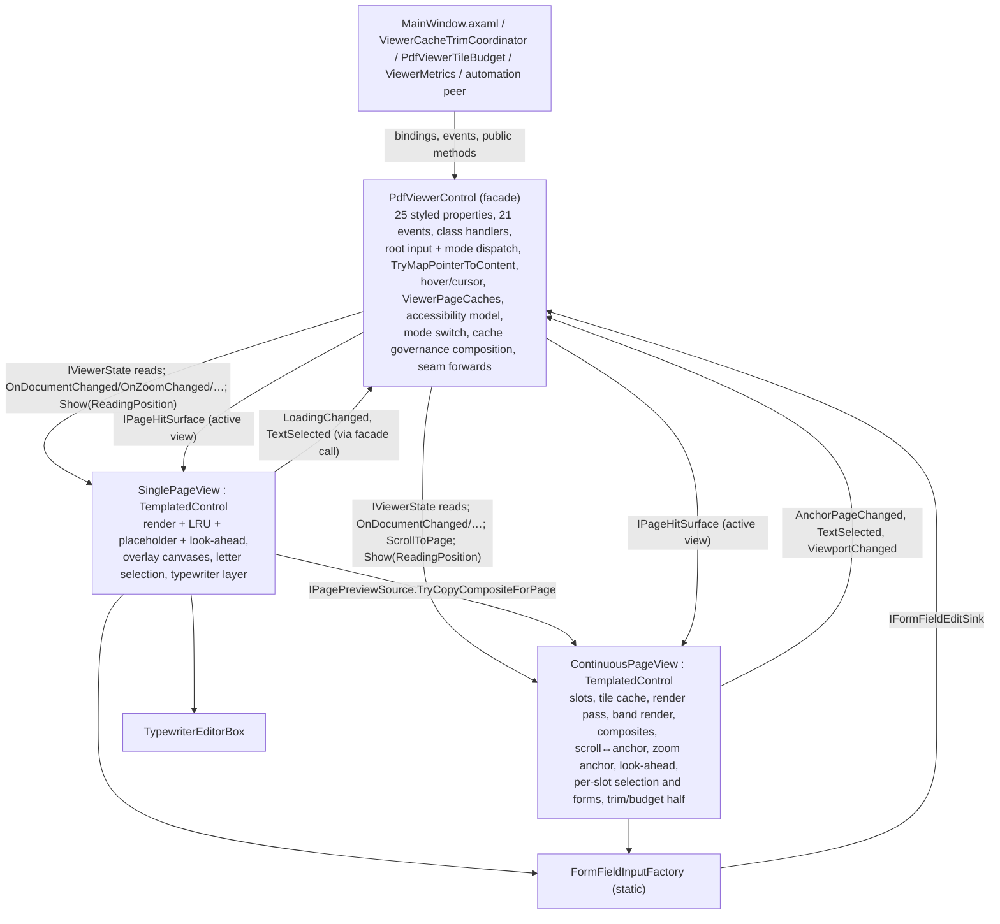

# PDF viewer control architecture (`avalonia`)

Target structure for `PdfViewerControl` and its partials in
`Excise.Avalonia/Controls/`, with the sequencing constraints an incremental,
behaviour-preserving split must respect. Written for #1842, following the
shape of [`main-window-architecture.md`](main-window-architecture.md) (#1500).

## Authority and scope

[`README.md`](README.md) requires a new architecture document to carry an
authority the existing files do not. This one does: **member-level target
design for the reusable viewer, component `avalonia`** (workflows `open-view`,
`redact-save`, `edit-save`), which unit owns which state, what each unit
exposes, and how the units communicate. `system-design.md` stops at
"`PdfViewerControl` schedules renders; `SinglePageRenderLifetime` owns the
active generation" and "`PdfViewerControl.Continuous` owns grid keys,
scheduling, coalescing, and a 200 MiB tile LRU" (`system-design.md:120-121`);
this document says what the two pipelines become as units, what stays on the
facade, and in what order the moves are safe.

Two things this document is not:

- It is not a status record. `architecture/assessment.json` owns the
  `avalonia` component's status and its open gap ("`PdfViewerControl` remains
  a large partial-class family ... continuous scheduling, layout, interaction,
  and accessibility boundaries still need measured decomposition",
  `assessment.json:255`).
- It is not a task list. §5 states the ordering constraints the design
  imposes; step tracking lives in #1842 and its sub-issues.

Every number here was **measured 2026-09-28 at develop `c3a7f83f`** by reading
the code; nothing was built or run. The method-cycle figure quoted in #1842 is
from `architecture/generated/code-topology.json` at `34f452f8` (two commits
earlier; no viewer file changed between the two). Line references are
`file:line` at `c3a7f83f`, with `PdfViewerControl.` dropped from partial file
names (`Continuous.cs:1204` means
`Excise.Avalonia/Controls/PdfViewerControl.Continuous.cs:1204`; `cs` alone
means `PdfViewerControl.axaml.cs`). They will drift; re-derive before acting
on one.

Facts a reader must know before the inventory:

- **`PdfViewerControl*` is a performance-sensitive path** by declaration
  (`scripts/check-gate-asymmetry.sh:122`, `PERF_PATHS`). Any commit range
  that touches these files and also rewrites a numeric test expectation fails
  the gate; the discipline is two commits, expectation first. §4 marks which
  steps this bites.
- **The 114-member "mutually recursive method group" is a tool measurement,
  not a call cycle.** §1.7 reconciles it: the invocation-only strongly
  connected component is 7 members, all inside the continuous render pipeline;
  the coupling that actually prevents a split is a shared-state star on six
  facade properties plus a short list of genuine cross-pipeline calls.
- **Two other pieces of work touch this control.** #1614 (byte-bounded
  single-page cache) is open and lands in `SinglePageRenderLifetime`, the
  `SinglePageCacheCapacity` setter and `GetRenderDiagnostics()`; #1926
  (viewer-owned page memory through `ICustomDrawOperation`) is deferred and
  would replace the single-page paint surface. §4.3 says where this design's
  seams help or hinder each.
- The product owner's framing (#1500, adopted by #1842): a large file is not
  the defect; the split "moves code without deleting it". Units below are
  judged by one responsibility per unit, one owner per piece of state, and
  testability of a pipeline without constructing both. No line-count target
  appears anywhere in this document.

### Drift since the 2026-09-25 review

#1842's seams cite line numbers from develop `4a5557ba`. Fourteen commits have
touched `Excise.Avalonia/Controls/` since (forms sizing #1897/#1898, save
reload #1876, cache-capacity #1887, a11y role classification, `PdfPageRect`
boundary #1836). Re-verified at `c3a7f83f`:

| #1842 citation | Now | Note |
|---|---|---|
| `PdfViewerControl.axaml.cs:1884-2185` (single-page render) | the `Rendering` region `cs:1782-2253`; `RenderCurrentPageAsync` is `cs:1952-2123`, the pure plan helpers `cs:2125-2216`, `InvalidatePageCache`/`ClearDisplay` `cs:2219-2251` | moved by the #1897/#1898 form-field additions above it |
| `PdfViewerControl.axaml.cs:981-1226` (`FormFieldInputFactory`) | `cs:991-1289`: `BuildFormFieldInput` `cs:996-1012`, the three `Create*FieldInput` `cs:1041-1182`, chrome `cs:1190-1259`, `CommitFieldEdit` `cs:1265-1289` | grew by the #1897 checkbox-styled and #1898 multiline rules |
| `PdfViewerControl.Typewriter.cs:103-373` (`TypewriterEditorBox`) | unchanged: `CreateTypewriterEditor` `Typewriter.cs:103-266`, move `268-317`, resize `319-373` | — |
| `SinglePagePlaceholder.cs:53` (cross-pipeline read) | unchanged: `TryCopyContinuousCompositeForPage(...)` call at `SinglePagePlaceholder.cs:53`, body `97-140` reads `_continuousSlots`, `slot.Bitmap`, `slot.CompositeKey`, `ContinuousRenderDpi` | — |
| "23 `FindControl<T>("name")` lookups" | confirmed 23: 19 in `cs` (10 in `InitializeComponent` `cs:1311-1320`, 9 in overlay methods `cs:797, 918, 964, 2311, 2334, 2343, 2367, 2376, 2399`), 2 in `Continuous.cs:337-338`, 2 in `Interaction.cs:998, 1036` | — |
| "21 partials, ~10.5k lines" | 17 `.cs` partials + `.axaml`, 10,115 lines (`wc -l`) | the review counted the seven sibling types in the folder |

## 1. Current state inventory

### 1.1 Files

| File | Lines | Role today |
|---|---:|---|
| `PdfViewerControl.axaml` | 216 | one `UserControl` template: the single-page `ScrollViewer`/`ZoomHost`/`Image` with nine overlay canvases, the continuous `ScrollViewer`/`ItemsControl` with its `PdfPageSlot` `DataTemplate`, the progress bar, two overlays. Every part is `Name=`, not `x:Name=` |
| `PdfViewerControl.axaml.cs` | 2,405 | 25 styled properties, 21 events, class handlers, root input registration, the form-field input factory, single-page render/cache/plan, single-page overlay drawing (annotations, hidden text, search, redaction), keyboard, automation properties, zoom transform, loading/error state |
| `.Continuous.cs` | 2,373 | the continuous pipeline: slots, tile cache, render pass, band render, composite, scroll↔page sync, zoom anchor, view-mode switch (**both directions**), `PdfPageSlot` |
| `.Interaction.cs` | 1,344 | root pointer handlers and mode dispatch for both views, the one pointer→content mapping, link/annotation/sticky-note hit-tests and caches, single-page letter selection, temporary drawings, freehand and vertex path capture |
| `.LookAhead.cs` | 694 | render-ahead (#1564), one half per view; the single-page render spec and options |
| `.Typewriter.cs` | 518 | typewriter layer, editor box with move/resize, focus chrome (#1648), DIP↔PDF mapping helpers |
| `.Types.cs` | 433 | 20 event-args classes, `PdfViewMode`, `PathCaptureKind`, `InteractionMode` |
| `.Accessibility.cs` | 407 | structure-tree model, `/Alt`/`/ActualText` carriers, role nodes, keyboard structure navigation (#631) |
| `.ContinuousSelection.cs` | 335 | per-slot text selection incl. cross-page (#815, #832), `PdfSelectionHighlight` |
| `.Diagnostics.cs` | 287 | viewport/render diagnostics structs, scroll-by/fraction, metrics mirrors (#1491), composite-overlap measurement (#1479) |
| `.CacheLimits.cs` | 240 | host-adjustable budgets: tile bytes, shared tile budget, single-page capacity, render concurrency |
| `.CacheTrim.cs` | 226 | `TrimCaches(level)` over both caches (#1478), `PdfViewerCacheTrimLevel`, `CacheTrimResult` |
| `.ContinuousGrid.cs` | 161 | pure grid math: `RequiredTileCells`, `CellKey`, `CellToRequest` (#848) |
| `.ContinuousForms.cs` | 159 | per-slot AcroForm inputs (#1807), field ordering and signature |
| `.SinglePagePlaceholder.cs` | 147 | single-page placeholder copied from the continuous composite (#1473) |
| `.WheelPan.cs` | 98 | Ctrl+wheel zoom and middle-button pan over whichever `ScrollViewer` is active (#827) |
| `.SelectAll.cs` | 51 | `SelectAllText` for both views (#1814) |
| `.Trace.cs` | 21 | `EXCISE_TRACE_VIEWER=1` tracing |

Already-extracted owners the partials delegate to (all `internal`, all in the
same folder): `SinglePageRenderLifetime<TBitmap>` (render generation and the
6-entry `(page, dpi)` LRU, `cs:561`), `PdfViewerTileBudget` (public; the
shared tile budget, attached at `CacheLimits.cs:45-58`),
`DecodedImageSampleRetention` (#1492, `Continuous.cs:72`),
`BoundedPageCache<T>` (#1485, `ContinuousSelection.cs:49`),
`ContinuousReadingAnchor`/`ReadingAnchor`/`SlotBox` (#846 reading-position
math, `Continuous.cs:761, 912`), `ViewerMetrics` (per-viewer gauges,
`cs:589`), `PdfViewerAutomationPeer` (`Excise.Avalonia/Automation/`),
`SkiaInterop` (`Excise.Avalonia/Imaging/`). The target units wrap these; they
do not replace them.

Composition today: the control is a `UserControl` whose template is declared
inline in its own `.axaml` and loaded by a hand-written private
`InitializeComponent()` (`cs:1306-1418`) that also does the 10 `FindControl`
lookups, registers the nine root input handlers and subscribes the viewport
observable. The XAML compiler additionally generates a public
`InitializeComponent(bool loadXaml = true)`, which appears in the public-API
baseline (`Excise.Avalonia.Tests/PublicApi/Excise.Avalonia.approved.txt:198`)
and is never called. `Excise.App` places exactly one instance,
`x:Name="PdfViewerControl"` (`MainWindow.axaml:1721`), with 22 property
bindings and 20 event attributes (`MainWindow.axaml:1722-1763`); the 21st
event, `VisibleViewportChanged`, is subscribed in code-behind
(`MainWindow.axaml.cs:725`).

### 1.2 Cross-cutting state and its readers

The state below is declared in one partial and read or written from others.
This is the coupling a split must untangle; each row is a piece of state that
today has a declaring file but no owning unit.

| State | Declared | Written by | Read by |
|---|---|---|---|
| `Document` (styled) | `cs:36` | host binding; `OnDocumentChanged` `cs:1784` reacts | every partial: Continuous (`RebuildContinuous` `:498`, `RenderVisibleContinuousTilesNowCore` `:1232`, `RenderContinuousCellsAsync` `:1377`, `RecomposeSlotCore` `:1856`, image-sample identity `:631, 648`), Interaction (`TryMapPointerToContent` `:529`, `EnsurePageLettersLoaded` `:426`, `GetPageAnnotations` `:795`), ContinuousSelection (`:67, 105`), ContinuousForms (`:47`), LookAhead (`:173, 527`, anchors `:114, 477`), Typewriter (`:88, 443, 454, 479, 491`), Accessibility (`:88, 246`), SinglePagePlaceholder (via slots), CacheTrim (via samples) |
| `CurrentPage` (styled, 1-based) | `cs:48` | host binding; `OnContinuousScrolled` `Continuous.cs:1124` (scroll→page, under `_syncingPageFromScroll`); `OnViewerKeyDown` `cs:1539, 1546`; `NextPage`/`PreviousPage` `cs:2260-2277`; `MoveToNextStructure` `Accessibility.cs:231` | `OnCurrentPageChanged` `cs:1838`; every single-page overlay (`RedrawAnnotationsLayer` `cs:944`, `RedrawFormFieldsLayer` `cs:978`, `RedrawTypewriterLayer` `Typewriter.cs:92`); selection (`Interaction.cs:427, 430, 953`); Continuous (`ContinuousIntraPageFraction` `:428`, `RebuildContinuous` `:543, 549`, `OnViewModeChanged` `:407`, `MostVisiblePage` `:1689, 1706`); LookAhead (both anchors); Accessibility (`:89, 172, 188`); `UpdateViewerAutomationProperties` `cs:1573` |
| `ZoomLevel` (styled) | `cs:60` | host binding; `ZoomIn/Out/ToActualSize` `cs:2282-2304`; `OnViewerPointerWheelChanged` `WheelPan.cs:41-44` | `UpdateZoomTransform` `cs:1706`; `OnZoomLevelChanged` `cs:1711`; `ContinuousRenderDpi` `Continuous.cs:218`; `ApplyContinuousSlotLayout` `:946`; slot layout, `RenderContinuousCellsAsync` `:1378`, `RecomposeSlotCore` `:1875, 1890`; ContinuousSelection (`:107, 121, 256, 302`); ContinuousForms (`:48, 56, 72, 90`); `ComputeSinglePageRenderSpec` `LookAhead.cs:433`; `TryCopyContinuousCompositeForPage` `SinglePagePlaceholder.cs:100-117` |
| `ViewMode` (styled) | `cs:103` | host two-way binding; the `InteractionMode` class handler forces `SinglePage` `cs:657-663` | `OnViewModeChanged` `Continuous.cs:375`; the branch in `OnDocumentChanged` `cs:1807`, `OnCurrentPageChanged` `cs:1842`, `OnZoomLevelChanged` `cs:1718`, `OnRenderVersionChanged` `cs:1915`, `OnPropertyChanged` `cs:898`; `GetVisibleViewportSize` `cs:1434`; `TryMapPointerToContent` `Interaction.cs:532`; `HitTestLinkForEvent` `:509`; pointer handlers (`:153, 262, 370`); `MostVisiblePage` `:1687`; `RefreshContinuousLayout` `:833`; `TakeKeepPagesOnScreenRequest` `:868`; `RefreshContinuousFormFieldsIfChanged` `ContinuousForms.cs:121`; `SelectAllText` `SelectAll.cs:22`; `ActiveScrollViewer` `WheelPan.cs:24`; `ActiveViewportScrollViewer` `Diagnostics.cs:279`; both look-ahead steps (`LookAhead.cs:170, 525`); `ContinuousDiagnostics` `:331` |
| `InteractionMode`, `PathCaptureKind` (styled) | `cs:72, 85` | host binding | class handler `cs:657-680`; `OnPropertyChanged` `cs:874-878`; pointer handlers throughout `Interaction.cs`; `UpdateHoverCursor` `:921`; `IsFormFieldOverlayEvent` `ContinuousForms.cs:149`; `CreateTypewriterEditor` `Typewriter.cs:119, 258` |
| `RenderVersion` (styled) | `cs:151` | host binding | `OnRenderVersionChanged` `cs:1897`; `NotifyAutomationPageTextChangedIfNeeded` `cs:1606`; `EnsureStructModel` `Accessibility.cs:247` |
| Five annotation flags `ShowAnnotations`, `ShowCommentAnnotations`, `ShowFieldAndLinkAnnotations`, `RevealHiddenAnnotations`, `HighlightFormFields` (styled) | `cs:183-243` | host binding | `OnPropertyChanged` `cs:884-907` (invalidates **both** caches); captured on the UI thread into the band render `Continuous.cs:1502-1506` and into `SinglePageRenderOptions` `LookAhead.cs:449-458` |
| `ReadingOrderStrategy`, `WhitespaceMode` (styled) | `cs:118, 136` | host two-way binding | `EnsurePageLettersLoaded` `Interaction.cs:432`; `GetContinuousPageLetters` `ContinuousSelection.cs:69`; `RaiseSinglePageTextSelected` `:406`; `EndContinuousTextSelection` `:233`; `OnReadingOrderStrategyChanged` `cs:1888` clears single-page letters **and** the continuous cache |
| `_currentSinglePageRenderDpi` | `cs:551` | `RenderCurrentPageAsync` `cs:1968-1976`; `ClearDisplay` `cs:2238` | `ViewerUnitsPerPoint` `cs:846`; `ToViewerDips` `cs:862`; `ViewerDipsRect` `cs:911`; `SinglePageDisplayScale` `cs:1701`; `TryMapPointerToContent` `Interaction.cs:560`; `HitTestLetterAt` `:959`; `PdfRectToViewerDips` `Typewriter.cs:498`; `NormalizeTypewriterDipRect` via `ViewerUnitsPerPoint` `:462-463` |
| `_pdfImage` (template part) | `cs:512` | `InitializeComponent` | the render publish `cs:2002-2016, 2078-2085`; `ClearDisplay` `cs:2244-2249`; `GetPressPoint` fallback `Interaction.cs:468`; `DrawSelectionRange` trace `:1007`; the "bitmap on screen" identity in `SinglePageCacheCapacity` `CacheLimits.cs:172`, `TrimCaches` `CacheTrim.cs:108`, look-ahead `LookAhead.cs:596`, and the render `cs:2072`; placeholder `SinglePagePlaceholder.cs:41-69` |
| `_scrollViewer` / `_continuousScrollViewer` (template parts) | `cs:518` / `Continuous.cs:30` | `InitializeComponent`, `InitializeContinuous` | visibility flip `Continuous.cs:387-388`; `GetVisibleViewportSize` `cs:1434-1444`; the two intra-page fractions `:425-443`; `ApplyPendingSingleFractionCore` `:472-492` (**single-page scroller written from the continuous partial**); `ActiveScrollViewer`/`ActiveViewportScrollViewer`; `ContinuousDiagnostics` |
| `_continuousSlots` | `Continuous.cs:32` | `RebuildContinuous` `:514`, `ClearContinuous` `:557` | the whole continuous pipeline; `TryMapPointerToContent` `Interaction.cs:534-540`; `TryContinuousPointToLetter` `ContinuousSelection.cs:106`; `AddContinuousPageHighlights` `:278`; `ClearContinuousSelectionHighlight` `:309`; `TryCopyContinuousCompositeForPage` `SinglePagePlaceholder.cs:99`; `MeasureContinuousBitmapOverlap` `Diagnostics.cs:228`; `ClearCompositesOutsideViewport` `CacheTrim.cs:175`; look-ahead anchors |
| `_continuousCache`, `_continuousInFlight`, `_continuousRequiredKeys`, `_continuousRenderGate`, `_continuousDocCts` | `Continuous.cs:55-81` | render pass and band render | `CacheLimits.cs` (budget, shared budget, concurrency), `CacheTrim.cs`, `Diagnostics.cs:164-168, 224, 260-261`, `LookAhead.cs` (`_continuousInFlight` `:255, 298`, `_continuousRequiredKeys` `:300, 378, 406`, `_continuousDocCts` `:174, 223`) |
| `_singlePageRenderLifetime` | `cs:561` | `RenderCurrentPageAsync`, `InvalidatePageCache`, `OnDocumentChanged`, detach | `SinglePageCacheCapacity` `CacheLimits.cs:167-173`; `TrimCaches` `CacheTrim.cs:109`; look-ahead `LookAhead.cs:509, 552, 597`; `Diagnostics.cs:142, 157, 265` |
| `_pageAnnotations` (per-page annotation cache, both modes) | `Interaction.cs:806` | `GetPageAnnotations` `:802`; cleared by `InvalidatePageCache` `cs:2233` and `InvalidateContinuousCache` `Continuous.cs:614` | `HitTestAnnotationForEvent`/`ForContextMenu`/`StickyNoteForEvent` `Interaction.cs:586, 616, 642` |
| `_currentPageLinks`/`_linksPageNumber` (single-page), `_continuousPageLinks` (continuous) | `cs:578-579`, `Continuous.cs:60` | `EnsurePageLinksLoaded` `Interaction.cs:479`; `GetContinuousPageLinks` `:873`; cleared by `OnDocumentChanged`/`OnCurrentPageChanged`/`OnRenderVersionChanged` and `InvalidateContinuousCache` `:611` | `HitTestLinkForEvent` `:509-511` |
| Single-page letters `_currentPageLetters`, `_readingOrderedLetters`, `_columnGapThreshold`, `_selectionAnchor`, `_selectionFocus`, `_lettersPageNumber` | `cs:567-572` | `EnsurePageLettersLoaded` `Interaction.cs:424`; cleared at `cs:1794-1796, 1857-1861, 1890-1893, 1904-1908`; set by pointer handlers and `SelectAllText` | `GetAccessiblePageText` `cs:1638-1650` (**accessibility reads the selection cache**), `RaiseSinglePageTextSelected`, `HitTestLetterAt`, `DrawSelectionRange` |
| Continuous selection `_continuousSelectionPage/FocusPage/Anchor/Focus`, `_continuousPageLetterCache` | `ContinuousSelection.cs:39-50` | selection gestures; `SelectAllText` `SelectAll.cs:33-35`; cleared by `InvalidateContinuousCache` `Continuous.cs:620-623` | `ComputeContinuousSpanEndpoints`, `EndContinuousTextSelection` |
| `_isDragging`, `_dragStart`, `_stickyNoteDragCandidate` | `cs:523-536` | pointer handlers | pointer handlers, `UpdateHoverCursor` gating `Interaction.cs:211` |
| `_syncingPageFromScroll`, `_pendingContinuousPage`, `_pendingContinuousAttempts`, `_pendingContinuousFraction` | `Continuous.cs:272-291` | `OnContinuousScrolled` `:1123-1125`; `ScrollToPageContinuous` `:961, 970, 998, 1003`; `RetryPendingContinuousScroll`; `InvalidateContinuousCache` `:588` | `OnCurrentPageChanged` `cs:1844, 1877`; `OnContinuousScrolled` `:1099`; `OnContinuousItemsLayoutUpdated` `:1164`; `MostVisiblePage` `:1705`; `ApplyContinuousZoom` `:759`; `RunContinuousLookAheadStep` `LookAhead.cs:178` |
| `_pendingSingleFraction`, `_pendingSingleFractionSub`, `_applyingSingleFraction` | `Continuous.cs:292-293, 453` | `OnViewModeChanged` `:417`; `ApplyPendingSingleFractionCore` | `RenderCurrentPageAsync` `cs:2011-2015, 2090-2091` (**the single-page render polls a field the continuous partial owns**) |
| `_pendingZoomAnchorPage/Fraction`, `_preserveReadingOnNextRebuild`, `_preservedReadingFraction` | `Continuous.cs:784-788` | `ApplyContinuousZoom` `:776-777`; `RebuildContinuous` `:538-544`; `PreserveContinuousReadingPositionOnNextRebuild` `:889-890` | `ApplyPendingZoomAnchor` `:903`; the extent subscription `:363`; `RunContinuousLookAheadStep` `LookAhead.cs:178` |
| `_continuousDetached` | `Continuous.cs:284` | ctor `cs:593` (false on attach), `OnDetachedFromVisualTreeHandler` `cs:697` (true) | every continuous entry point (`:1206, 1227, 1367, 1855`, `LookAhead.cs:156, 170`), `ReleaseImageSamplesOfUnrealizedPages` `:666`, `RenderContinuousCellsAsync` finally `:1596, 1607` |
| `_keepPagesOnScreenFor` (#1876) | `Continuous.cs:841` | `KeepPagesOnScreenUntilRendered` `:848` (public, from `MainWindow.axaml.cs:667`) | `TakeKeepPagesOnScreenRequest` `:862`, consumed in `OnDocumentChanged` `cs:1801` |
| `_focusedTypewriterId`, `_typewriterChrome` | `Typewriter.cs:39, 47` | `FocusTypewriterBox`, `ClearTypewriterFocus` (from the class handler `cs:677`), editor focus events | `CreateTypewriterEditor` `:120` |
| `_watchedHighlights`, `_watchedTypewriterTextOperations` | `cs:730-731` | the two `On*Changed` handlers | — |
| Freehand/vertex capture `_freehandDips`, `_vertexDips`, temp shapes `_tempRedactionRect`, `_tempTypewriterRect`, `_tempFreehandPath`, `_tempVertexPath` | `Interaction.cs:1050, 1110-1111, 1235-1236`, `Typewriter.cs:23` | the draw/clear helpers | `ClearTemporaryDrawings` `Interaction.cs:1077-1099` (one method knows all four) |
| Metrics mirrors `_metricsContinuousTileBytes`, `_metricsContinuousCompositeBytes`, `MetricsViewerId` | `Diagnostics.cs:252-256` | `RefreshContinuousByteMirrors` `:271` (called from 9 continuous sites) | `ViewerMetrics` from the listener thread (`ViewerMetrics.cs:54-82`) |
| Test seams (`internal`, reached through `InternalsVisibleTo` for both test projects, `Excise.Avalonia.csproj:18, 46`) | throughout: `ContinuousCacheByteBudgetOverride` `Continuous.cs:113`, `ContinuousCompositeByteBoundOverride` `:169`, `RenderScalingOverride` `:269`, `ContinuousBandRenderStartingForTests` `:736`, `ContinuousImageSamplesForTests` `:730`, `RenderAheadEnabled` `LookAhead.cs:67`, `SinglePageLookAheadStartingForTests` `:501`, `SinglePageCacheContainsForTests` `:507`, counters `Continuous.cs:295-309`, `LookAhead.cs:136-148, 491-504`, `CacheTrim.cs:68-71, 202-206`, `Diagnostics.cs:138-148, 219`, `SinglePagePlaceholder.cs:28-33`, `GlyphRectToViewerDipsForTest` `Interaction.cs:980` | tests | ~60 names, see §1.6 |

### 1.3 `PdfViewerControl.axaml.cs` members by responsibility

Callers column: **X** = `MainWindow.axaml` binding or event attribute, **V** =
`MainWindow.axaml.cs` code-behind, **A** = other `Excise.App` code
(`ViewerCacheTrimCoordinator`, `Automation/*`), **P** = another partial,
**T** = tests, **R** = `tests/gui-interaction-registry.json` (t0 gate),
**M** = `ViewerMetrics`/`PdfViewerTileBudget`/`PdfViewerAutomationPeer`
(sibling types in `Excise.Avalonia`).

**Styled properties and events (the public contract)**

| Member (line) | What it does | Pipeline | Callers |
|---|---|---|---|
| `Document` (36-43) | the document; class handler → `OnDocumentChanged` | both | X, V (`:1186-1196`), A (`ViewerCacheTrimCoordinator.cs:191`), T |
| `CurrentPage` (48-55) | 1-based page; **the scroll anchor in continuous view, not the most-visible page** (`Continuous.cs:1109-1115`) | both | X, V, A, P (see §1.2), T |
| `ZoomLevel` (60-67) | zoom; class handler → `OnZoomLevelChanged` | both | X, A, P, T |
| `InteractionMode` (72-79), `PathCaptureKind` (85-92) | what a drag does; class handler forces `SinglePage` for editing modes, sweeps empty typewriter boxes, clears typewriter focus, redraws (657-680) | both (dispatch), single-page (editing) | X, P |
| `ViewMode` (103-110) | single-page or continuous; class handler → `OnViewModeChanged` (`Continuous.cs:375`) | both | X (two-way), A, P, T |
| `ReadingOrderStrategy` (118-126), `WhitespaceMode` (136-144) | copy/selection preferences (#774) | both selections | X (two-way), P |
| `RenderVersion` (151-158) | host content-version counter; class handler → `OnRenderVersionChanged` | both | X, A, P |
| `IsLoading` (163-170, private set), `HasError` (248-255), `ErrorMessage` (260-267) | single-page render state; class handlers drive the progress bar and error overlay | single-page | A (`IsLoadingProperty` is an activity property, `ViewerCacheTrimCoordinator.cs:194`), T (`SinglePageViewerWaits.cs:39`) |
| `ShowAnnotations` (183-190), `ShowCommentAnnotations` (197-204), `ShowFieldAndLinkAnnotations` (210-217), `RevealHiddenAnnotations` (223-230), `HighlightFormFields` (236-243) | render options; `OnPropertyChanged` (884-907) invalidates both caches and, in continuous view, drops the hidden single-page bitmap (#1473) | both | X, P |
| `Annotations` (273-280) | current page's annotations for the single-page `AnnotationsLayer`; set by `RefreshPageAnnotations` (1934) **and** by the host (`MainWindow.axaml.cs:1191-1196`) | single-page | V, P |
| `FormFields` (288-295) | current page's fields for the single-page `FormFieldsLayer`; the class handler also calls `RefreshContinuousFormFieldsIfChanged` (623-627) | both | X, P |
| `PageFormFieldsProvider` (332-339) | any page's fields, for the continuous slots (#1807) | continuous | X, P |
| `FormFieldEditGate` (347-354) | pre-store permission check (#1874) | both (via `CommitFieldEdit`) | X, P |
| `ContextMenuPageNumber` (304-311), `ContextMenuAnnotation` (317-324) | right-click context (#1817, #1815); set in the press handler, cleared posted on menu close (1420-1425) | both | X (`OneWayToSource`), P |
| `HiddenTextHighlights` (361-368), `TypewriterTextOperations` (370-377) | host collections; `INotifyCollectionChanged` is re-subscribed per value (733-793) | single-page | X, P |
| 20 events (386-505) + `VisibleViewportChanged` (1449) | the host contract; raised from Interaction, Typewriter, ContinuousSelection, `CommitFieldEdit`, `OnCurrentPageChanged` | both | X (20 attributes), V (`VisibleViewportChanged`, `:725`) |

**Construction, class handlers, lifetime**

| Member (line) | What it does | State | Callers |
|---|---|---|---|
| fields (511-581) | see §1.2 | — | P |
| ctor (585-594) | `InitializeComponent`, `new SkiaRenderer()`, `ViewerMetrics.Register(this)`, `Focusable`, automation props, detach/attach hooks | `_renderer`, `MetricsViewerId` | `MainWindow.axaml`, T |
| static ctor (607-681) | **all** property class handlers, registered once per process (the comment at 596-606 records the N-fold duplicate-handler defect a per-instance registration caused) | — | Avalonia |
| `OnDetachedFromVisualTreeHandler` (683-717) | cancels the single-page render and look-ahead, sets `_continuousDetached`, disposes the four scroll subscriptions, unhooks the three `ItemsControl` events, cancels cell renders | both | Avalonia |
| `IsEditingMode` (727-728) | Redaction/FormAuthoring/Typewriter force single-page; TextSelection deliberately does not (#815) | — | class handler |
| `OnHiddenTextHighlightsChanged` (733-750), `OnHighlightsCollectionChanged` (752-753), `OnTypewriterTextOperationsChanged` (755-772), `OnTypewriterTextOperationsCollectionChanged` (774-793) | collection re-subscription; the typewriter one also sweeps empty boxes on Add (#1648) | `_watched*` | class handlers |
| `OnPropertyChanged` (870-908) | cancels a vertex path on mode/kind change; annotation flag toggle → invalidate both caches, re-render or clear the hidden Image | both | Avalonia |
| `InitializeComponent` (1306-1418) | XAML load, 10 `FindControl`, zoom transform, **nine `AddHandler` registrations** (1349-1394: press/move/release Bubble+handledEventsToo, exited Direct, key Tunnel+Bubble, wheel/pan Tunnel), viewport observable (1412-1414), `InitializeContinuous()` | template parts | ctor; **R** (the registry generator keys its nine `mouse` rows on `PdfViewerControl.axaml.cs:<Event>`, `scripts/build-gui-interaction-registry.py:129-131`) |
| `OnContextMenuClosed` (1420-1425) | posted clear of the context-menu properties | — | class handler |

**Viewport and keyboard**

| Member (line) | What it does | Pipeline | Callers |
|---|---|---|---|
| `GetVisibleViewportSize` (1432-1446) | the active scroller's `Viewport` | both | V (`:579`), P |
| `OnScrollViewerViewportChanged` (1457-1464), `ReportActiveViewport` (1466-1473), `_lastReportedViewport` (1451), subscriptions (1452-1455) | debounced `VisibleViewportChanged` | both | `InitializeComponent`, `OnContinuousViewportChanged` (`Continuous.cs:371`), `OnViewModeChanged` |
| `OnViewerKeyDown` (1475-1564) | vertex-path keys first; Ctrl+/−/0 zoom; PageUp/Down/arrows/Home/End; `H`/Shift+H structure navigation (#631); skips `TextBox`/`ComboBox` sources | both | AddHandler; **R** |
| `IsKeyboardEditingSource` (1566-1567) | — | — | above |

**Automation and accessible text**

| Member (line) | What it does | Pipeline | Callers |
|---|---|---|---|
| `UpdateViewerAutomationProperties` (1569-1584) | Name/ItemStatus/HelpText; calls `NotifyAutomationPageTextChangedIfNeeded` | both | ctor, zoom, page, document, view-mode changes |
| `OnCreateAutomationPeer` (1591-1592) | `PdfViewerAutomationPeer` | — | Avalonia |
| `NotifyAutomationPageTextChangedIfNeeded` (1602-1617), `_announced*` (1598-1600) | raise a Name change on the synthetic text peer only when page/document/content changed | — | above, `OnRenderVersionChanged` |
| `GetAccessiblePageText` (1633-1654), `_accessibleTextSource/Cache` (1623-1624) | reading-order page text from the **single-page letter cache** (`EnsurePageLettersLoaded`) | single-page cache used for both modes | **M** (peer via `Accessibility.cs`), `FilterActualTextsAlreadyInPageText`, `GetAccessibleReadingOrderText`, T |
| `BuildViewerAutomationHelpText` (1656-1666), `ExtractCurrentPageTextPreview` (1668-1686), `ViewModeDescription` (1688-1689) | help text with a 500-char page preview (`Document.GetPage(CurrentPage).Text`) | — | above |

**Single-page zoom transform, loading and error chrome**

| Member (line) | What it does | Callers |
|---|---|---|
| `SinglePageDisplayScale` (1700-1701), `UpdateZoomTransform` (1703-1709) | `ZoomHost` scale = `ZoomLevel × 96/logicalDpi` so both views display `pt × 96/72 × zoom` (#693) | `InitializeComponent`, `OnZoomLevelChanged`, `RenderCurrentPageAsync` (1975), `ClearDisplay` (2243) |
| `OnZoomLevelChanged` (1711-1732) | transform, then `ApplyContinuousZoom()` or `RenderCurrentPageAsync()` by view mode | class handler |
| `OnLoadingStateChanged` (1734-1755) | progress bar visible **and** indeterminate follow `IsLoading` (#1462 idle-CPU) | class handler |
| `OnErrorStateChanged` (1760-1772), `OnErrorMessageChanged` (1774-1780), `ErrorOverlayBrush` (1757) | error overlay hit-test only while shown | class handlers |

**Document / page / version reactions (the fan-out hub)**

| Member (line) | What it does | Pipeline | Callers |
|---|---|---|---|
| `OnDocumentChanged` (1784-1836, `async void`) | drop single-page cache, letters, links, selection; `TakeKeepPagesOnScreenRequest`; `InvalidateContinuousCache(keep)`; then by mode: continuous → `RenderVisibleContinuousTiles()` or `RebuildContinuous()` + `ClearDisplay()` (#1473), single → `RenderCurrentPageAsync()`; null → clear both | **both** | class handler |
| `OnCurrentPageChanged` (1838-1880, `async void`) | continuous: `ScrollToPageContinuous` unless scroll-driven, raise `PageChanged`, return; single-page: drop letters/links/selection, `RefreshPageAnnotations`, `RedrawTypewriterLayer`, `await RenderCurrentPageAsync()`, raise `PageChanged`. **Correction (#1842 step 0): lines 1874-1878 ARE reachable** — if `ViewMode` switches to `Continuous` while the single-page branch's `await RenderCurrentPageAsync()` is in flight, execution resumes past the initial check and this trailing block runs, discarding the reading fraction a concurrent mode switch was carrying (proven by a planted-failure test; see #1931) | both | class handler |
| `OnReadingOrderStrategyChanged` (1888-1895) | drop single-page ordering **and** `InvalidateContinuousCache()` | both | class handler |
| `OnRenderVersionChanged` (1897-1932) | `InvalidatePageCache` + `InvalidateContinuousCache` + letters/links/selection; by mode `RebuildContinuous`+`RenderVisibleContinuousTiles`+`ClearDisplay` or `RenderCurrentPageAsync`; automation notify | both | class handler |
| `RefreshPageAnnotations` (1934-1950) | `Annotations = page.GetAnnotations()` for the single-page layer | single-page | document/page/version handlers |

**Single-page render and cache**

| Member (line) | What it does | State | Callers |
|---|---|---|---|
| `RenderCurrentPageAsync` (1952-2123) | plan (`ComputeSinglePageRenderSpec`), sync `_currentSinglePageRenderDpi`+transform, `JoinOrCancelSinglePageLookAheadAsync`, cache hit → publish + `ReleaseSinglePagePlaceholder` + pending fraction; else lease, placeholder, `Task.Run(_renderer.RenderPage)`, `SkiaInterop.ToAvaloniaBitmap`, `Add(..., keep: shown)`, publish, pending fraction, error/finally, `ScheduleSinglePageLookAhead` | `_singlePageRenderLifetime`, `_pdfImage`, `IsLoading`, `HasError`, `_singlePagePublishCount`, `_pendingSingleFraction` (read) | document/page/zoom/version/view-mode/flag handlers |
| `EffectiveSinglePageRenderDpi` (2125-2140), `SinglePageRenderPlan` (2185-2193), `SinglePageLayoutSize` (2202-2204), `MaxSinglePageRenderScale` (2210-2216) | pure plan math (#682, #683, #1487, #1489, #697) | consts 545-550 | `ComputeSinglePageRenderSpec` (`LookAhead.cs:428`), placeholder, T (`SinglePageRenderPlanTests`, `SinglePageLayoutGeometryTests`) |
| `InvalidatePageCache` (2219-2234, public) | `InvalidateSinglePageLookAhead`, drop the LRU, **clear `_pageAnnotations` for both modes** (#1794) | single-page cache, shared annotation cache | `OnDocumentChanged`, `OnRenderVersionChanged`, `OnPropertyChanged` (900) |
| `ClearDisplay` (2236-2251) | reset logical DPI + transform, drop `Image.Source`, release placeholder | `_pdfImage` | document/version/flag handlers in continuous view |

**Single-page overlays (host-driven, single-page canvases only)**

| Member (line) | What it does | Callers |
|---|---|---|
| `ViewerUnitsPerPoint` (846), `ToAvaloniaRect` (848), `ToViewerDips` (851-863), `ViewerDipsRect` (910), `ContentRect` (913) | the single-page DIP mapping through `PdfCoordinateMapper` at `_currentSinglePageRenderDpi` | every single-page overlay and gesture |
| `RedrawHiddenTextOverlays` (795-842) | `HiddenTextRevealLayer` rectangles + labels | collection handlers |
| `RedrawAnnotationsLayer` (916-960), `AnnotationColors` (1291-1304) | `AnnotationsLayer` tinted rects; skips `/Text` (#1797) | `Annotations` class handler |
| `RedrawFormFieldsLayer` (962-989) | `FormFieldsLayer` inputs via `BuildFormFieldInput` in tab order | `FormFields` class handler |
| `AddSearchHighlight` (2309-2327), `ClearSearchHighlights` (2332-2336), `AddPendingRedaction` (2341-2360), `ClearPendingRedactions` (2365-2369), `AddAppliedRedaction` (2374-2392), `ClearAppliedRedactions` (2397-2401) (public) | draw on `SearchHighlightsLayer`/`PendingRedactionsLayer`/`AppliedRedactionsLayer`, which live inside the single-page `PdfScrollViewer` and are **not shown in continuous view** | V (`MainWindow.axaml.cs:1167-1222`), T (`SearchHighlightOverlayTests`) |
| `NextPage`, `PreviousPage`, `ZoomIn`, `ZoomOut`, `ZoomToActualSize` (2260-2304, public) | navigation and zoom steps (clamped 0.1–5.0) | keyboard, wheel, A (`ZoomIn/Out` once each), T |

**The form-field input factory (shared by both views)**

| Member (line) | What it does | Callers |
|---|---|---|
| `BuildFormFieldInput` (996-1012) | field → `TextBox`/`ComboBox`/`CheckBox`, sized, with chrome; "the one place a field becomes an input control" | `RedrawFormFieldsLayer` (982), `SyncContinuousSlotFormFields` (`ContinuousForms.cs:80`) |
| `CreateTextFieldInput` (1041-1107), `CreateChoiceFieldInput` (1113-1138), `CreateButtonFieldInput` (1140-1182), consts (1022-1036), `LayerUnitsPerPoint` (1038), `EscapedLabelTemplate` (1110) | input construction incl. #1897 checkbox-styled, #1898 multiline font, #1660 commit-on-change-only, #1446 escaped options | `BuildFormFieldInput` |
| `ApplyFormFieldChrome` (1193-1217), `FieldOverlayBrushes` (1219), `ColorOf` (1227), `WithAlpha` (1230), `SetFormFieldChrome` (1232-1259), `RestingTintAlpha/BorderAlpha` (1190-1191) | tab index, min size, tooltip (#1205), resting/hover/focus chrome | `BuildFormFieldInput` |
| `CommitFieldEdit` (1265-1289) | no-op skip, `FormFieldEditGate`, `field.SetValue`, `FormFieldEditRejected` on `ArgumentException` (#1671), `FormFieldEdited` with `field.PageNumber ?? CurrentPage` (#1807) | the three input factories |

### 1.4 Partial-class members

Line numbers are within the named partial.

**`Continuous.cs`** — the continuous pipeline plus, misplaced, the view-mode
switch and the single-page reading-position carry.

| Member (line) | Kind | Does | State | Callers |
|---|---|---|---|---|
| fields (30-82), constants (85-215), `ContinuousRenderDpi` (217-218), `EffectiveContinuousDpi` (247-254), `EffectiveRenderScaling` (260-261), `RenderScalingOverride` (269) | state | tile LRU, in-flight/required key sets, document CTS, image-sample retention, render gate; byte budget (200 MiB) and composite bound (138 MiB) with test overrides; grid constants; DPI model (#1480, #1472) | own | P, T (`ContinuousCacheMemoryTests`, `ContinuousDpiTests`) |
| counters (295-309), `ContinuousDiagnostics` (317-333) | seams | #855 CI legibility | own | T (`ContinuousDiagnostics` in 5 files, `ContinuousInFlightCount` in 10) |
| `InitializeContinuous` (335-367) | private | 2 `FindControl`, three `ItemsControl` events, offset/viewport/extent subscriptions (extent re-posts `ApplyPendingZoomAnchor`, #700) | template parts | `InitializeComponent` |
| `OnContinuousViewportChanged` (369-373) | private | report + render pass | — | subscription |
| `OnViewModeChanged` (375-422) | private | **the mode switch**: capture the outgoing view's intra-page fraction (425-443), flip the two scrollers' `IsVisible`, cancel the other view's look-ahead, then continuous → `RebuildContinuous` + posted `ScrollToPageContinuous(CurrentPage, fraction)`; single → `_pendingSingleFraction = fraction` + `RenderCurrentPageAsync()`; automation props | both scrollers, both look-aheads | `ViewMode` class handler |
| `ContinuousIntraPageFraction` (425-434), `SingleIntraPageFraction` (437-443) | private | fraction of the current page above the viewport top, per view | both scrollers | `OnViewModeChanged`, `PreserveContinuousReadingPositionOnNextRebuild` |
| `ApplyPendingSingleFraction` (455-470), `ApplyPendingSingleFractionCore` (472-492), `_applyingSingleFraction` (453) | private | wait on the **single-page** scroller's `Extent` and apply the carried fraction (#693) | `_scrollViewer`, `_pendingSingleFraction` | `RenderCurrentPageAsync` (`cs:2014, 2091`) |
| `RebuildContinuous` (495-551) | private | slots from the document, release outgoing composites (#1466), re-assert `CurrentPage` (navigation-before-document race) or restore the #846 anchor | `_continuousSlots`, `_pendingZoomAnchor*` | `OnDocumentChanged`, `OnRenderVersionChanged`, `OnViewModeChanged`, `RefreshContinuousLayout` |
| `ClearContinuous` (553-559), `ReleaseSlotComposites` (563-567) | private | drop slots | — | `OnDocumentChanged`, `RebuildContinuous` |
| `CancelContinuousCellRenders` (572-582) | private | new document generation; clear in-flight/required; cancel look-ahead | CTS, sets | detach, `InvalidateContinuousCache` |
| `InvalidateContinuousCache` (584-636) | private | cancel, drop composites (or mark stale for #1876), dispose tiles (#1467), clear links/annotations/selection caches, reset image samples on document identity change | most continuous state + `_pageAnnotations`, `_lastHoveredAnnotation` | document/version/strategy/flag handlers, `RefreshContinuousLayout` |
| `RecordContinuousImageSamples` (643-656), `ReleaseImageSamplesOfUnrealizedPages` (664-691), `ReleaseContinuousImageSamples` (698-712), `ContinuousImageSampleKeepPages` (720-727) | private/static | #1492 sample retention keyed by realized/in-flight/look-ahead pages | `_continuousImageSamples` | band render, render pass, `RecomposeSlotCore`, `TrimCaches`, look-ahead |
| `ApplyContinuousZoom` (743-782) | private | capture reading anchor, re-layout slots, restore through the extent-settle loop (#700), render pass | anchors | `OnZoomLevelChanged` |
| `RefreshContinuousLayout` (831-839, public) | public | structural mutation (#917/#1651): invalidate + rebuild + render | — | V (`:674`) |
| `KeepPagesOnScreenUntilRendered` (848-849, public), `TakeKeepPagesOnScreenRequest` (862-879) | public/private | #1876 save-reload keeps composites | `_keepPagesOnScreenFor` | V (`:667`), `OnDocumentChanged` |
| `PreserveContinuousReadingPositionOnNextRebuild` (881-891, public) | public | #846 snapshot before a structural mutation | `_preserved*` | V (`:661`) |
| `SlotBoxes` (894-900), `ApplyPendingZoomAnchor` (903-930), `ExtentReflectsSlots` (933-939), `ApplyContinuousSlotLayout` (941-949) | private | anchor resolution through `ContinuousReadingAnchor`; slot layout | slots, scroller | zoom, rebuild, extent subscription |
| `ScrollToPageContinuous` (953, 958-1005), `RetryPendingContinuousScroll` (1014-1063), `ReachedContinuousTarget` (1065-1088), `MaxPendingContinuousScrollAttempts` (1012) | private | programmatic navigation with the pending-page latch and bounded retry (the extent-0 clamp defect) | `_pendingContinuous*` | `OnCurrentPageChanged`, `RebuildContinuous`, `OnViewModeChanged` |
| `OnContinuousScrolled` (1090-1129) | private | derive the anchor page from the offset (`FindTopVisibleContinuousPage`), write `CurrentPage` under `_syncingPageFromScroll`, render pass; skipped while a navigation is pending | `CurrentPage` (writes) | offset subscription |
| `OnContinuousItemsLayoutUpdated` (1158-1178), `_recomposeFromCacheOnLayout` (1134), `RecomposeFromCacheOnLayoutPending` (1181) | private | same-frame recomposite after a scroll (#1564 one-frame-late fix) | — | `LayoutUpdated` |
| `OnContinuousContainerPrepared` (1183-1187), `OnContinuousContainerClearing` (1189-1202) | private | realization → render pass (clearing cannot read the slot; the pass enforces #1466) | — | `ItemsControl` |
| `RenderVisibleContinuousTiles` (1204-1215), `RenderVisibleContinuousTilesNow` (1217-1223), `RenderVisibleContinuousTilesNowCore` (1225-1331) | private | **the render pass**: per realized slot sync form fields, compute required cells and keys, `OnContinuousRequiredKeysChanged`, enforce composite-only-when-realized, release samples, schedule missing cells as one batch, `RecomposeSlot`, then `MaybeScheduleContinuousLookAhead` | required keys, composites, form fields | scroll, viewport, realization, document/version, zoom, look-ahead finish |
| `RenderContinuousCellsAsync` (1363-1610) | private async | **the band render**: claim keys, bounding band, `CellToRequest` clip, gate wait, stale-drop, capture the five flags on the UI thread, `Task.Run(new SkiaRenderer().RenderPage)` with `ImageSampleStreamSink`, metrics, `SliceBandIntoCells`, `RecomposeSlot`; finally record samples, release claims, `OnContinuousBandRenderFinished` | in-flight, cache, samples, counters | render pass, look-ahead |
| `SliceBandIntoCells` (1620-1669) | private | band bitmap → per-cell tiles by the same floored arithmetic as `ComputeMosaic` | cache | band render |
| `MostVisiblePage` (1683-1713, public), `FindMostVisibleContinuousPage` (1735-1770), `FindTopVisibleContinuousPage` (1772-1796) | public/static | the page a "current page" command acts on (#1650) vs the scroll anchor | slots, scroller | V (`:943`), `SelectAllText`, T |
| `TryMapContinuousPointToPage` (1808-1834) | internal static | items-space point → (page, page-local DIPs); pure | — | `TryMapPointerToContent`, `TryContinuousPointToLetter`, T (`ContinuousLinkHitTestTests`) |
| `RecomposeSlot` (1846-1851), `RecomposeSlotCore` (1853-1963) | private | composite the band from cached cells into one `WriteableBitmap`; keep the previous composite when a cell is missing; #1466 bound check | slots, metrics | render pass, band render, layout-updated |
| `ComputeMosaic` (1974-1997), `PeekContinuousCached` (1999-2004), `BlitCell` (2010-2030, unsafe), `TryGetContinuousCached` (2032-2047) | static/private | mosaic layout, LRU peek/touch, pixel blit | cache | recompose, placeholder (`BlitCell`), look-ahead (`Peek`) |
| `AddToContinuousCache` (2061-2094, internal), `AddLookAheadTileToContinuousCache` (2096-2138) | internal/private | insert with byte-budget eviction; look-ahead tiles never evict band tiles | cache, `_continuousLookAheadTiles` | slicing, T (6 files) |
| `ContinuousCacheResidentBytes` (2140-2146), `ContinuousTileByteSize` (2155-2156), `ContinuousCellPixelExtent` (2163-2164), `ContinuousCompositeByteSize` (2173-2178), `ContinuousCompositeResidentBytes` (2186-2196) | private/internal static | byte accounting (4 B/px) | cache, slots | budgets, trim, diagnostics, T (`ContinuousTileByteSize` in 8 files) |
| `ContinuousTileKey` (2201-2202), `ContinuousTileRequest` (2204-2209) | internal records | content-addressed key; clip request | — | grid, cache, T |
| `PdfPageSlot` (2227-2373, internal sealed, `INotifyPropertyChanged`) | class | per-page layout (`TopDip`, `DisplayWidth/Height`), composite (`Bitmap` + placement + `CompositeKey`), `SelectionRects`, `FormFieldControls` (+ zoom/signature), `ApplyZoom/ApplyLayout`, `SetComposite`, `MarkCompositeStale` (#1876), `ClearComposite`, `ReleaseAfterBindingMoves` (posted dispose, #1466) | own | the `DataTemplate` (`x:DataType="controls:PdfPageSlot"`), the pipeline, T (19 files) |

**`Interaction.cs`** — root input for **both** views; the one coordinate
funnel.

| Member (line) | Kind | Does | State | Callers |
|---|---|---|---|---|
| `OnInteractionLayerPointerPressed` (19-174) | handler | skip typewriter/form overlays; middle → pan; right → context props; **ambient** link hit (any mode, both views) → `LinkClicked`/`ExternalLinkClicked`/`DangerousLinkClicked`; ambient sticky-note press stages a drag candidate (#1794); `None` returns; `StickyNote` click → placement; then mode drag start: vertices/freehand, continuous selection (`BeginContinuousTextSelection`) or single-page letter anchor | `_isDragging`, `_dragStart`, `_stickyNoteDragCandidate`, `ContextMenu*`, selection state | AddHandler (Bubble, handledEventsToo); **R** |
| `OnViewerPointerExited` (180-185) | handler | clear hover state (Direct routing, #1075) | — | AddHandler; **R** |
| `OnInteractionLayerPointerMoved` (187-285) | handler | sticky-drag claim; hover (link wins over annotation, #1074) + cursor when not dragging; vertex rubber band; drag previews by mode: redaction/form/shape rect, typewriter rect, freehand, continuous selection, single-page letter range | temp shapes, selection | AddHandler; **R** |
| `OnInteractionLayerPointerReleased` (287-387) | handler | resolve sticky click/drag; by mode raise `RedactionDrawn` (viewer-DIP `PdfPageRect`, #472), `FormFieldRectDrawn`/`ShapeAnnotationRectDrawn` (content points, >4 DIP), end freehand, `CreateTypewriterTextFromPointer`, `EndContinuousTextSelection`, `RaiseSinglePageTextSelected` | `_isDragging` | AddHandler; **R** |
| `RaiseSinglePageTextSelected` (394-417) | private | `TextSelectionEngine.BuildSelection` → `TextSelected` with a viewer-DIP bbox | letters | release, `SelectAllText` |
| `EnsurePageLettersLoaded` (424-445), `EnsurePageLinksLoaded` (479-494), `LoadedCurrentPageLinks` (565-569) | private | single-page per-page caches | `cs:567-579` | selection, hit-tests, accessibility |
| `GetPressPoint` (454-477) | private | pointer position relative to `OverlayCanvas` (pre-zoom DIPs) with traced fallbacks | template parts | every single-page gesture |
| `HitTestLinkForEvent` (504-513), `FindLinkAt` (852-862), `GetContinuousPageLinks` (873-889) | private | link containment in content points, per view's link cache | link caches | press, move |
| `TryMapPointerToContent` (525-563) | private | **pointer → (page, content point) for both views**: continuous through `TryMapContinuousPointToPage` + `ContinuousDips(PointsToDip × zoom)`; single-page through `GetPressPoint` + `ViewerDips(_currentSinglePageRenderDpi)`; both end in `PdfCoordinateMapper.ToContentPoints` | slots / render DPI | link/annotation/sticky hit-tests, context-menu page, sticky placement and drag |
| `HitTestAnnotationForEvent` (581-603), `HitTestAnnotationForContextMenu` (611-625), `HitTestStickyNoteForEvent` (635-652), `ContainsPoint` (766-780), `GetPageAnnotations` (787-804), `_pageAnnotations` (806) | private | topmost-first annotation containment with the /Text icon-size rule; per-page cache for both modes | `_pageAnnotations` | move, press |
| `GetViewerPositionForPageRect` (664-669, public) | public | page rect → control-space rect through the single-page mapping (#1788) | — | V (`:1704`, sticky-note popup placement) |
| `ResolveStickyNoteDragOrClick` (695-727), `ClampRectToPage` (736-746), `StickyNoteDragThreshold` (678) | private | click vs move (#1794/#1797) | — | release |
| `UpdateAnnotationHoverState` (814-821), `DescribeAnnotation` (827-849), `UpdateLinkHoverState` (926-947), `UpdateHoverCursor` (917-924), cursors (901-904) | private | enter/exit-edged status events; cursor every move | `_lastHovered*` | move, exited |
| `HitTestLetterAt` (949-963), `PdfRectangleToDips` (965-970), `GlyphRectToViewerDipsForTest` (980), `UnionRects` (982-994), `DrawSelectionRange` (996-1031), `ClearSelectionHighlight` (1034-1038, public) | private/public | single-page letter selection and its `TextSelectionLayer` highlight | letters | press, move, `SelectAllText`, document/page handlers |
| `CreateRect` (1040-1048), `DrawTemporaryRedactionRectangle` (1052-1075), `ClearTemporaryDrawings` (1077-1099) | private | `InteractionLayer` previews; clear knows all four temp shapes | temp shapes | move, release |
| Freehand (1102-1220): `BeginFreehandStroke`, `ExtendFreehandStroke`, `EndFreehandStroke`, `ToContentPoint` (1190-1196), `DrawTemporaryFreehandPath` | private | #934 D/E capture; every sample through the same `PdfCoordinateMapper` path as rects | `_freehandDips` | press, move, release |
| Vertex (1222-1341): `AppendVertex`, `RemoveLastVertex`, `CancelVertexPath`, `FinishVertexPath`, `DrawTemporaryVertexPath`, `HandleVertexPathKey` | private | #934 F multi-click capture; cleared only on finish/cancel/mode change | `_vertexDips` | press, move, key, `OnPropertyChanged` |

**`LookAhead.cs`** — two halves, one per view; the file already draws the line
at 417 (`// ---- Single-page view`).

| Member (line) | Kind | Does | Pipeline | Callers |
|---|---|---|---|---|
| `RenderAheadEnabled` (67-79) | internal | master switch; off cancels both | both | T (2) |
| `ContinuousLookAheadBatch` (86-106), `ContinuousLookAheadAnchor` (112-114), fields (116-131), seams (134-148) | private/internal | one in-flight batch with a linked CTS; the plan's anchor; attempted/tile/sample-page sets | continuous | P, T |
| `MaybeScheduleContinuousLookAhead` (154-166), `RunContinuousLookAheadStep` (168-233), `PlanContinuousLookAhead` (240-264), `PredictedContinuousOffset` (271-277), `SlotsIntersecting` (280-290), `ContinuousVisibleBandSettled` (296-306) | private/static | plan N+1 then N−1 at the offset a turn would land on; same keys as the real pass | continuous | render pass, band finish, T |
| `OnContinuousRequiredKeysChanged` (316-328), `PositionNeedsAny` (339-353), `CancelContinuousLookAhead` (359-366), `SuppressContinuousLookAheadAfterTrim` (372-387), `OnContinuousBandRenderFinished` (392-415) | private | cancel on reader movement unless the new bands need the batch; trim suppression; hand coalesced cells back to a visible pass | continuous | render pass, band render, trim, detach, view-mode switch |
| `SinglePageRenderSpec` (424-426), `ComputeSinglePageRenderSpec` (428-438), `SinglePageRenderOptions` (449-458) | internal/private | the one plan and the one `RenderOptions` for visible and look-ahead single-page renders | single-page | `RenderCurrentPageAsync`, look-ahead, `SinglePageCacheContainsForTests` |
| `SinglePageLookAhead` (460-474), `SinglePageLookAheadAnchor` (476-477), fields (479-489), seams (491-509) | private/internal | one in-flight render; generation and request sequence | single-page | P, T |
| `ScheduleSinglePageLookAhead` (511-521), `RunSinglePageLookAheadStep` (523-560), `StartSinglePageLookAhead` (562-626), `JoinOrCancelSinglePageLookAheadAsync` (635-650), `CancelSinglePageLookAhead` (652-659), `InvalidateSinglePageLookAhead` (673-680), `SuppressSinglePageLookAheadAfterTrim` (682-691), `IsAttachedToVisualTree` (693) | private | render N±1 into the same LRU under the same key; the visible render joins or cancels it | single-page | `RenderCurrentPageAsync`, `InvalidatePageCache`, detach, trim, view-mode switch |

**`Typewriter.cs`**

| Member (line) | Kind | Does | Callers |
|---|---|---|---|
| consts (18-21), `_tempTypewriterRect` (23), `_focusedTypewriterId` (39), `_typewriterChrome` (47) | state | box minimums/defaults; #1648 focus | P |
| `FocusTypewriterBox` (52-57), `ClearTypewriterFocus` (60, internal), `DiscardEmptyPendingTypewriterText` (66-78, internal) | — | chrome on the focused box only; sweep empty boxes via `TypewriterTextDeleted` | editor focus, class handler, collection handler |
| `RedrawTypewriterLayer` (80-101) | private | rebuild the `TypewriterLayer` for the current page's pending operations | document/page/version handlers, class handler, collection handler |
| `CreateTypewriterEditor` (103-266), `AttachTypewriterMoveBehavior` (268-317), `AttachTypewriterResizeBehavior` (319-373), `RaiseTypewriterBoundsChanged` (375-388) | private | the editor box: frame, drag handle, `TextBox` (raises `TypewriterTextEdited` per change, Esc rule #780), delete button, resize grip; move/resize with pointer capture against `_typewriterLayer`; chrome closure; posted focus for a new box | `RedrawTypewriterLayer` |
| `DrawTemporaryTypewriterRectangle` (390-414), `IsTypewriterOverlayEvent` (416-428) | private | drag preview; "is this event from my layer" | move; press/move/release guards |
| `CreateTypewriterTextFromPointer` (441-450, internal), `NormalizeTypewriterDipRect` (452-475, internal), `ViewerDipsToPdfRect` (477-487, internal), `PdfRectToViewerDips` (489-500, internal) | internal | click-or-drag placement (#780); clamp to the page at `ViewerUnitsPerPoint`; DIP↔PDF through `PdfCoordinateMapper` at `_currentSinglePageRenderDpi` | release, editor, T (`ViewerDipsToPdfRect` 4 files, `CreateTypewriterTextFromPointer` 2) |
| `ToAvaloniaBrush` (502-509), `ToAvaloniaTextAlignment` (511-517) | static | style conversion | editor |

**`Accessibility.cs`** — self-contained over `Document`, `RenderVersion`,
`CurrentPage` and `GetAccessiblePageText`. #1842 says the structure-tree
accessibility model is tracked in another issue (the one depending on #1833;
#1838 has since landed the one-model rebuild), so this document inventories it
and leaves it on the facade (§3.2).

| Member (line) | Kind | Does | Callers |
|---|---|---|---|
| fields (33-50) | state | flattened struct model keyed by (document, `RenderVersion`); role nodes; navigation cursor; per-page carrier caches | P |
| `GetAccessibleAltTexts` (58-62), `GetAccessibleActualTexts` (79-83), `EnsureStructTextCaches` (85-116), `TextCarriersOn` (123-129), `FilterActualTextsAlreadyInPageText` (137-154), `NormalizeWhitespace` (156) | internal/private | `/Alt` and deduplicated `/ActualText` for the current page | **M** (`PdfViewerAutomationPeer`), T |
| `GetAccessibleReadingOrderText` (168-176), `GetAccessibleStructRoleNodes` (186-192), `CurrentStructureNavigationTarget` (199-202) | internal | struct-ordered text; role peers; last landed node | **M**, T |
| `MoveToNextStructure` (213-242) | internal | heading/structure navigation; **writes `CurrentPage`** across pages; notifies the peer | `OnViewerKeyDown` (`cs:1555`), T |
| `EnsureStructModel` (244-273), `Flatten` (281-292), `StructNodes` (294-298), `BuildStructNodes` (300-324), `ResolveMcidText` (333-343), `ClassifyStructRole` (352-375) | private/static | one flattened walk (#1838), `/RoleMap`-resolved roles, MCID text bridge (#776) | above |
| `AccessibleStructNode` (389-393), `AccessibleStructRole` (396-407) | internal types | — | peer, T |

**`ContinuousSelection.cs`**

| Member (line) | Kind | Does | Callers |
|---|---|---|---|
| fields (39-42), `_continuousPageLetterCache` (49-50), `ContinuousPageLetters` (52-57) | state | anchor/focus page+letter; bounded per-page letters pinned to the live span (#1485) | P |
| `GetContinuousPageLetters` (59-91) | private | per-page raw/reading/gap with the pinned span | selection, `SelectAllText` |
| `TryContinuousPointToLetter` (98-126) | private | slot geometry + `ContinuousDips` mapping + `TextSelectionEngine.HitTest` (**a second copy of the continuous half of `TryMapPointerToContent`**, `Interaction.cs:532-551`) | begin/update |
| `BeginContinuousTextSelection` (128-148), `UpdateContinuousTextSelection` (150-176), `ComputeContinuousSpanEndpoints` (185-213), `EndContinuousTextSelection` (215-259) | private | cross-page span (#832); raises `TextSelected` with a `ContinuousDips` bbox for a one-page selection | pointer handlers, `SelectAllText` |
| `DrawContinuousSelectionSpan` (262-273), `AddContinuousPageHighlights` (276-294), `ContinuousGlyphToPageLocalRect` (297-304), `ClearContinuousSelectionHighlight` (307-313, public) | private/public | per-slot `SelectionRects` through `PdfCoordinateMapper.ToContinuousDips` | selection; the public clear has no App caller today |
| `PdfSelectionHighlight` (321-335) | internal type | bound by the `DataTemplate` | XAML |

**`Diagnostics.cs`**

| Member (line) | Kind | Does | Callers |
|---|---|---|---|
| `PdfViewerViewportDiagnostics` (16-47), `PdfViewerRenderDiagnostics` (54-110) | public structs | value snapshots (baseline) | A, T |
| `GetViewportDiagnostics` (118-129), `TryScrollViewportBy` (175-186), `TrySetViewportVerticalFraction` (193-209), `ActiveViewportScrollViewer` (278-279), `SetVerticalOffset` (281-286) | public/private | active-scroller access without exposing template parts | V (`:831, 848`), A (perf automation), T |
| `_singlePagePublishCount` (131), `SinglePagePublishCount` (138), `SinglePageCacheResidentBytes` (141-142), `HasPendingSinglePageWork` (148) | internal | single-page report seams | T (`SinglePagePublishCount` in 8 files) |
| `GetRenderDiagnostics` (155-169) | public | both caches' entry/hit/byte figures in one struct | A (3), T |
| `MeasureContinuousBitmapOverlap` (219-243), `ContinuousBitmapOverlap` (246-247) | internal | #1479 tile-vs-composite overlap | T |
| metrics mirrors (252-265), `RefreshContinuousByteMirrors` (271-276) | internal/private | #1491 gauge sources refreshed on the UI thread | `ViewerMetrics` (listener thread); 9 continuous call sites |

**`CacheLimits.cs`** and **`CacheTrim.cs`** — one API over two caches.

| Member (line) | Kind | Does | Pipeline | Callers |
|---|---|---|---|---|
| `ContinuousTileCacheByteBudget` (24-34), `ContinuousRenderConcurrency` (184-200), `ContinuousTileCacheResidentBytes` (150-157) | public | live budget / gate width / resident bytes | continuous | V (`OnPerformanceSettingsApplied`, `:107-111`, `:940`) |
| `SharedTileBudget` (45-58), `_sharedTileBudget` (60), `ContinuousCacheBudgetNow` (69-76), `ContinuousCacheProtectedBytes` (83-94), `EvictTilesForSharedBudget` (104-143, internal) | public/internal | #1551 shared budget: attach/detach, budget-now, cross-viewer eviction order (look-ahead → non-band → band) | continuous | V (`:73, 108`), **M** (`PdfViewerTileBudget.BudgetFor`), T (`SharedTileBudgetTests`) |
| `SinglePageCacheCapacity` (165-175) | public | LRU count with the on-screen bitmap kept (#1887) | single-page | V (`:110`), T (`PerformancePreferencesLiveApplyTests`) |
| `EnforceContinuousCacheBudget` (209-239, internal) | internal | evict to budget: look-ahead first, never band tiles | continuous | setters, T |
| `PdfViewerCacheTrimLevel` (`CacheTrim.cs:12-40`) | public enum | Background/Warn/Critical (#1478) | — | A (`ViewerCacheTrimCoordinator`), baseline |
| `TrimCaches` (78-133, public) | public | suppress both look-aheads; `TrimContinuousTiles(keep)`; Critical also `ClearCompositesOutsideViewport`; `_singlePageRenderLifetime.Trim(keep shown)`; release image samples outside the bands; metrics; `LastCacheTrim` | **both** | A (`ViewerCacheTrimCoordinator.cs:151`), T (`ViewerCacheTrimTests`) |
| `TrimContinuousTiles` (142-164), `ClearCompositesOutsideViewport` (173-191), `SlotIntersectsViewport` (197-199) | private/internal static | — | continuous | `TrimCaches`, T |
| `CacheTrimCount` (68), `LastCacheTrim` (71), `ContinuousCacheEntriesForTests` (202-203), `ContinuousRequiredKeysForTests` (206), `CacheTrimResult` (212-225) | internal | seams and the result record (bitmap bytes + decoded-sample bytes) | — | T (`LastCacheTrim` 3, `ContinuousCacheEntriesForTests` 5, `ContinuousRequiredKeysForTests` 4) |

**`ContinuousGrid.cs`** — pure, exhaustively unit-tested
(`ContinuousTileGridTests`): `GridCell` (42-43), `RequiredTileCells` (63-114),
`CellKey` (126-130), `CellToRequest` (138-160, rotation-aware clip through
`PdfCoordinateMapper.ToContentPoints`). Callers: render pass, band render,
recompose, look-ahead, `SlotIntersectsViewport`.

**`ContinuousForms.cs`** (#1807): `OrderFormFieldsForTabbing` (36-41, used by
the single-page layer too, `cs:971`), `SyncContinuousSlotFormFields` (44-92:
provider → `BuildFormFieldInput` → `slot.FormFieldControls`, positioned by
`PdfCoordinateMapper.ToContinuousDips`, tagged with the
`continuous-form-field` class), `ClearContinuousFormFields` (94-99),
`FormFieldSetSignature` (102-111), `RefreshContinuousFormFieldsIfChanged`
(119-140, from the `FormFields`/`PageFormFieldsProvider` class handlers),
`IsFormFieldOverlayEvent` (147-158: walks `e.Source`'s parents for the class,
only in `None`/`TextSelection` modes).

**`SinglePagePlaceholder.cs`** (#1473 option 3): `_singlePagePlaceholder`
(26), counters (28-30), `SinglePagePlaceholderForTests` (33),
`ShowSinglePagePlaceholder` (39-74: size the Image from
`SinglePageLayoutSize`, then show a copy of the continuous composite if one
matches this zoom), `ReleaseSinglePagePlaceholder` (80-87),
`ReleasePlaceholderLater` (89-95, posted dispose),
`TryCopyContinuousCompositeForPage` (97-140: **reads `_continuousSlots`,
`slot.Bitmap`, `slot.CompositeKey`, `ContinuousRenderDpi`, blits with
`BlitCell`**), `FillOpaqueWhite` (142-146). Callers:
`RenderCurrentPageAsync` (`cs:2036, 2009, 2084`), `ClearDisplay`, T
(`SinglePagePlaceholderTests`, `SinglePagePlaceholderForTests` in 4 files).

**`WheelPan.cs`** (#827): `_isPanning`, `_panStartPointer`, `_panStartOffset`
(15-17), `ActiveScrollViewer` (23-26), `OnViewerPointerWheelChanged` (34-50,
Ctrl/Meta+wheel → `ZoomIn/Out`, Tunnel), `OnPanPointerPressed/Moved/Released`
(52-95, middle-button pan with pointer capture on the control). Registered at
`cs:1383-1394`; **R** rows.

**`SelectAll.cs`** (#1814): `SelectAllText(int pageNumber = 0)` (17-50,
public) — continuous: page from argument / `ContextMenuPageNumber` /
`MostVisiblePage`, then the continuous selection members; single-page: the
letter members and `RaiseSinglePageTextSelected`. Caller V (`:679`), T
(`SelectAllTextTests`).

**`Trace.cs`**: `TraceEnabled` (13-14), `Trace` (16-20); 30 call sites across
the partials.

**`Types.cs`**: 20 public event-args classes (11-321; all in the baseline),
`PdfViewMode` (328-335), `PathCaptureKind` (344-361), `InteractionMode`
(366-433, eight modes incl. `ShapeAnnotation`, whose doc comment records why
it exists). No behaviour; unchanged by this design.

### 1.5 The template (`PdfViewerControl.axaml`)

| Part (`Name=`) | Lines | Owner today | Used by |
|---|---|---|---|
| `PdfScrollViewer` | 15-63 | single-page | `_scrollViewer`, visibility flip, fractions, diagnostics, wheel/pan, T (6 lookups) |
| `ZoomHost` (`LayoutTransformControl` + `ScaleTransform`) | 36-42 | single-page | `_zoomHost`/`_zoomScaleTransform`, T (7 lookups, `SinglePageViewerWaits`) |
| `ContentGrid`, `PdfImage` (`Stretch="Fill"`) | 43-45 | single-page | `_pdfImage`, placeholder, cache "shown" identity, T (**30 lookups**) |
| `OverlayCanvas` and nine layers: `AnnotationsLayer`, `SearchHighlightsLayer`, `AppliedRedactionsLayer`, `PendingRedactionsLayer`, `TextSelectionLayer`, `HiddenTextRevealLayer`, `FormFieldsLayer`, `InteractionLayer`, `TypewriterLayer` | 48-60 | single-page | `GetPressPoint` basis (`OverlayCanvas`), the overlay methods, temp drawings, T (`OverlayCanvas` 10, `TextSelectionLayer` 7, `AnnotationsLayer` 7, `TypewriterLayer` 4) |
| `ContinuousScrollViewer` (`IsVisible="False"`) | 70-175 | continuous | `_continuousScrollViewer`, T (16 lookups) |
| `ContinuousItems` (`ItemsControl`, `VirtualizingStackPanel`) with the `PdfPageSlot` `DataTemplate`: a `Border` sized by `DisplayWidth/Height`, one `Image` bound to `Bitmap`/`TileDisplay*`, the `SelectionRects` `ItemsControl` (compiled-binding style scoped to `PdfSelectionHighlight`, #906), the `FormFieldControls` `ItemsControl` | 75-174 | continuous | `_continuousItems`, T (24 lookups; 15 files probe `PdfPageSlot`) |
| `LoadingProgressBar`, `LoadingOverlay`, `ErrorOverlay`/`ErrorMessageText` | 185-214 | single-page render state | `OnLoadingStateChanged`, `OnErrorStateChanged`, T (1) |

The template is one name scope. The margin comment at 27-35 (Center alignment
is load-bearing for overlay/image origin agreement) and the note at 83-111
(one composite Image per page, no seams) are invariants any re-templating
keeps.

### 1.6 External consumers that address members by name

These are the constraints on any rename, move or re-scoping.

| Consumer | What it reads | Effect of the split |
|---|---|---|
| `Excise.Avalonia.Tests/PublicApi/Excise.Avalonia.approved.txt` (`ViewerPublicApiApprovalTests`, t0) | the whole public surface: 25 `StyledProperty` fields, 31 CLR properties, 21 events, 26 public methods plus the constructor and two protected overrides on `PdfViewerControl` (`:105-214`); `PdfViewerTileBudget`, the two diagnostics structs, `PdfViewerCacheTrimLevel`, the event args, the three enums | any public member added, moved or re-typed changes the baseline; **children stay `internal`** so nothing moves |
| `MainWindow.axaml:1721-1763` | 22 bindings, 20 event attributes (the 21st event, `VisibleViewportChanged`, is wired in code-behind at `MainWindow.axaml.cs:725`), `x:Name="PdfViewerControl"`, the `ContextMenu` | unchanged while the facade keeps every property and event |
| `MainWindow.axaml.cs` | `FindControl<PdfViewerControl>("PdfViewerControl")` (`:56, 68, 104, 526, 1185`); `SharedTileBudget`, `ContinuousTileCacheByteBudget`, `SinglePageCacheCapacity`, `ContinuousRenderConcurrency` (`:73-111`); `GetVisibleViewportSize` (`:579`); `PreserveContinuousReadingPositionOnNextRebuild`, `KeepPagesOnScreenUntilRendered`, `RefreshContinuousLayout`, `SelectAllText` (`:661-679`); `VisibleViewportChanged` (`:725`); `GetViewportDiagnostics`/`TrySetViewportVerticalFraction` (`:831, 848`); `ContinuousTileCacheResidentBytes` (`:940`); `MostVisiblePage` (`:943`); the six overlay methods (`:1167-1222`); `Document`/`CurrentPage`/`Annotations` (`:1186-1196`); `GetViewerPositionForPageRect` + `TranslatePoint` (`:1704-1712`) | unchanged: all public facade members |
| `Excise.App/Services/ViewerCacheTrimCoordinator.cs:145-194` | `viewer.TrimCaches` as a delegate; `viewer.PropertyChanged` filtered on `PdfViewerControl.ZoomLevelProperty`/`CurrentPageProperty`/`DocumentProperty`/`ViewModeProperty`/`RenderVersionProperty`/`IsLoadingProperty`; `ScrollViewer.ScrollChangedEvent` bubbling through the viewer | the six activity properties must stay **on the facade** as the same `StyledProperty` fields; a child's scroll events still bubble through the facade |
| `Excise.Avalonia/Controls/PdfViewerTileBudget.cs:114-133` (public type) | `Attach/Detach(PdfViewerControl)`, `BudgetFor(PdfViewerControl requester, ...)`, `Foreground` is a `PdfViewerControl`; calls `EvictTilesForSharedBudget` and the resident-bytes members | the facade forwards to the continuous child; the budget's public signature is unchanged |
| `Excise.Avalonia/Controls/ViewerMetrics.cs:114-124, 240` | `Register(PdfViewerControl)` → `MetricsViewerId`; observers read `MetricsContinuousTileBytes`, `MetricsContinuousCompositeBytes`, `MetricsContinuousTileCount`, `MetricsContinuousInFlightCount`, `MetricsContinuousCacheHits`, `MetricsSinglePageCache()` **from the listener thread** | one viewer id per facade; the mirrors stay volatile fields the facade reads from its children on the UI thread |
| `Excise.Avalonia/Automation/PdfViewerAutomationPeer.cs` | `GetAccessibleStructRoleNodes`, `GetAccessibleReadingOrderText`, `GetAccessibleAltTexts`, `GetAccessibleActualTexts` (internal) | unchanged while `Accessibility.cs` stays on the facade |
| `Excise.App/Automation/PerfScenarioHost.cs:51`, `VisualTraceRunner.cs:51`, `AppPerfScenarioTarget.cs` | `FindControl<PdfViewerControl>("PdfViewerControl")`, then public members only (`Excise.App` has no `InternalsVisibleTo`) | unchanged |
| `tests/gui-interaction-registry.json:1862-1950` (t0 BLOCK `gui-interaction-registry`) | nine `mouse` rows keyed `PdfViewerControl.axaml.cs:<Event>` with the handler name as `command`, generated by `scripts/build-gui-interaction-registry.py:127-146`, which globs `Excise.Avalonia/Controls/PdfViewerControl*.cs` for `AddHandler(<X>Event, <handler>)` | **keeping the nine `AddHandler` calls in `PdfViewerControl.axaml.cs` keeps the registry byte-identical**; moving them to a child file drops the rows (the glob would not see `ContinuousPageView.cs`) or changes their `path` |
| `scripts/check-gate-asymmetry.sh:120-126` (`PERF_PATHS`, t0) | `Excise.Avalonia/Controls/PdfViewerControl*` | **a new file that does not start with `PdfViewerControl` silently leaves the perf-path set**; the step that creates a child adds its path (the preflight at `:129-150` fails a declared path that matches no tracked file, so add the entry in the same commit as the first file) |
| `architecture/design.json` (`avalonia` component, `pathRole: container`, `sourceRoots: ["Excise.Avalonia"]`) and `architecture/generated/*` (t0 `architecture-registry`) | every file under `Excise.Avalonia` is owned by the container | no per-file registry edit (unlike #1500's ownership roots), but `code-topology.json`, `architecture-conformance.json` and the artifact-set hash change with every structural move: regenerate with `scripts/check-architecture-artifacts.sh --update` in the same change |
| 34 test files (`Excise.App.Tests`, `Excise.Avalonia.Tests`) | `viewer.FindControl<T>("<part>")` on the template parts: `PdfImage` 30 uses, `ContinuousItems` 24, `ContinuousScrollViewer` 16, `OverlayCanvas` 10, `TextSelectionLayer` 7, `AnnotationsLayer` 7, `PdfScrollViewer` 6, `ZoomHost` 7, `TypewriterLayer` 4, `LoadingProgressBar` 1; the shared helper is `Excise.App.Tests/Utilities/SinglePageViewerWaits.cs:39-42` | a child `UserControl` is its own name scope: `viewer.FindControl<Image>("PdfImage")` returns null once `PdfImage` lives in `SinglePageView.axaml`. Either the facade re-exports the parts (a `internal Image PdfImagePart` style accessor, or `FindControl` on the child), or the 34 files change. §6 decision |
| 15 test files | `PdfPageSlot` (internal, 19 files including the two above) through `ContinuousItems.ItemsSource`/`DataContext` casts | keep `PdfPageSlot`'s namespace and shape; only its declaring file moves |
| ~60 internal seams (§1.2 last row), e.g. `RenderScalingOverride` (9 files), `ContinuousInFlightCount` (10), `SinglePagePublishCount` (8), `ContinuousRenderStartCount` (7), `AddToContinuousCache` (6), `ContinuousCacheEntriesForTests` (5), `ContinuousDiagnostics()` (5) | `viewer.<seam>` through `InternalsVisibleTo` | moving a seam's implementation into a child breaks every test unless the facade forwards it under the same name (Phase A) or the tests are edited to reach the child (Phase B); §6 decision |
| `HeadlessTestApp.cs` (`Excise.Avalonia.Tests`) and `TestApp` (`Excise.App.Tests`) | construct the control under a `FluentTheme`; the comment at `HeadlessTestApp.cs:16-29` records that a missing `ControlTheme` silently zeroes a `ScrollViewer`'s extent and that `PdfViewerControl` needs no theme "since its own template is declared inline in its own .axaml file" | a `TemplatedControl` child with a `ControlTheme` resource would need that resource loaded in **three** hosts (App, both test apps) and would fail silently where it is not; see §3.1 principle 2 and §6 |

### 1.7 The "114-member mutually recursive method group"

#1842 quotes `architecture/generated/code-topology.json`'s `methodCycles`
entry for the viewer: 114 members at `34f452f8`. Three facts about that number:

1. **How it is computed.** `tools/Excise.Reachability/Program.cs:580-650`
   runs Tarjan's algorithm over `_edges` restricted to method symbols. The
   edges are every static Roslyn reference from a declared member to another
   registered symbol (`CollectReferences`, `:722-760`), so property accessors
   are method nodes, and a read of `Document` inside a method is an edge to
   `Document.get`. Its member list for the viewer contains `Trace`,
   `AnnotationColors`, `ColorOf`, `WithAlpha`, `BlitCell`, `ComputeMosaic`,
   `FillOpaqueWhite`, `ClassifyStructRole`, `NormalizeWhitespace`,
   `SinglePageRenderPlan` and `RequiredTileCells`, which call nothing in the
   class, plus two members of other types
   (`PdfViewerAutomationPeer.SyncRolePeers`, `PdfViewerTileBudget.BudgetFor`).
   It is therefore not the invocation graph's strongly connected component;
   it is a reference-graph SCC in which reading a property is an edge.
2. **Re-measured at `c3a7f83f`** with a comment- and string-stripped Tarjan
   over the 17 partials (scratch script, not committed): with **invocation
   edges only**, the largest SCC is **7** members, all continuous —
   `RenderVisibleContinuousTiles` → `…Now` → `…NowCore` →
   `RenderContinuousCellsAsync` → `OnContinuousBandRenderFinished` →
   `MaybeScheduleContinuousLookAhead` → `RunContinuousLookAheadStep` →
   `RenderContinuousCellsAsync` (`Continuous.cs:1204-1331, 1363-1610`,
   `LookAhead.cs:154-233, 392-415`). This loop is the render pass feeding
   render-ahead feeding the pass, and it is entirely inside the continuous
   pipeline: it moves as one piece. With **property getters as nodes** the
   SCC is **149**, centred on `Document`, `CurrentPage`, `ZoomLevel`,
   `ViewMode`, `InteractionMode` and `RenderVersion`.
3. **What the coupling actually is.** A star, not a ring. Almost every method
   in both pipelines reads the same six facade properties and the five
   annotation flags (§1.2), and the property class handlers fan out into both
   pipelines. The genuine cross-pipeline **calls** — verified against the
   source, not the tool — are these and only these:

| From (single-page or shared) | To (continuous) | Line |
|---|---|---|
| `OnDocumentChanged` | `TakeKeepPagesOnScreenRequest`, `InvalidateContinuousCache`, `RenderVisibleContinuousTiles`/`RebuildContinuous`, `ClearDisplay` (single-page, in the continuous branch), `ClearContinuous` | `cs:1801-1832` |
| `OnCurrentPageChanged` | `ScrollToPageContinuous` unless `_syncingPageFromScroll` | `cs:1842-1847` |
| `OnZoomLevelChanged` | `ApplyContinuousZoom` | `cs:1720` |
| `OnRenderVersionChanged`, `OnReadingOrderStrategyChanged`, `OnPropertyChanged` (flags) | `InvalidateContinuousCache` (+ `RebuildContinuous`, `RenderVisibleContinuousTiles`) | `cs:1894, 1903, 1917-1918, 890` |
| `InitializeComponent`, `OnDetachedFromVisualTreeHandler` | `InitializeContinuous`; subscription disposal, `ItemsControl` unhook, `CancelContinuousCellRenders` | `cs:1417, 698-716` |
| the three pointer handlers | `IsFormFieldOverlayEvent`; `BeginContinuousTextSelection`/`UpdateContinuousTextSelection`/`EndContinuousTextSelection` | `Interaction.cs:21, 157, 189, 265, 289, 373` |
| `TryMapPointerToContent`, `HitTestLinkForEvent` | `TryMapContinuousPointToPage` over `_continuousSlots`/`_continuousItems`; `GetContinuousPageLinks` | `Interaction.cs:534-548, 510` |
| `ShowSinglePagePlaceholder` | `TryCopyContinuousCompositeForPage` (reads slots, composite key, `ContinuousRenderDpi`, uses `BlitCell`) | `SinglePagePlaceholder.cs:53, 97-140` |
| `SelectAllText` | `MostVisiblePage`, `GetContinuousPageLetters`, `ClearContinuousSelectionHighlight`, `DrawContinuousSelectionSpan`, `EndContinuousTextSelection` | `SelectAll.cs:24-37` |
| `GetVisibleViewportSize`, `ActiveScrollViewer`, `ActiveViewportScrollViewer` | `_continuousScrollViewer` | `cs:1434`, `WheelPan.cs:24`, `Diagnostics.cs:279` |
| `TrimCaches`, `GetRenderDiagnostics`, `RefreshContinuousByteMirrors`, `RenderAheadEnabled` | both caches / both look-aheads | `CacheTrim.cs:88-121`, `Diagnostics.cs:157-168, 271-276`, `LookAhead.cs:75-76` |

| From (continuous) | To (single-page or shared) | Line |
|---|---|---|
| `OnViewModeChanged` | `SingleIntraPageFraction` (reads `_scrollViewer`), `_scrollViewer.IsVisible`, `CancelSinglePageLookAhead`, `_pendingSingleFraction`, `RenderCurrentPageAsync`, `ReportActiveViewport`, `UpdateViewerAutomationProperties` | `Continuous.cs:385-421` |
| `ApplyPendingSingleFractionCore` | `_scrollViewer.Extent/Offset` (single-page scroller) | `Continuous.cs:474-491` |
| `OnContinuousScrolled` | `CurrentPage` **setter** (→ `OnCurrentPageChanged`), under `_syncingPageFromScroll` | `Continuous.cs:1119-1126` |
| `InvalidateContinuousCache` | `_pageAnnotations.Clear()`, `_lastHoveredAnnotation = null` (shared hover caches) | `Continuous.cs:614-615` |
| `SyncContinuousSlotFormFields` | `BuildFormFieldInput` (the shared factory, whose `CommitFieldEdit` raises the facade's events) | `ContinuousForms.cs:80` |
| `OnContinuousViewportChanged` | `OnScrollViewerViewportChanged` (shared debounce) | `Continuous.cs:371` |
| `RunSinglePageLookAheadStep`, `StartSinglePageLookAhead` (misfiled in the same partial as the continuous half) | `_singlePageRenderLifetime`, `_pdfImage` | `LookAhead.cs:509, 552, 596-597` |

Two of these are **two-way loops with designed guards**, and they are what a
split must give an explicit contract:

- **Scroll ↔ page.** `OnContinuousScrolled` writes `CurrentPage`;
  `OnCurrentPageChanged` calls `ScrollToPageContinuous`; the loop is broken
  by `_syncingPageFromScroll` (`Continuous.cs:272, 1123-1125`, read at
  `cs:1844`) and the pending-navigation latch `_pendingContinuousPage`
  (`:279`, read by the scroll handler `:1099`, the layout-updated handler
  `:1164`, `MostVisiblePage` `:1705` and the look-ahead step
  `LookAhead.cs:178`). `CurrentPage` is deliberately the top-edge anchor and
  not the most-visible page (`:1109-1115`, #1650).
- **View-mode switch.** `OnViewModeChanged` (in the continuous partial)
  captures the outgoing view's fraction and drives the incoming view; for
  single-page it parks `_pendingSingleFraction` and `RenderCurrentPageAsync`
  polls it on publish (`cs:2011-2015, 2090-2091`), and
  `ApplyPendingSingleFractionCore` writes the single-page scroller from the
  continuous file. `TryCopyContinuousCompositeForPage` is the same handoff in
  the other direction (the outgoing composite becomes the incoming
  placeholder, #1473).

Everything else in the tables is a one-way fan-in of property reads or a
one-way call, which an interface or a forwarding method resolves without a
behaviour change. So the answer to #1842's premise: the cycle is smaller than
described (7 members, movable as one block) and the obstacle is shared state,
which the seams in §3 address by giving each pipeline its own reads through a
narrow contract while the facade keeps the properties.

### 1.8 Defects and doc rot observed while reading

The split is behaviour-preserving. Each item is **kept as-is by the step that
touches it, pinned by a test of the current behaviour**, and changed only
under its own issue. None is filed by this pass; the orchestrator decides.

- **Correction (#1842 step 0):** `OnCurrentPageChanged` `cs:1874-1878` was
  described here as unreachable; it is not. If `ViewMode` switches to
  `Continuous` while the single-page branch's `await RenderCurrentPageAsync()`
  is in flight, the trailing `if (ViewMode == Continuous &&
  !_syncingPageFromScroll) ScrollToPageContinuous(...)` runs and discards the
  reading fraction a concurrent mode switch was carrying. Filed as #1931, not
  as dead code (moved out of #1930, which originally listed it as such).
- Detach disposes the four scroll subscriptions and unhooks the three
  `ItemsControl` events (`cs:698-712`), but `AttachedToVisualTree` only
  resets `_continuousDetached` (`cs:593`) and nothing re-subscribes: after a
  detach/re-attach the continuous view has no scroll, viewport, extent or
  container events and `VisibleViewportChanged` never fires again. The
  comment at `cs:683-687` says the control "may be reattached". Latent in
  the app (one viewer per window, never re-parented; the tab design in
  `main-window-architecture.md` §7.3 shares one viewer per window), visible
  only if a test or a future host re-attaches. **Fixed (#1929):** attach now
  restores the viewport subscription and the continuous view's subscriptions
  and hooks, once (`Excise.Avalonia.Tests/ViewerReattachTests.cs`).
- `AddSearchHighlight`, `AddPendingRedaction`, `AddAppliedRedaction` and
  `ClearSelectionHighlight` draw on canvases inside `PdfScrollViewer`, which
  is hidden in continuous view (`Continuous.cs:388`). `MainWindow.axaml.cs`
  calls them regardless of mode (`:1167-1222`), so in the default view the
  host's search and redaction overlays are not visible; text selection got
  its per-slot overlay in #815. Check #1631 (usability: selection, copy,
  search) before filing as new.
- `TryContinuousPointToLetter` (`ContinuousSelection.cs:98-126`) repeats the
  continuous half of `TryMapPointerToContent` (`Interaction.cs:532-551`)
  rather than calling it; both are correct today, and the doc comment on the
  latter says it is "the one place the coordinate math lives".
- Doc rot: three stacked `<summary>` blocks on `RefreshContinuousLayout`
  (`Continuous.cs:790-814`, the first two describe other members) and a
  stale "One rendered grid cell" summary above `PdfPageSlot`
  (`Continuous.cs:2212-2218`).
- `LoadingOverlay` (`.axaml:196-198`) is never made visible
  (`OnLoadingStateChanged` `cs:1753-1754` forces it hidden); kept "for
  back-compat with code-behind that toggles it", which nothing does.
- The generated `InitializeComponent(bool loadXaml = true)` is public and in
  the API baseline (`approved.txt:198`) while the private hand-written
  `InitializeComponent()` (`cs:1306`) is the one the constructor calls;
  calling the public one would load the XAML a second time.
- `SinglePageRenderLifetime` is `IDisposable`; the control never disposes it
  (the same class as the undisposed `ThumbnailSidebarSession` in #1500 §1.8).

## 2. Assessment against Avalonia conventions

### 2.1 What strains the conventions, and why it costs maintainability

**Two pipelines, one object, no owner for either.** The single-page render
(`cs:1952-2123`) and the continuous render pass (`Continuous.cs:1204-1331`)
share nothing but the facade properties, yet every reaction to a property
change knows both (`OnDocumentChanged`, `OnCurrentPageChanged`,
`OnZoomLevelChanged`, `OnRenderVersionChanged`, `OnPropertyChanged`).
Adding a third reaction means editing a branch in each, and forgetting one
is the #1473 class ("every document open still runs a hidden single-page
render") and the #1651 class ("a structural refresh did not drop the tile
cache for a whole release"). The view-mode switch lives in the continuous
file and writes the single-page scroller; the single-page render polls a
field the continuous file owns.

**The pointer→content mapping has one implementation for both views
(`TryMapPointerToContent`) — which is right — but the per-view halves reach
into the other view's private fields** (`_continuousSlots`,
`_continuousItems.Bounds`, `_currentSinglePageRenderDpi`). The same rule
that keeps this to one function (the #992 "one walk, many sinks" lesson,
quoted in its own comment at `Interaction.cs:517-523`) needs a contract each
view fulfils, not field access, and `TryContinuousPointToLetter` already
drifted into a second copy.

**Cache governance is written per cache in three files.** Budgets
(`CacheLimits.cs`), trims (`CacheTrim.cs`) and diagnostics
(`Diagnostics.cs`) each contain a continuous half and a single-page half
interleaved, because there is one object to hang them on. #1614 will add a
byte budget to the single-page half; without an owner it lands as another
interleaved pair.

**Template parts are strings.** 23 `FindControl<T>("...")` calls, ten of them
in `InitializeComponent` and nine in overlay methods that look the canvas up
on every call (`AddSearchHighlight` etc.). The XAML uses `Name=` rather than
`x:Name=`, so no fields are generated; `MainWindow.axaml` already uses
`x:Name` and its generated fields (`MainMenuBar`, `MainWindow.axaml.cs:167`).
The test suites inherited the same habit: 34 files address the parts by
string through the facade (§1.6).

**Two class-handler registrations for one concern.** The static constructor
registers every property class handler once per process — and the comment
at `cs:596-606` records the N-fold duplicate-handler defect a per-instance
registration caused. Any child control that re-declared `Document`,
`CurrentPage`, `ZoomLevel` or `ViewMode` as its own `StyledProperty` with its
own class handler would recreate a facade→child double reaction; §3.1
principle 3 forbids it.

**Naming that misleads.** `InvalidatePageCache` (public, "the single-page
cache") also clears the annotation cache both modes hit-test with
(`cs:2233`); `PdfViewerControl.LookAhead.cs` holds the single-page render
spec and options (`LookAhead.cs:424-458`) that the visible render depends
on; `Continuous.cs` holds `SingleIntraPageFraction` and
`ApplyPendingSingleFraction`; `ContinuousForms.cs` holds
`OrderFormFieldsForTabbing`, which the single-page layer uses.

### 2.2 What is already fine and should stay

- **The facade's public contract.** 25 styled properties, 21 events, the
  overlay methods and the diagnostics structs are what `MainWindow`, the
  trim coordinator, the perf automation and 85 test files program against,
  and the API baseline gates them. Nothing in this design changes a public
  signature.
- **The already-extracted owners** (§1.1): `SinglePageRenderLifetime`
  (render generation + LRU with a `keep` predicate), `PdfViewerTileBudget`,
  `DecodedImageSampleRetention`, `BoundedPageCache`,
  `ContinuousReadingAnchor`, `ViewerMetrics`, the pure grid math in
  `ContinuousGrid.cs`, the pure plan math at `cs:2125-2216`. Each is
  headlessly unit-tested; the units below compose them.
- **`PdfPageSlot` as the continuous view's per-page view model**, bound by a
  compiled `DataTemplate`, with its deferred-dispose composite rule
  (`ReleaseAfterBindingMoves`, #1466). It stays exactly as it is.
- **The lifetime rules written into the field comments**
  (`Continuous.cs:34-54`: tiles disposed on the UI thread because compositing
  runs there; composites released only after the binding moves) and the
  detach rule (`cs:683-717`). A unit boundary must not move a dispose to a
  different thread or a different dispatcher priority.
- **One coordinate funnel** (`TryMapPointerToContent`) and one
  content-space conversion (`PdfCoordinateMapper`) per gesture, per
  CLAUDE.md rule 8. The design keeps one funnel and makes the per-view part a
  contract.
- **Root-level input registration with `handledEventsToo`** and the exact
  routing strategies chosen at `cs:1334-1394` (Bubble once for press/move/
  release, Direct for exited, Tunnel for wheel/pan). These encode #675, #1075
  and #827; they stay on the facade so the registry rows and the semantics
  are untouched.
- **Static class handlers, registered once** (`cs:607-681`).
- **The render-ahead invariant** that a look-ahead composite is
  pixel-identical to the visible one because it uses the same keys, batch
  and slicing (`LookAhead.cs:29-38`, pinned by `RenderAheadTests`).

## 3. Target architecture

### 3.1 Principles

1. **Facade stays; ownership moves.** `PdfViewerControl` keeps every public
   property, event and method with its current name, type and semantics, the
   nine root `AddHandler` registrations, the static class handlers, the
   automation peer, and the mode dispatch. Two child controls own the two
   pipelines' state and work; the facade forwards.
2. **Children are `internal UserControl`s with inline XAML, not
   `TemplatedControl`s with a `ControlTheme`** (Phase A). Three measured
   reasons: `HeadlessTestApp.cs:16-29` documents that a control built from a
   `ControlTheme` silently reports a zero extent in any host that has not
   loaded the theme, and this control has three hosts; the trim coordinator
   subscribes to the facade's `StyledProperty` fields by identity
   (`ViewerCacheTrimCoordinator.cs:189-194`); and the shared tile budget,
   the metrics registry and the automation peer all take the facade type.
   `TemplatedControl` is a Phase B question (§6).
   **Phase B (step 9) made them `TemplatedControl`s.** None of the three
   reasons held against a template whose `ControlTheme` ships with the
   viewer: `PdfViewerControl.axaml` merges both themes into its own
   resources, so no host loads anything, and the coordinator, budget,
   metrics and peer key on the facade, which Phase A made independent of
   what the children derive from. What a template does change is timing
   (it applies on first style and measure, never for a viewer outside a
   window) and the logical tree (template parts are not logical children).
   The facade's constructor therefore applies both views' styling and
   template before it wires them, and a view refuses a second template.
3. **Children declare no `StyledProperty` that the facade already declares.**
   They receive `Document`, `CurrentPage`, `ZoomLevel`, the flags,
   `ReadingOrderStrategy`, `WhitespaceMode`, `PageFormFieldsProvider` and
   the render scaling through one narrow read interface the facade
   implements (`IViewerState`), and they report back through plain events.
   This is what keeps the once-per-process class handlers single and the
   #700 double-`ApplyContinuousZoom` defect from returning.
4. **Three contracts, no more:** a hit surface (`IPageHitSurface`), a
   preview source (`IPagePreviewSource`, the seam #1842 names) and a
   form-edit sink (`IFormFieldEditSink`). Cross-pipeline **state** goes
   through `IViewerState`; cross-pipeline **calls** go through the child's
   internal methods invoked by the facade. No event bus, no service locator
   (#1264's own rule).
5. **One coordinate funnel remains one.** `TryMapPointerToContent` stays on
   the facade and asks the active hit surface for `(page, tagged
   zero-size PdfPageRect)`, then performs the single
   `PdfCoordinateMapper.ToContentPoints`. `TryContinuousPointToLetter`
   calls it instead of repeating it.
6. **The two two-way loops (§1.7) get value-typed handoffs.** Scroll→page is
   an event from the continuous child (`AnchorPageChanged`) that the facade
   turns into a `CurrentPage` write under its own re-entrancy guard;
   page→scroll is a facade call into the child. The mode switch is a
   `ReadingPosition` value captured from the outgoing child and restored by
   the incoming one; each child owns its own pending-restore mechanism.
7. **Lifetime rules travel with the code.** Each child owns exactly the
   disposal it does today, on the same thread and at the same dispatcher
   priority; the facade's detach handler calls each child's `Detach()`, in
   the order the single handler runs today.
8. **Internal test seams keep their names on the facade in Phase A** as
   one-line forwards, so the ~60 names in §1.6 and the 34 part lookups keep
   working; retiring them is Phase B (§6). Phase B retired them: tests
   address `viewer.SinglePagePart.X` / `viewer.ContinuousPart.X`.
9. **Every new file is perf-path.** A step that creates a file under
   `Excise.Avalonia/Controls/Viewer/` adds that folder to `PERF_PATHS` in the
   same commit (§1.6).

### 3.2 Units

Signatures are the intended contracts; types are existing types unless
marked *new*. Everything below is `internal`.

#### `PdfViewerControl` — the facade

Responsibility: the public contract; the property class handlers and their
fan-out (which becomes two calls, one per child, instead of two inline
branches); root input registration and mode dispatch (`Interaction.cs`
handlers, wheel/pan, keyboard); hover state and cursor; the shared per-page
caches; automation properties and the accessibility model
(`Accessibility.cs`, unchanged); the mode switch; cache governance
composition (`TrimCaches`, `GetRenderDiagnostics`, budgets, shared budget,
`RenderAheadEnabled`); metrics registration and mirrors; the test-seam
forwards. Owns: every styled property, `_isDragging`/`_dragStart`,
`_stickyNoteDragCandidate`, `_lastHoveredLink`/`_lastHoveredAnnotation`,
the vertex/freehand capture lists (they are mode state, not view state),
`ViewerPageCaches`, the struct model fields.

```csharp
internal SinglePageView     SinglePage { get; }       // child, x:Name="SinglePagePart"
internal ContinuousPageView Continuous { get; }       // child, x:Name="ContinuousPart"
IPageHitSurface ActiveHitSurface => ViewMode == PdfViewMode.Continuous ? Continuous : SinglePage;
// IViewerState (implemented explicitly): Document, CurrentPage, ZoomLevel, RenderScaling,
//   ReadingOrderStrategy, WhitespaceMode, RenderFlags, PageFormFieldsProvider
// existing public surface: unchanged (see the baseline, approved.txt:105-214)
```

`IViewerState` (*new*, the one read contract):

```csharp
internal interface IViewerState
{
    PdfDocument? Document { get; }
    int CurrentPage { get; }                       // the anchor, 1-based
    double ZoomLevel { get; }
    double RenderScaling { get; }                  // today EffectiveRenderScaling (Continuous.cs:260)
    ReadingOrderStrategy ReadingOrderStrategy { get; }
    WhitespaceMode WhitespaceMode { get; }
    ViewerRenderFlags RenderFlags { get; }         // *new* record struct of the five annotation flags
    Func<int, IReadOnlyList<PdfField>>? PageFormFieldsProvider { get; }
}
```

`ViewerRenderFlags` replaces the two places that copy the five flags by
hand (`Continuous.cs:1502-1506`, `LookAhead.cs:453-457`); it is a value the
facade builds on the UI thread, which is exactly the "read the styled
property HERE" rule at `Continuous.cs:1499-1501`.

The mode switch, today `OnViewModeChanged` (`Continuous.cs:375-422`), becomes:

```csharp
private void OnViewModeChanged()
{
    var (outgoing, incoming) = ViewMode == PdfViewMode.Continuous ? (SinglePage, Continuous) : (Continuous, SinglePage);
    var position = outgoing.CaptureReadingPosition();     // ReadingAnchor-like: page + fraction
    outgoing.CancelLookAhead();
    outgoing.IsVisible = false; incoming.IsVisible = true;
    incoming.Show(position);                               // continuous: RebuildContinuous + posted ScrollToPage(fraction)
                                                           // single-page: park the fraction, RenderCurrentPageAsync
    ReportActiveViewport(); UpdateViewerAutomationProperties();
}
```

The scroll→page loop becomes:

```csharp
Continuous.AnchorPageChanged += page => { _syncingPageFromScroll = true; try { CurrentPage = page; } finally { _syncingPageFromScroll = false; } };
// OnCurrentPageChanged, continuous branch: if (!_syncingPageFromScroll) Continuous.ScrollToPage(CurrentPage);
```

`_syncingPageFromScroll` moves to the facade because it guards a facade
property write. `_pendingContinuousPage` stays in the child; the facade asks
`Continuous.HasPendingNavigation` where `MostVisiblePage` reads it today.

#### `ContinuousPageView` (*new*, `Excise.Avalonia/Controls/Viewer/ContinuousPageView.axaml(.cs)`)

Responsibility: the continuous pipeline exactly as it is. Owns
(`Continuous.cs` minus the mode switch and the single-page fraction;
`ContinuousGrid.cs`; `ContinuousSelection.cs`; `ContinuousForms.cs`; the
continuous half of `LookAhead.cs` (67-415, `RenderAheadEnabled` forwarded);
the continuous halves of `CacheLimits.cs`, `CacheTrim.cs` and
`Diagnostics.cs`; `PdfPageSlot`, `PdfSelectionHighlight`,
`ContinuousTileKey`, `ContinuousTileRequest`, `GridCell`,
`ContinuousLookAheadBatch`). Template: lines 70-175 of today's XAML, verbatim.
Depends on: `IViewerState`, `FormFieldInputFactory`, `ViewerPageCaches`
(for the links it caches per page), `DecodedImageSampleRetention`,
`BoundedPageCache`, `ContinuousReadingAnchor`, `PdfViewerTileBudget`
(through the facade's forward), `ViewerMetrics`.

```csharp
internal sealed partial class ContinuousPageView : TemplatedControl, IPageHitSurface, IPagePreviewSource, IReadingPositionSource
{
    internal ContinuousPageView(IViewerState state);
    // lifecycle
    internal void OnDocumentChanged(bool keepPagesOnScreen);   // today cs:1801-1832's continuous lines
    internal void OnZoomChanged();                              // ApplyContinuousZoom
    internal void OnRenderVersionChanged();                     // InvalidateContinuousCache + Rebuild + Render
    internal void InvalidateCache(bool keepComposites = false); // InvalidateContinuousCache
    internal void Refresh();                                    // RefreshContinuousLayout
    internal void Show(ReadingPosition position);  internal ReadingPosition CaptureReadingPosition();
    internal void Detach();                                     // the continuous lines of cs:697-716
    // navigation
    internal void ScrollToPage(int page);  internal bool HasPendingNavigation { get; }
    internal event Action<int>? AnchorPageChanged;              // replaces the CurrentPage write at Continuous.cs:1124
    internal int MostVisiblePage(int anchor);
    internal void PreserveReadingPositionOnNextRebuild();  internal void KeepPagesOnScreenUntilRendered(PdfDocument reloaded);
    // selection (#815/#832) and forms (#1807)
    internal void BeginSelection(PointerEventArgs e); internal void UpdateSelection(PointerEventArgs e);
    internal void EndSelection();  internal bool SelectAll(int page);  internal void ClearSelectionHighlight();
    internal event EventHandler<TextSelectedEventArgs>? TextSelected;
    internal void RefreshFormFieldsIfChanged();
    internal bool IsOwnOverlayEvent(PointerEventArgs e);        // IsFormFieldOverlayEvent
    // cache governance (continuous half)
    internal long TileCacheByteBudget { get; set; }  internal int RenderConcurrency { get; set; }
    internal long TileCacheResidentBytes { get; }  internal int EnforceCacheBudget();
    internal (int Tiles, long Bytes) EvictTilesForSharedBudget(long bytesWanted, bool includeBands);
    internal long ProtectedBytes { get; }
    internal ContinuousTrimResult Trim(PdfViewerCacheTrimLevel level);   // tiles, composites, samples, look-ahead tiles
    internal void CancelLookAhead();  internal bool RenderAheadEnabled { get; set; }
    // diagnostics and seams: every internal counter and *ForTests member of today's continuous files, same names
    internal ScrollViewer Scroller { get; }                     // for the facade's GetVisibleViewportSize / diagnostics / pan
    internal event EventHandler<Size>? ViewportChanged;
}
```

The 7-member recursion (§1.7 item 2) is entirely inside this class. The
five class-handler fan-outs in the facade each become one call here.

#### `SinglePageView` (*new*, `Excise.Avalonia/Controls/Viewer/SinglePageView.axaml(.cs)`)

Responsibility: the single-page pipeline. Owns: the `Rendering` region
(`cs:1782-2251`) minus the continuous branches, `_currentSinglePageRenderDpi`
and the DIP mapping (`cs:846-914`), `UpdateZoomTransform`/`SinglePageDisplayScale`,
loading/error chrome, `SinglePageRenderLifetime`, the placeholder
(`SinglePagePlaceholder.cs`), the single-page half of `LookAhead.cs`
(417-693, including `SinglePageRenderSpec`/`ComputeSinglePageRenderSpec`/
`SinglePageRenderOptions`), the single-page letter and link caches and
selection drawing (`Interaction.cs:424-445, 479-494, 949-1038`), the
temporary drawings (`Interaction.cs:1050-1099`, `Typewriter.cs:390-414`),
the typewriter layer (`Typewriter.cs:80-101, 441-500`), the overlay layers
and their public draw methods (`cs:795-989, 2309-2401`), the pending
reading-fraction restore (`Continuous.cs:437-492`, which is single-page code
today in the wrong file). Template: lines 15-63 and 185-214 of today's XAML,
verbatim. Depends on: `IViewerState`, `IPagePreviewSource` (the continuous
child, for the placeholder), `FormFieldInputFactory`, `TypewriterEditorBox`,
`ViewerPageCaches`, `SkiaInterop`, `ViewerMetrics`.

```csharp
internal sealed partial class SinglePageView : TemplatedControl, IPageHitSurface, IReadingPositionSource
{
    internal SinglePageView(IViewerState state, IPagePreviewSource preview);
    internal Task RenderCurrentPageAsync();  internal void InvalidateCache();  internal void ClearDisplay();
    internal void OnDocumentChanged();  internal void OnPageChanged();  internal void OnRenderVersionChanged();
    internal void Show(ReadingPosition position);  internal ReadingPosition CaptureReadingPosition();
    internal void Detach();                                     // CancelRender + CancelLookAhead + IsLoading=false
    internal bool IsLoading { get; }  internal event Action? LoadingChanged;   // the facade mirrors into its IsLoading/HasError/ErrorMessage
    internal Point GetPressPoint(PointerEventArgs e);           // today Interaction.cs:454
    internal bool IsOwnOverlayEvent(PointerEventArgs e);        // IsTypewriterOverlayEvent
    // coordinates (the single-page mapping at the current logical DPI)
    internal double ViewerUnitsPerPoint { get; }  internal PdfPageRect ToViewerDips(PdfPageRect r);
    internal Rect PdfRectToViewerDips(PdfRectangle r, int page);  internal PdfRectangle ViewerDipsToPdfRect(Rect r, int page);
    // selection
    internal void BeginLetterSelection(Point p); internal void ExtendLetterSelection(Point p); internal bool EndLetterSelection(out TextSelectedEventArgs args);
    internal bool SelectAll(out TextSelectedEventArgs args);  internal void ClearSelectionHighlight();
    internal IReadOnlyList<Letter>? ReadingOrderedLetters { get; }   // for GetAccessiblePageText (cs:1638)
    // overlays (today's public methods, forwarded): AddSearchHighlight, ClearSearchHighlights, AddPendingRedaction, ...,
    //   RedrawAnnotationsLayer(annots), RedrawFormFieldsLayer(fields), RedrawHiddenTextOverlays(highlights), RedrawTypewriterLayer(ops, focusedId)
    // typewriter gestures
    internal void DrawTemporaryTypewriterRectangle(Point a, Point b);  internal void CreateTypewriterTextFromPointer(Point a, Point b);
    // cache governance (single-page half)
    internal int CacheCapacity { get; set; }  internal (int Bitmaps, long Bytes) Trim();  internal long CacheResidentBytes { get; }
    internal SinglePageRenderLifetime<WriteableBitmap>.CacheDiagnostics CacheDiagnostics { get; }
    internal void CancelLookAhead();  internal bool RenderAheadEnabled { get; set; }
    internal ScrollViewer Scroller { get; }  internal Image PageImage { get; }   // for pan/diagnostics and the tests' name re-export
    // seams: SinglePagePublishCount, SinglePagePlaceholder*, SinglePageLookAhead*, same names
}
```

Everything that keys on "the bitmap on screen" (`_pdfImage.Source` identity
at `cs:2072`, `CacheLimits.cs:172`, `CacheTrim.cs:108`, `LookAhead.cs:596`)
is inside this class, which is where #1614's byte budget also needs it (§4.3).

#### `FormFieldInputFactory` (*new*, static, `Viewer/FormFieldInputFactory.cs`)

`cs:991-1289` as a static class: `Build(PdfField, double w, double h, int
tabIndex, IFormFieldEditSink sink)`, the three `Create*`, the chrome
helpers, the constants, `OrderFormFieldsForTabbing` and
`FormFieldSetSignature` (from `ContinuousForms.cs:36-41, 102-111`).
`CommitFieldEdit` becomes:

```csharp
internal interface IFormFieldEditSink               // *new*; the facade implements it
{
    bool AdmitEdit();                                             // FormFieldEditGate?.Invoke() != false
    void EditStored(PdfField field, string? newValue, string? oldValue, int fallbackPage);   // raises FormFieldEdited
    void EditRejected(string fieldName, string message);          // raises FormFieldEditRejected (#1671)
}
```

`fallbackPage` is the facade's `CurrentPage` at commit time, preserving
`field.PageNumber ?? CurrentPage` (`cs:1287`). Both views call the same
`Build`, which is the #1807 guarantee ("the two can never fill a field
differently") made structural.

#### `TypewriterEditorBox` (*new*, `Viewer/TypewriterEditorBox.cs`)

`Typewriter.cs:103-388` as a class that builds one editor: `Create(
PdfTypewriterTextOperation op, Rect rect, bool inMode, bool focused, Canvas
layer, double unitsPerPoint, ITypewriterEditSink sink)` returning the shell
plus its `ApplyChrome(bool)` closure, with the move/resize behaviours taking
the layer they capture against. The sink is three callbacks (`Edited`,
`Deleted`, `BoundsChanged(Rect dips)`) the single-page view maps to the
facade's events after `ViewerDipsToPdfRect`. The focus registry
(`_focusedTypewriterId`, `_typewriterChrome`, `FocusTypewriterBox`,
`ClearTypewriterFocus`, `DiscardEmptyPendingTypewriterText`) stays with
`RedrawTypewriterLayer` in `SinglePageView`; `NormalizeTypewriterDipRect`
stays there too because it needs the page geometry.

#### `ViewerPageCaches` (*new*, `Viewer/ViewerPageCaches.cs`)

The per-page annotation cache (`Interaction.cs:787-806`), the two link caches
(`cs:578-579` + `Interaction.cs:479-494`, `Continuous.cs:60` +
`Interaction.cs:873-889`) and their clearing rules, keyed by the document:
`Annotations(page)`, `Links(page)`, `Clear()`, `ClearPage(page)`. Today three
different handlers clear three different subsets (`cs:1797-1798, 1862-1863,
1909-1910, 2233`, `Continuous.cs:611-614`); one owner with one `Clear()` on
document/version change and the same per-page invalidation is
behaviour-preserving and removes the `InvalidateContinuousCache →
_pageAnnotations` cross-call.

#### Contracts

```csharp
internal interface IPageHitSurface           // *new*: the per-view half of TryMapPointerToContent
{
    bool IsOwnOverlayEvent(PointerEventArgs e);                 // typewriter layer / continuous-form-field class
    bool TryMapPointToPage(PointerEventArgs e, out int pageNumber, out PdfPageRect point);
    // point is a zero-size rect tagged ViewerDips(logicalDpi) or ContinuousDips(PointsToDip × zoom);
    // the facade performs the ONE PdfCoordinateMapper.ToContentPoints
}

internal interface IPagePreviewSource         // *new*, #1842's seam; cuts SinglePagePlaceholder.cs:53
{
    WriteableBitmap? TryCopyCompositeForPage(int pageNumber, double widthPt, double heightPt, double zoom, long maxPixels);
}

internal interface IReadingPositionSource     // *new*: the mode-switch handoff
{
    ReadingPosition CaptureReadingPosition();                    // page + intra-page fraction (today Continuous.cs:425-443)
    void Show(ReadingPosition position);                         // each view's own pending-restore mechanism
}
internal readonly record struct ReadingPosition(int Page, double Fraction);   // *new*; ReadingAnchor's shape
```

`ReadingAnchor` (`ContinuousReadingAnchor.cs`) already has this shape; the
implementation step may reuse it rather than add a second record.

### 3.3 Composition and data flow



Data flow for the three workflows the registry names for `avalonia`:

- **open-view**: host sets `Document` → facade class handler → drop
  `ViewerPageCaches`, `SinglePage.OnDocumentChanged()`,
  `Continuous.OnDocumentChanged(keepPagesOnScreen)` → the visible child
  renders (continuous: rebuild + render pass; single-page:
  `RenderCurrentPageAsync`) → `PageChanged`/`VisibleViewportChanged` to the
  host. A scroll in continuous view → `AnchorPageChanged` → facade writes
  `CurrentPage` under its guard → `PageChanged`.
- **redact-save**: host `InteractionMode = Redaction` → class handler forces
  `SinglePage` (the mode switch above) → press/move/release on the facade →
  `SinglePage.GetPressPoint` → `RedactionDrawn(ViewerDipsRect)` → host
  marks → host bumps `RenderVersion` → both children invalidate, the
  visible one re-renders; host `AddPendingRedaction` → `SinglePage`'s layer.
- **edit-save**: a field input built by `FormFieldInputFactory` in either
  view → `IFormFieldEditSink.AdmitEdit` (`FormFieldEditGate`) →
  `field.SetValue` → `EditStored` → facade raises `FormFieldEdited`; a
  typewriter box → `TypewriterEditorBox` sink → `SinglePage` maps DIPs →
  facade raises `TypewriterText*`.

### 3.4 Folder and file layout

```
Excise.Avalonia/Controls/
├── PdfViewerControl.axaml(.cs)          # facade: properties, events, class handlers, hosts the two children
├── PdfViewerControl.Interaction.cs      # root handlers, mode dispatch, TryMapPointerToContent, hover, capture (unchanged file name: registry glob)
├── PdfViewerControl.Accessibility.cs    # unchanged
├── PdfViewerControl.CacheGovernance.cs  # TrimCaches / budgets / diagnostics COMPOSITION (from CacheLimits, CacheTrim, Diagnostics)
├── PdfViewerControl.Types.cs, .Trace.cs # unchanged
├── Viewer/                              # NEW folder; add "Excise.Avalonia/Controls/Viewer/*" to PERF_PATHS
│   ├── SinglePageView.axaml(.cs)  SinglePageView.LookAhead.cs  SinglePageView.Placeholder.cs  SinglePageView.Selection.cs
│   ├── ContinuousPageView.axaml(.cs)  ContinuousPageView.Grid.cs  ContinuousPageView.Selection.cs
│   │   ContinuousPageView.Forms.cs  ContinuousPageView.LookAhead.cs  ContinuousPageView.Cache.cs  PdfPageSlot.cs
│   ├── FormFieldInputFactory.cs  TypewriterEditorBox.cs  ViewerPageCaches.cs
│   └── IViewerState.cs  IPageHitSurface.cs  IPagePreviewSource.cs  IReadingPositionSource.cs  IFormFieldEditSink.cs
└── (SinglePageRenderLifetime, PdfViewerTileBudget, DecodedImageSampleRetention, BoundedPageCache,
     ContinuousReadingAnchor, ViewerMetrics unchanged)
```

On the reachability tool's canonical-declaration rule
(`tools/Excise.Reachability/ArchitectureOwnership.cs:111-150`): a partial
type's canonical file is `{TypeName}.cs` by file name without extension, so
`PdfViewerControl.axaml.cs` is **not** canonical today and the type resolves
through the fallback for a partial type whose declarations all sit in one
component. The children are in the same `avalonia` container, so the same
fallback applies; file naming is a readability choice here, not a gate
concern. Giving each child a plain `{TypeName}.cs` canonical file alongside
its `.axaml.cs` would be tidier and is left to the implementer.

## 4. Cross-cutting risks

### 4.1 Performance path and the two-commit discipline

`Excise.Avalonia/Controls/PdfViewerControl*` is declared performance-sensitive
(`scripts/check-gate-asymmetry.sh:122`). The gate fails any commit range that
touches a perf path **and** rewrites a numeric correctness expectation in a
test. Consequences for every step in §5:

- A step that must change a test expectation (a counter, a byte figure, a
  timing) lands the expectation change first, in its own commit, with its
  own justification; the code move follows. This is the discipline the
  memory file `gate-asymmetry-no-escape-hatch-atomic-fixes.md` records: there
  is no bypass, and the answer to "but the fix is atomic" is to ask the owner.
- Steps 6 and 7 (the two pipeline extractions) touch the render pass, the
  band render, the tile cache and `RenderCurrentPageAsync`. They are
  behaviour-preserving moves, so **no expectation should change**; if one
  does, that is a defect in the move, not a reason to edit the test. The
  instruments that must read identically before and after:
  `RenderAheadTests` (a render-ahead composite is pixel-identical to the
  visible one), `ContinuousCacheMemoryTests` (derives the 200 MiB / 138 MiB
  bounds from the real `CellToRequest` + `EffectiveContinuousDpi` +
  `ContinuousTileByteSize` paths), `ContinuousDpiTests`,
  `SinglePageRenderPlanTests`, `SinglePageLayoutGeometryTests`,
  `EditModeSwitchReportTests` (mode-switch timing and publish counts),
  `ViewerMetricsSiteTests`, and the #1543/#1544 automation
  (`Excise.App/Automation/PerfScenarioHost.cs`, `AppPerfScenarioTarget.cs`,
  which find the viewer by `x:Name="PdfViewerControl"` and read only public
  members, so they run unchanged). Per the `render-perf-hotspot.md` memory:
  pixel-diff every hot-loop change; per `automate-perf-measurement.md`:
  compare the final figure, not the peak.
- New files under `Excise.Avalonia/Controls/Viewer/` are outside the glob.
  The first commit that creates the folder adds
  `Excise.Avalonia/Controls/Viewer/*` to `PERF_PATHS`; the gate's preflight
  (`:129-150`) rejects a declared path that matches no tracked file, so the
  line and the first file arrive together.

### 4.2 Threading, lifetime and Avalonia mechanics

- **Tile disposal is UI-thread-only because compositing is** (`Continuous.cs:34-47`).
  Moving `AddToContinuousCache`, `EnforceContinuousCacheBudget`,
  `TrimContinuousTiles` and `RecomposeSlotCore` into one class changes
  nothing here; the risk is an implementer "helpfully" adding
  `ConfigureAwait(false)` or a lock. The band render awaits without
  `ConfigureAwait(false)` on purpose (`:42-44`).
- **Composites are disposed only after the binding moves** (`PdfPageSlot.ReleaseAfterBindingMoves`,
  posted at `Background`), the placeholder the same way
  (`SinglePagePlaceholder.cs:89-95`), and the single-page LRU keeps the
  bitmap `_pdfImage.Source` shows through a `keep` predicate at four sites.
  The single-page identity predicate must stay inside `SinglePageView`,
  where `PageImage` lives; a facade that forwards `Trim()` cannot know the
  shown bitmap.
- **Class handlers once per process** (`cs:596-606`). Children have static
  constructors only for their own, non-facade properties (none are planned).
  Children read facade state through `IViewerState`, never through a
  duplicated `StyledProperty`.
- **Detach order.** `OnDetachedFromVisualTreeHandler` (`cs:683-717`) cancels
  the single-page render and look-ahead, then sets `_continuousDetached`,
  disposes subscriptions and cancels cell renders. A child `UserControl`
  receives its own `DetachedFromVisualTree` when the parent detaches, but
  the order between parent and children is not something the moves should
  depend on: the facade's handler calls `SinglePage.Detach()` then
  `Continuous.Detach()` explicitly, and the children register no detach
  handler of their own. `_continuousDetached` moves into the continuous child
  with its reset on attach (and the re-attach gap in §1.8 stays as-is).
- **Dispatcher priorities are part of the behaviour.** `Render` for the
  render pass (`Continuous.cs:1214`), `Loaded` for the scroll retries and the
  pending fraction (`:972, 999, 1029, 1053`, `cs:2014, 2091`), `Background`
  for look-ahead (`LookAhead.cs:165, 520`), composite release and the
  context-menu clear. Each moves with its code unchanged.
- **`async void` reactions.** `OnDocumentChanged` and `OnCurrentPageChanged`
  are `async void` class-handler bodies. The facade keeps them `async void`
  and awaits the single-page child's `Task`; the child must not itself be
  `async void` at the boundary or a cancellation becomes an unobserved
  exception on the dispatcher (the failure mode `Continuous.cs:1372-1376`
  describes).
- **The mode switch's ordering** (`Continuous.cs:382-388`: capture the
  fraction **before** flipping visibility, because a hidden scroller's
  offset is untrustworthy) is preserved by `CaptureReadingPosition()`
  running before `IsVisible` changes in the facade's `OnViewModeChanged`.
- **`EffectiveRenderScaling`** reads `TopLevel.GetTopLevel(this)`; a child
  resolves the same `TopLevel`, so reading it on the facade (`IViewerState.RenderScaling`)
  or the child is equivalent. `RenderScalingOverride` (9 test files) stays a
  facade seam that `IViewerState` honours.

### 4.3 Interaction with #1614 and #1926

**#1614 (byte-bounded single-page cache; open).** Its acceptance list puts the
work in `SinglePageRenderLifetime` (a byte budget next to the count, evict on
insert and on lowering, keep the shown bitmap, dispose what is dropped),
the `SinglePageCacheCapacity` setter (`CacheLimits.cs:165-175`), the stale
comment at `cs:553-555`, and `GetRenderDiagnostics()`. Every one of those
sites is inside what step 7 moves into `SinglePageView`, and the "shown
bitmap" predicate it must keep is the one step 7 encapsulates. So:

- The two are **not** independent; land #1614 either **before step 7**
  (then step 7 moves the finished budget with the rest, and `SinglePageView`
  exposes `CacheByteBudget` next to `CacheCapacity`) or **after** it (then
  #1614 edits one class instead of three files). Never concurrently: both
  rewrite `CacheLimits.cs:165-175` and `Diagnostics.cs:155-169`.
- Step 7 does not redesign the cache: `SinglePageRenderLifetime` keeps its
  API, and the facade's `SinglePageCacheCapacity` forward is a one-liner
  #1614 extends. The only design choice this document makes for #1614 is
  where the new public property lives: on the facade, forwarded, like the
  count.
- #1614's "per window or shared" question is unaffected by the split: the
  facade is what `PdfViewerTileBudget` attaches to, and a shared single-page
  budget would attach the same way.

**#1926 (viewer-owned page memory through `ICustomDrawOperation`; deferred).**
Its suggested first step is "a spike on one narrow surface, e.g. just the
single-page cache, not continuous view". `SinglePageView` **is** that
surface: after step 7 the `Image`+`WriteableBitmap` publish path
(`cs:2002-2016, 2064-2085`), the placeholder copy, the LRU `keep` predicate
and `ClearDisplay` are one class of a few hundred lines with one
`IViewerState` dependency and one `IPagePreviewSource` dependency, which is
where an arena-backed custom draw operation would replace `PageImage`. Two
honest caveats:

- #1926 replaces `PdfImage` and probably `ZoomHost` (a custom draw
  operation paints in the control's own render pass and handles its own
  invalidation). The 30 `PdfImage` and 7 `ZoomHost` test lookups (§1.6),
  `SinglePageViewerWaits.cs`, and `DpiStampedBitmapPaintProbeTests` break
  under #1926 **regardless** of this design. Step 7's name re-export (§6
  decision 2) is where those tests should already be going through a
  helper, which is what makes #1926's change to them mechanical.
- `IPagePreviewSource` hands #1926 a `WriteableBitmap` copy. An arena
  design would rather blit from the continuous composite's pixels into its
  own slice; the interface should therefore be allowed to grow a second
  method (`TryCopyCompositeInto(Span<byte>/IntPtr, stride)`) without the
  copy. Phase B added it as two members, `CompositeCopySize` and
  `TryCopyCompositeInto(..., IntPtr destination, int rowBytes, PixelSize)`,
  which write the same pixels into caller-owned memory.
- The continuous view is not touched by #1926's first step, and step 6
  keeps it a separate class, so a spike can proceed in `SinglePageView`
  while `ContinuousPageView` is untouched — the isolation #1926 asks for.

### 4.4 Test-suite mechanics

- `Excise.App.Tests` is serial by design (#363) and 68 of its files touch
  this control; each of steps 6 and 7 needs the full serial run
  (`app-tests-unchunked-evidence`), which exceeds three minutes and needs
  the owner's go-ahead per the `ask-before-tests-over-3-minutes.md` memory.
  Steps 1-5 and 8 are guarded by the named subsets in §5 and t0.
- `Excise.Avalonia.Tests` runs under `HeadlessTestApp` with no Skia backend;
  the tests that construct the control there (`PdfViewerViewportDiagnosticsTests`,
  `SharedTileBudgetTests`' headless half, the accessibility tests) exercise
  the template's `ScrollViewer` extents. A child `UserControl` with inline
  XAML needs no theme, like the facade today; this is the concrete reason
  §3.1 principle 2 rejects `TemplatedControl` for Phase A. Phase B's
  templated children keep that property because their themes live in the
  viewer's own resources; `ViewerTemplatePartsTests` pins it.
- 34 test files reach template parts by name through the facade (§1.6).
  Step 7 must decide the re-export before it moves `PdfImage`; §6
  decision 2. Until then, `SinglePageViewerWaits.cs:39-42` is the one
  helper to change first so the majority of the 30 `PdfImage` lookups move
  with one edit.
- The continuous-render waits in tests key on `ContinuousDiagnostics()`,
  `ContinuousRenderStartCount`, `ContinuousInFlightCount` (8, 7 and 10
  files). Forwarding them on the facade (principle 8) keeps every wait
  working; a test that reads a counter *before* and *after* an action
  compares two forwards of the same field, so the numbers are unchanged.
- The `window.json` view-mode leak that contaminated continuous-view tests
  before (#1500 constraints; `continuous-test-contamination-is-settings-leak.md`)
  is an App-side settings concern, not a control concern, but a step that
  changes which view is visible at construction (none planned) would show up
  there first.

## 5. Migration sequencing

Each step is independently mergeable and behaviour-preserving. "Must not
change" for every step: the public surface in
`Excise.Avalonia.approved.txt`, `MainWindow.axaml`'s bindings and event
attributes, `tests/gui-interaction-registry.json`, the six activity
`StyledProperty` fields the trim coordinator filters on, `PdfPageSlot`'s
namespace and shape, and the names of every internal seam a test uses
(forwarded, not renamed). Every step regenerates the architecture artifacts
in the same change (`scripts/check-architecture-artifacts.sh --update`,
after the commit, then amend — `registry-regen-comes-after-the-commit.md`).
Every step's evidence run is the named test classes plus t0; steps 6 and 7
add the full serial `app-tests-unchunked-evidence`.

Sizes follow #1500: S ≤ half a day, M ≤ two days, L ≤ a week.

| # | Step | Files / ranges | Outcome | Guarding tests (existing) | Risks | Size |
|---|---|---|---|---|---|---|
| 0 | **Pin the cross-pipeline invariants** before anything moves: (a) `TryMapPointerToContent` gives the same content point for the same page point in both views (extend `ContinuousLinkHitTestTests`); (b) the mode switch carries the reading fraction both ways (`ModeSwitchDisplayTests` covers single→continuous; add the reverse against `_pendingSingleFraction`); (c) a scroll-derived page change does not scroll back (`ContinuousNavigationRegressionTests`); (d) `InvalidatePageCache` clears the annotation hit-test cache in continuous view (`StickyNotePopupWorkflowTests` drag-then-hover); (e) detach cancels both look-aheads and the render (`RenderAheadTests`); (f) the §1.8 behaviours pinned as-is: dead branch untouched, `AddSearchHighlight` in continuous view draws nowhere visible, re-attach leaves the continuous view inert. Create `Excise.Avalonia/Controls/Viewer/` with the first interface file and add the folder to `PERF_PATHS` | `Excise.App.Tests/UI`, `Excise.Avalonia.Tests`, `scripts/check-gate-asymmetry.sh:120-126` | every later step has a test that fails if the seam is drawn in the wrong place | the classes named, plus `PointerInteractionTests`, `InPageLinkClickTests`, `ContinuousLinkInteractionTests` | new tests must not encode a wrong expectation as correct; review each against the source line it pins | S |
| 1 | **`FormFieldInputFactory`** (static) with `IFormFieldEditSink` implemented by the facade; `RedrawFormFieldsLayer` and `SyncContinuousSlotFormFields` call `Build`; `OrderFormFieldsForTabbing` and `FormFieldSetSignature` move with it | `cs:991-1289`, `cs:962-989` (call site), `ContinuousForms.cs:36-41, 80, 102-111`, new `Viewer/FormFieldInputFactory.cs`, `Viewer/IFormFieldEditSink.cs` | one place a field becomes an input, testable without a viewer | `FormFieldsOverlayTests`, `ContinuousFormFillTests`, `UnencodableTextSurfacedTests`, `PointerInteractionTests`, `GuiWorkflowCoverageMatrixTests`, `FormAuthoringTests` | `CommitFieldEdit`'s `field.PageNumber ?? CurrentPage` (`cs:1287`) needs the facade's page at commit time: pass it through the sink call, do not capture it at build time (a slot's inputs outlive page changes) | S |
| 2 | **`TypewriterEditorBox`** with a three-callback sink; `RedrawTypewriterLayer`, the focus registry and `NormalizeTypewriterDipRect` stay where they are | `Typewriter.cs:103-388`, new `Viewer/TypewriterEditorBox.cs` | the editor is a class with a constructor, not a 160-line method with closures over the control | `TypewriterBoxChromeTests`, `TypewriterWorkflowTests`, `PdfViewerControlTypewriterTests`, `TypewriterColorPresetAccessibilityTests`, `EditModeSwitchReportTests`, `KeyboardShortcutEffectTests` | the `ApplyChrome` closure is registered in `_typewriterChrome` by operation id (`Typewriter.cs:253`) and the `LostFocus` handler clears `_focusedTypewriterId` (`:248-249`): the box needs a way to report "I lost focus" and to receive `ApplyChrome(bool)`; both are the sink. The posted `Focus()` for an empty box (`:260-263`) stays a caller decision | M |
| 3 | **Template parts become generated fields**: `Name=` → `x:Name=` in the XAML, delete the 10 `FindControl` in `InitializeComponent` and the 9 in overlay methods; call the generated `InitializeComponent(bool)` once from the constructor (today's private overload goes; the public generated one is already in the baseline, `approved.txt:198`) | `PdfViewerControl.axaml`, `cs:1306-1320, 797, 918, 964, 2311-2399`, `Continuous.cs:337-338`, `Interaction.cs:998, 1036` | no string lookups inside the control; the parts are typed fields the two later extractions move | `PdfViewerControlTests`, `SearchHighlightOverlayTests`, `PdfViewerHeadlessRenderTests`, `PdfViewerViewportDiagnosticsTests`, `SinglePagePlaceholderTests` | the XAML must load exactly once (`AvaloniaXamlLoader.Load(this)` today at `cs:1308`); the generated method loads when `loadXaml` is true. Tests that `FindControl` by name keep working: `x:Name` registers the same names. **Registry hazard:** the private `InitializeComponent()` being deleted is where the nine `AddHandler` calls live (`cs:1349-1394`), and `build-gui-interaction-registry.py:129-131` keys its rows on the *file* containing them — the block moves to the constructor or another method **in `PdfViewerControl.axaml.cs`**, never to another file, or the t0 `gui-interaction-registry` gate diffs and decision 6's "unchanged" promise breaks | S |
| 4 | **`ViewerPageCaches`**: the annotation cache and both link caches behind one owner with `Clear()`/`ClearPage(page)`; the five clearing sites call it | `Interaction.cs:479-494, 787-806, 873-889`, `cs:578-579, 1797-1798, 1862-1863, 1909-1910, 2233`, `Continuous.cs:60, 611-615`, new `Viewer/ViewerPageCaches.cs` | hover hit-testing's per-page caches have one owner; `InvalidateContinuousCache` stops reaching into the interaction partial | `AnnotationHoverReadingTests`, `StickyNotePopupWorkflowTests`, `InPageLinkClickTests`, `ContinuousLinkInteractionTests`, `AnnotationContextMenuTests`, `DocumentContextMenuTests` | the single-page link cache is per-current-page (`_linksPageNumber`) while the continuous one is per-document; one owner keyed by page covers both, but the single-page clear-on-page-change (`cs:1862-1863`) must become "no clear" only if the tests prove `GetLinks()` results are stable per page for one document, which they are (immutable `PdfLink` lists); pin it | S |
| 5 | **`IPageHitSurface`** (+ `IViewerState`): `TryMapPointerToContent` asks the surface for a tagged zero-size rect and performs the one `ToContentPoints`; `TryContinuousPointToLetter` calls it; `IsTypewriterOverlayEvent`/`IsFormFieldOverlayEvent` become `IsOwnOverlayEvent`. The facade implements both surfaces itself in this step (the children do not exist yet), so the step is pure re-plumbing | `Interaction.cs:21, 189, 289, 525-563`, `ContinuousSelection.cs:98-126`, `ContinuousForms.cs:147-158`, `Typewriter.cs:416-428`, new `Viewer/IPageHitSurface.cs`, `Viewer/IViewerState.cs` | the coordinate funnel is one method with one conversion, and each view's half is a contract the extractions implement | step 0(a), `ContinuousLinkHitTestTests`, `TextSelectionAlignmentTests`, `TextSelectionDragTests`, `RtlMouseSelectionClipboardTests`, `AnnotationPlacementAccuracyTests`, `SelectAllTextTests` | none behavioural; watch that the `ContinuousDips` unit is `PointsToDip × zoom` (`Interaction.cs:548`) and the single-page one is `_currentSinglePageRenderDpi` (`:560`) in the tagged rect | M |
| 6 | **`ContinuousPageView`** (§3.2): move the continuous files and halves; the facade's five class-handler fan-outs call the child; `AnchorPageChanged` replaces the `CurrentPage` write; `_syncingPageFromScroll` moves to the facade; `SingleIntraPageFraction`/`ApplyPendingSingleFraction*` stay on the facade for one step (they are single-page code, moved in step 7); `PdfViewerTileBudget`'s calls forward; metrics mirrors forward; every continuous seam forwards by name | `Continuous.cs` (all but 437-492), `ContinuousGrid.cs`, `ContinuousSelection.cs`, `ContinuousForms.cs`, `LookAhead.cs:67-415`, `CacheLimits.cs:24-157, 184-239`, `CacheTrim.cs:88-101, 118-206`, `Diagnostics.cs:164-168, 219-276`, `cs:1801-1832, 1842-1851, 1720, 1890-1894, 1902-1922, 890-902, 1417, 698-716`, XAML lines 70-175 → `Viewer/ContinuousPageView.axaml` | the continuous pipeline, including the 7-member recursion, is one class constructed from `IViewerState`; the facade holds no tile, slot or in-flight state | `ContinuousCacheMemoryTests`, `ContinuousTileGridTests`, `ContinuousDpiTests`, `ContinuousTileCacheDisposalTests`, `ContinuousCompositeReleaseTests`, `ContinuousCompositeReleaseRenderTests`, `ContinuousTileEvictionCompositeTests`, `ContinuousImageSampleReleaseTests`, `ContinuousRotateReadingAnchorTests`, `RenderAheadTests`, `SharedTileBudgetTests`, `ViewerCacheTrimTests`, `PerformancePreferencesLiveApplyTests`, `SaveReloadKeepsPagesOnScreenTests`, `ContinuousFormFillTests`, `ContinuousNavigationRegressionTests`, `UndoRedoContinuousKeyboardTests`, `CurrentPageCommandTargetTests`, `PageOrganizationCommandTests`, `SelectAllTextTests`, `ViewerMetricsSiteTests`, `ViewerMetricsTests`, `ModeSwitchDisplayTests`, `ModeSwitchVisualTests`, `EditModeSwitchReportTests`, `GuiClickSafetySweepTests`, `IdleAnimationQuiescenceTests`, full serial App.Tests | **perf-sensitive** (§4.1): no expectation may change; the render pass, band render and cache code move verbatim with their dispatcher priorities and thread rules; the `ItemsControl` name `ContinuousItems` and `ContinuousScrollViewer` move scope (24 + 16 test lookups → §6 decision 2, resolved before this step); `ViewerCacheTrimCoordinator` relies on `ScrollViewer.ScrollChangedEvent` bubbling from the child through the facade (it does: routed events bubble through the visual tree) — pin with `ViewerCacheTrimTests`; `PdfViewerTileBudget.BudgetFor(PdfViewerControl …)` keeps the facade type and the facade forwards `EvictTilesForSharedBudget`/`ProtectedBytes` | L |
| 7 | **`SinglePageView`** + **`IPagePreviewSource`** + **`IReadingPositionSource`**: move the single-page pipeline; the placeholder takes the composite through the interface (cuts `SinglePagePlaceholder.cs:53`); the mode switch becomes the §3.2 `OnViewModeChanged`; `IsLoading`/`HasError`/`ErrorMessage` on the facade mirror the child's state (they stay facade `StyledProperty`s for the trim coordinator and the API); `TrimCaches`/`GetRenderDiagnostics`/`SinglePageCacheCapacity` compose the two halves | `cs:509-583 (single-page fields), 795-989, 846-914, 1700-1780, 1782-2251, 2309-2401`, `Interaction.cs:424-445, 454-477, 479-494, 949-1038, 1050-1099`, `Typewriter.cs:18-101, 390-500`, `SinglePagePlaceholder.cs`, `LookAhead.cs:417-693`, `Continuous.cs:375-492`, `CacheLimits.cs:165-175`, `CacheTrim.cs:103-111`, `Diagnostics.cs:131-148`, XAML lines 15-63 and 185-214 → `Viewer/SinglePageView.axaml` | both pipelines are classes; the facade is contract + dispatch + composition; #1926's spike surface exists; #1614's sites are in one class | `SinglePageRenderPlanTests`, `SinglePageLayoutGeometryTests`, `SinglePagePlaceholderTests`, `SinglePageRenderLifetimeTests`, `RenderAheadTests`, `PdfViewerHeadlessRenderTests`, `DpiStampedBitmapPaintProbeTests`, `PdfViewerControlTests`, `PdfViewerSelectionTests`, `TextSelectionDragTests`, `TextSelectionAlignmentTests`, `DefaultTextSelectionTests`, `TextSelectionRtlTests`, `RedactionMouseWorkflowTests`, `RedactionMouseDragBroadeningTests`, `SearchHighlightOverlayTests`, `TypewriterWorkflowTests`, `TypewriterBoxChromeTests`, `FormFieldsOverlayTests`, `ShapeAnnotationModeWorkflowTests`, `AnnotationToolPlacementSweepTests`, `ModeSwitchDisplayTests`, `ModeSwitchVisualTests`, `EditModeSwitchReportTests`, `PerformancePreferencesLiveApplyTests` (#1887 case), `ViewerCacheTrimTests`, `PdfViewerAccessibilityTests`, `PdfViewerActualTextTests`, `PdfViewerStructTreeA11yTests`, `AccessibilityRegressionTests`, full serial App.Tests | **perf-sensitive**; `PdfImage`/`ZoomHost`/`OverlayCanvas`/`PdfScrollViewer` and the nine layers change scope (30 + 7 + 10 + 6 + 25 test lookups; `SinglePageViewerWaits.cs` first); `GetAccessiblePageText` (`cs:1633`) reads the single-page letters — it stays on the facade and reads `SinglePage.ReadingOrderedLetters`; `GetPressPoint`'s basis is `OverlayCanvas` inside the child (the traced fallbacks at `Interaction.cs:468-476` move with it); sequencing with #1614 per §4.3 | L |
| 8 | **Facade cleanup**: `PdfViewerControl.CacheGovernance.cs` replaces `CacheLimits.cs`/`CacheTrim.cs`/`Diagnostics.cs` as composition only; `RenderAheadEnabled` forwards to both; `SelectAllText` is a two-line dispatch; `InvalidatePageCache` clears `ViewerPageCaches` and calls `SinglePage.InvalidateCache()`; the facade's `Interaction.cs` shrinks to dispatch + hover + capture; retire the misfiled doc comments (§1.8) | the three governance files, `SelectAll.cs`, `Interaction.cs`, `cs` | the facade reads as: contract, routing, composition | everything in steps 6-7's lists at t1 | none behavioural; the registry glob still sees `PdfViewerControl.axaml.cs`'s `AddHandler` block, unchanged | M |
| 9 | **Phase B** (each its own decision, §6): `TemplatedControl` + `ControlTheme` for the children; tests reach children directly (`viewer.SinglePage.PageImage`) and the facade's seam forwards retire; the registry generator learns a second glob if any `AddHandler` moves; `IPagePreviewSource` grows the no-copy method for #1926 | children, 34 + ~30 test files, `scripts/build-gui-interaction-registry.py:129`, `HeadlessTestApp`/`TestApp` resource loading | discoverability and a smaller facade | `gui-interaction-registry`, `ViewerPublicApiApprovalTests`, full t1 | this is the only step that changes test lookups and the registry; keep it separate from any behavioural step | L |

Ordering rationale: step 0 first because a design that cannot be pinned is
a design nobody can verify (the CLAUDE.md line "fixtures written by the
people who wrote the code cannot see an assumption they share" applies to a
split as much as to a parser). Steps 1-2 are the leaf extractions with no
cross-pipeline state; they shrink `cs` and `Typewriter.cs` and make the two
later moves smaller. Step 3 precedes 6-7 because a typed field moves with a
`Cut`/`Paste`, a string lookup does not. Step 4 precedes 6 because it is the
one continuous→interaction cross-call that is not a coordinate mapping. Step
5 precedes 6-7 because the children must have a contract to implement before
they exist; doing it while the facade still implements both halves makes the
plumbing change reviewable on its own. Step 6 precedes 7 because the
continuous view is the default and the larger perf surface, and because
after 6 what remains on the facade *is* the single-page control plus
routing, which makes 7 a subtraction rather than a second untangling; the
reverse order (7 before 6) is viable and preferable only if #1926 is
prioritised, since it hands #1926 its surface a week earlier (§6 decision 4).
Step 8 after both because composition can only be written once both sides
exist. Step 9 is the only step whose diffs touch the name-addressed
consumers in §1.6 and is kept last and separate.

Total Phase A (steps 0-8): four S, three M, two L; about three and a half
weeks of focused work by the #1500 scale, dominated by the two L steps and
their full serial runs.

## 6. Open decisions for the product owner

1. **Phase B at all, and when.** Phase A reaches "each pipeline is one class
   with one read contract; the facade is contract, routing and composition"
   without changing a public signature, a registry row or a test lookup. Phase
   B (step 9) buys `TemplatedControl` re-templating, direct test access and a
   smaller facade at the cost of one deliberate churn of ~60 test files and
   the two headless hosts' resource loading. Decide after step 7 lands.
2. **How the 34 part-lookup test files keep working through steps 6-7.**
   Options: (a) the facade re-exports the parts as internal typed accessors
   (`internal Image PdfImagePart => SinglePage.PageImage`) and the tests
   switch from `FindControl<Image>("PdfImage")` to the accessor in one
   mechanical edit routed through `SinglePageViewerWaits.cs`; (b) the facade
   overrides name resolution so `viewer.FindControl("PdfImage")` searches
   the children (Avalonia `INameScope` composition — works, but hides the
   scope change from the reader); (c) edit the 34 files to
   `viewer.SinglePage.FindControl(...)`. Recommendation: (a), because it is
   also the edit #1926 will need (§4.3). This has to be decided before step
   6 starts.
3. **Facade forwards for ~60 internal seams (Phase A) versus editing tests
   now.** Principle 8 says forward; the cost is ~60 one-line members on the
   facade that exist only for tests. The alternative edits ~40 test files in
   steps 6-7 and is exactly the mixing of "move" and "test change" the perf
   gate is designed to catch. Recommendation: forward in Phase A, retire in
   Phase B.
4. **Order of steps 6 and 7 relative to #1614 and #1926.** Default order
   (6 then 7) suits #1614 landing first (it then moves as finished code in
   step 7). If #1926's spike is wanted sooner, do 7 before 6 and land #1614
   after 7 inside `SinglePageView`. What must not happen is #1614 and step 7
   in flight at once.
5. **`TemplatedControl` for the children (Phase B).** Idiomatic for a
   reusable library, but this control's template is currently inline by
   design and the headless test host comment (`HeadlessTestApp.cs:16-29`)
   shows what a missing theme does. If adopted, the `ControlTheme` must ship
   in `Excise.Avalonia`'s own resource dictionary that the control
   registers itself, not in the app's `App.axaml`, or the two test hosts
   silently lose extents.
   **Adopted in Phase B** that way: `PdfViewerControl.axaml` merges the two
   views' `ControlTheme` dictionaries into its own resources (§3.1
   principle 2).
6. **Registry generator scope.** Today the nine `mouse` rows come from a
   glob on `PdfViewerControl*.cs`. This design keeps every `AddHandler` on
   the facade so the generator and the JSON are unchanged. If a future step
   wants a child to register its own handlers, the generator's glob is a
   t0-gate input and the change needs the owner's agreement, as #1500 §6
   item 6 already says of the shortcut table. Phase B moved no `AddHandler`: all nine stay
   in `PdfViewerControl.axaml.cs` and the generator is unchanged.
7. **Which §1.8 behaviours to keep.** The dead branch and the doc rot are
   free to fix under a housekeeping issue. The re-attach gap, the invisible
   search/redaction overlays in continuous view, the never-shown
   `LoadingOverlay`, the public generated `InitializeComponent(bool)` and the
   undisposed `SinglePageRenderLifetime` each need a yes/no under their own
   issue; step 0 pins each as it is today.
8. **Where `Accessibility.cs` goes.** This design leaves it on the facade
   because #1842 says the structure-tree model is tracked elsewhere and the
   automation peer reaches four internal methods on the facade type. If that
   other work wants a `PdfViewerStructureModel` class, it composes cleanly
   with this design (it reads `IViewerState` and `SinglePage.ReadingOrderedLetters`),
   but it is not planned here.
9. **`IViewerState` as an interface versus passing the facade.** The
   interface costs one file and makes a child constructible in a unit test
   from a fake; passing the facade type is shorter and keeps the children
   coupled to the whole control. Recommendation: the interface, for the
   same reason #1500 §3.1 principle 4 gives ("each has one production
   adapter and one in-memory fake").
10. **`ReadingPosition` versus reusing `ReadingAnchor`.** Same shape; the
    existing record is documented as continuous-view math. Reusing it avoids
    a second type; a new name says the value crosses views. Either is fine;
    pick one before step 7.
